# Informe De Analisis Integral De Resultados - TP1

## Alcance

Este informe releva **todas las figuras PNG disponibles** en las carpetas `results_*`, cruza los resultados con el enunciado y agrega una lectura crítica apoyada en teoría clásica de IA. El foco real de este set no está en éxito/fracaso: todas las suites con CSV tienen `success_rate = 1.0` en todos los niveles y métodos, así que la discusión pasa por costo, expansiones, frontera y tiempo.

## Lectura Del Enunciado

Leí el PDF `Catedra/Enunciado TP1.pdf` renderizando sus páginas porque el archivo no traía texto extraíble de manera limpia. La consigna relevante para este repo queda así:

- El trabajo propone dos partes: razonamiento sobre `8-puzzle` y luego elegir un juego para implementar. Este proyecto eligió `Sokoban`.
- Para el juego elegido se pide implementar y resolver con `BFS`, `DFS`, `Greedy` y `A*`; `IDDFS` es opcional.
- Se piden al menos dos heurísticas admisibles; las no admisibles son opcionales.
- Al finalizar cada corrida se espera informar resultado, costo, cantidad de nodos expandidos, cantidad de nodos frontera, solución y tiempo de procesamiento.
- El entregable esperado incluye código fuente, presentación y README de ejecución.

## Hallazgos Transversales

- `A* (combined)` es la variante óptima más sólida: mantiene costo óptimo y reduce nodos/tiempo frente a `BFS` en casi todos los escenarios comparables.
- `Greedy (combined)` es la variante no óptima más fuerte del set: en estos cuatro niveles empata el costo óptimo y además es la más rápida entre los métodos informados.
- `static_deadlock` sola funciona más como **test de poda** que como heurística de ranking: devuelve `0` o `inf`, así que ordena mal los estados aunque detecte imposibles.
- La poda de deadlocks cambia muchísimo el panorama de `DFS` y bastante el de `BFS`, siempre sin alterar el costo final en las suites donde se la comparó.
- `Nivel 3 - Sala abierta` es el mejor nivel para contar la historia heurística: el branching alto amplifica enseguida la diferencia entre búsquedas informadas y no informadas.
- `Nivel 1 - Intro` es demasiado trivial para extraer conclusiones de tiempo; sus microsegundos sirven solo como chequeo de implementación.
- Las iteraciones repetidas no están midiendo variabilidad algorítmica real: el código fija semillas, pero la búsqueda y el orden de sucesores son deterministas ([search.py](../src/engine/search.py), [state.py](../src/model/state.py)).
- La métrica `frontier_count` no es pico de memoria sino tamaño de la frontera en el instante de terminar la búsqueda, según [search.py](../src/engine/search.py). Esto hay que aclararlo si la usás como proxy de complejidad espacial.

## Niveles Del Benchmark

- `Nivel 1 - Intro`: nivel trivial de una sola caja y una sola resolución evidente; sirve más como sanity check que como discriminador.
- `Nivel 2 - Dos cajas`: instancia chica pero ya con dos cajas y varias asignaciones posibles.
- `Nivel 3 - Sala abierta`: sala abierta con mucho branching; es donde más se nota el valor de una heurística informativa.
- `Nivel 4 - Pasillo`: tablero más constreñido por paredes y pasillos; la poda de deadlocks pesa más y el overhead heurístico puede amortizarse peor.

## Analisis Por Carpeta

## `results_benchmark_levels`

Corrida parcial sobre los niveles benchmark. Solo contiene `A* (combined, allow)` y una iteración por nivel, así que sirve como verificación de pipeline y escala básica, no como benchmark comparativo completo.

Todas las corridas resumidas en esta carpeta tuvieron `success_rate = 1.0`. La tabla siguiente consolida los promedios globales por solver:

| Solver | Tiempo medio | Nodos expandidos | Frontera final | Costo |
|---|---:|---:|---:|---:|
| A* (combined, allow) | 0.000962 s | 76.50 | 34.50 | 9 |

### `results_benchmark_levels/bfs_vs_dfs_nodes_expanded_errorbars.png`

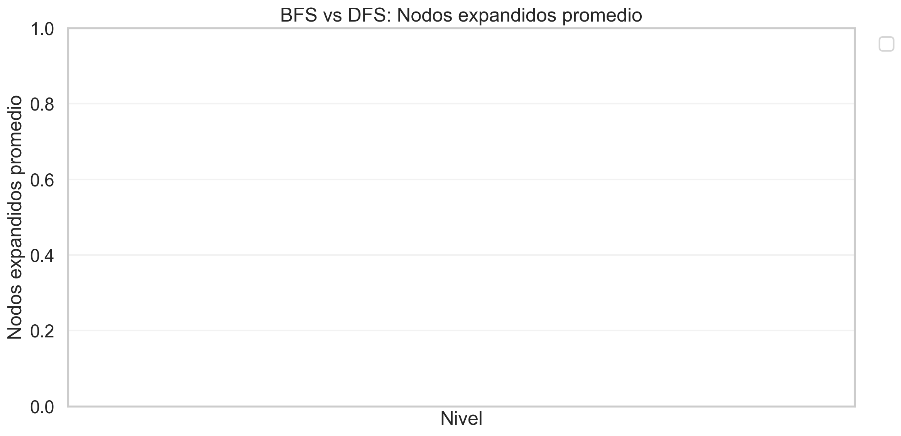

**Qué muestra.** La carpeta no contiene a la vez `BFS` y `DFS`, así que esta figura es un remanente del generador y no una comparación real.

**Por qué importa.** La dejaría fuera de la presentación principal porque el archivo existe por el generador genérico, pero no agrega comparación sustantiva para esta suite.

### `results_benchmark_levels/bfs_vs_dfs_time_errorbars.png`

**Qué muestra.** La carpeta no contiene a la vez `BFS` y `DFS`, así que esta figura es un remanente del generador y no una comparación real.

**Por qué importa.** La dejaría fuera de la presentación principal porque el archivo existe por el generador genérico, pero no agrega comparación sustantiva para esta suite.

### `results_benchmark_levels/boxplot_cost.png`

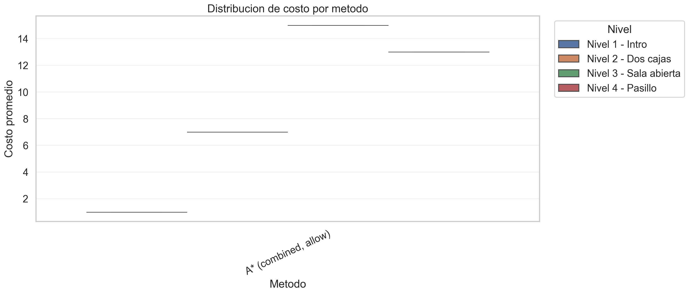

**Qué muestra.** Resume la dispersión de la métrica por método a lo largo de las iteraciones y niveles.

**Por qué importa.** Esta figura es metodológicamente débil para la presentación: como el pipeline es determinista, la caja colapsa casi por completo y lo que ves repite un valor fijo por nivel. La dejaría afuera salvo que quieras mostrar explícitamente que no hubo variación entre corridas.

### `results_benchmark_levels/boxplot_frontier_count.png`

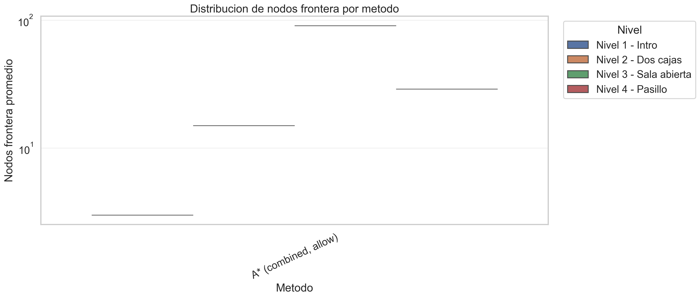

**Qué muestra.** Resume la dispersión de la métrica por método a lo largo de las iteraciones y niveles.

**Por qué importa.** Esta figura es metodológicamente débil para la presentación: como el pipeline es determinista, la caja colapsa casi por completo y lo que ves repite un valor fijo por nivel. La dejaría afuera salvo que quieras mostrar explícitamente que no hubo variación entre corridas.

### `results_benchmark_levels/boxplot_nodes_expanded.png`

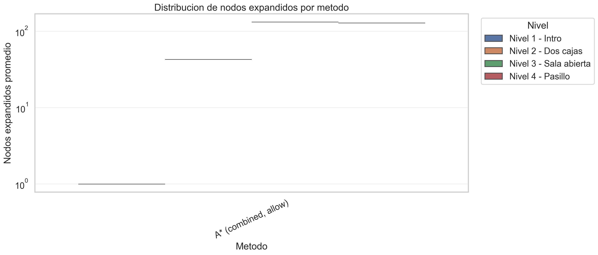

**Qué muestra.** Resume la dispersión de la métrica por método a lo largo de las iteraciones y niveles.

**Por qué importa.** Esta figura es metodológicamente débil para la presentación: como el pipeline es determinista, la caja colapsa casi por completo y lo que ves repite un valor fijo por nivel. La dejaría afuera salvo que quieras mostrar explícitamente que no hubo variación entre corridas.

### `results_benchmark_levels/boxplot_time.png`

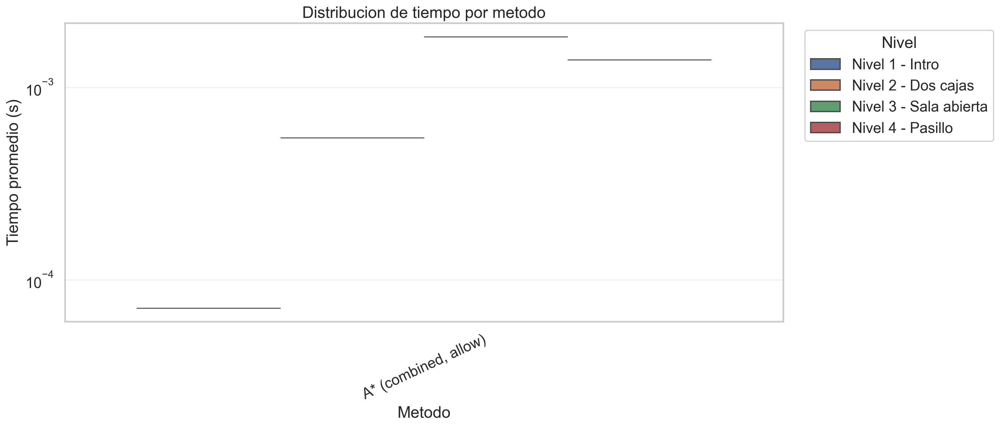

**Qué muestra.** Resume la dispersión de la métrica por método a lo largo de las iteraciones y niveles.

**Por qué importa.** En este proyecto la búsqueda es determinista: los nodos expandidos, la frontera final y el costo no varían entre iteraciones; solo fluctúa el tiempo por ruido de ejecución. Por eso este boxplot sí sirve para hablar de estabilidad temporal, pero no para inferir aleatoriedad algorítmica.

### `results_benchmark_levels/cost_by_level_errorbars.png`

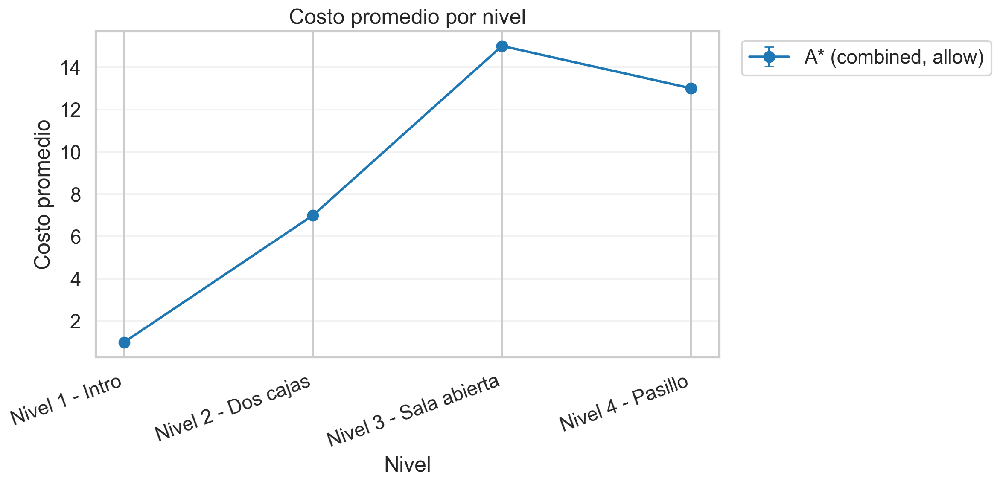

**Qué muestra.** Todos los solvers de esta suite empatan en costo medio global (9). El gráfico entonces sirve más para confirmar la preservación del costo que para ordenar alternativas. Participan: `A* (combined, allow)`.

**Por qué importa.** Cuando todos empatan en costo, la discusión correcta se mueve a tiempo y expansiones. En A* esto es exactamente lo que predice la teoría con heurísticas admisibles; en suites parciales, simplemente te marca que falta contraste real.

### `results_benchmark_levels/greedy_vs_astar_nodes_expanded_errorbars.png`

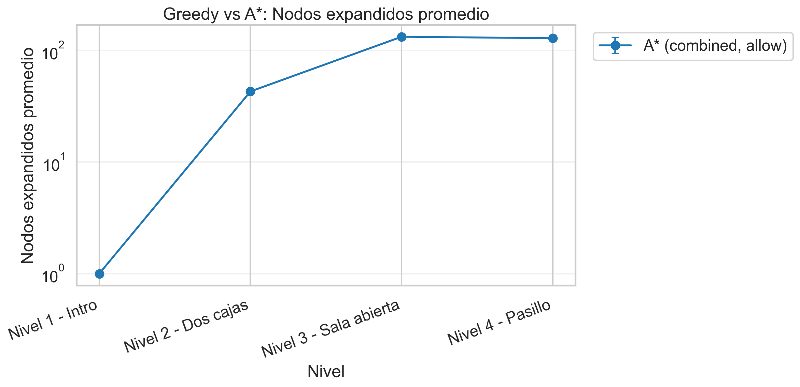

**Qué muestra.** La carpeta no contiene simultáneamente familias `Greedy` y `A*`, así que el archivo no aporta una comparación genuina.

**Por qué importa.** La dejaría fuera de la presentación principal porque el archivo existe por el generador genérico, pero no agrega comparación sustantiva para esta suite.

### `results_benchmark_levels/greedy_vs_astar_time_errorbars.png`

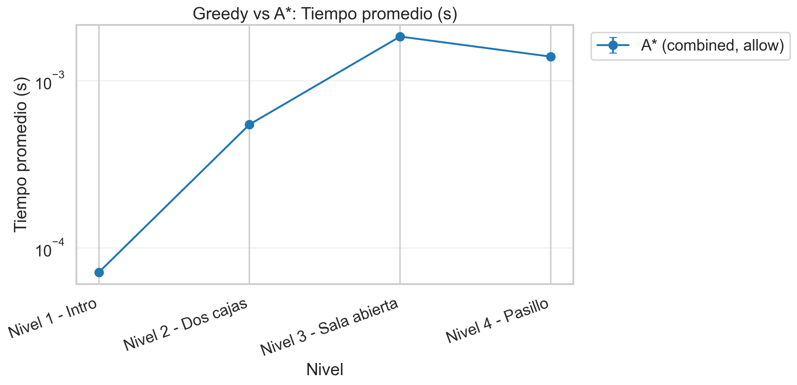

**Qué muestra.** La carpeta no contiene simultáneamente familias `Greedy` y `A*`, así que el archivo no aporta una comparación genuina.

**Por qué importa.** La dejaría fuera de la presentación principal porque el archivo existe por el generador genérico, pero no agrega comparación sustantiva para esta suite.

### `results_benchmark_levels/non_optimal_frontier_count_by_level.png`

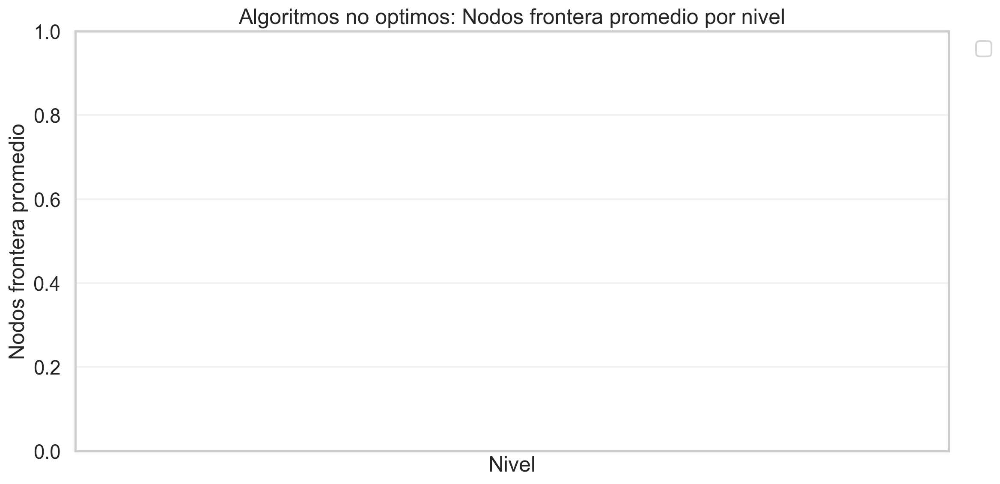

**Qué muestra.** La figura no compara realmente varios métodos no óptimos: solo aparecen datos vacíos.

**Por qué importa.** La dejaría fuera de la presentación principal porque el archivo existe por el generador genérico, pero no agrega comparación sustantiva para esta suite.

### `results_benchmark_levels/non_optimal_nodes_expanded_by_level.png`

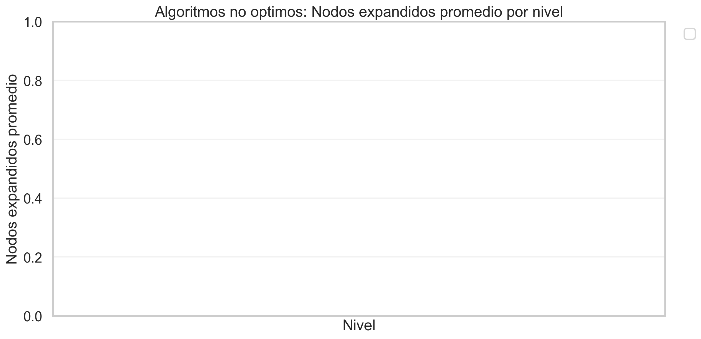

**Qué muestra.** La figura no compara realmente varios métodos no óptimos: solo aparecen datos vacíos.

**Por qué importa.** La dejaría fuera de la presentación principal porque el archivo existe por el generador genérico, pero no agrega comparación sustantiva para esta suite.

### `results_benchmark_levels/non_optimal_time_by_level.png`

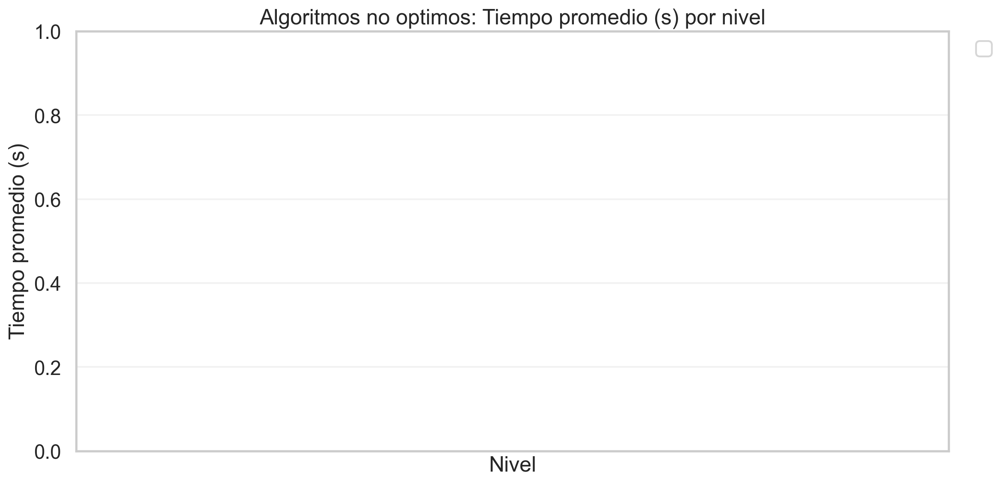

**Qué muestra.** La figura no compara realmente varios métodos no óptimos: solo aparecen datos vacíos.

**Por qué importa.** La dejaría fuera de la presentación principal porque el archivo existe por el generador genérico, pero no agrega comparación sustantiva para esta suite.

### `results_benchmark_levels/optimal_frontier_count_by_level.png`

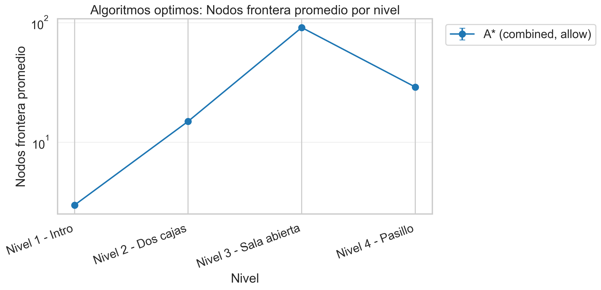

**Qué muestra.** La figura solo contiene `A* (combined, allow)`. En `results_benchmark_levels` esto pasa porque la corrida quedó reducida a `A* (combined, allow)` con una sola iteración por nivel.

**Por qué importa.** La dejaría fuera de la presentación principal porque el archivo existe por el generador genérico, pero no agrega comparación sustantiva para esta suite.

### `results_benchmark_levels/optimal_nodes_expanded_by_level.png`

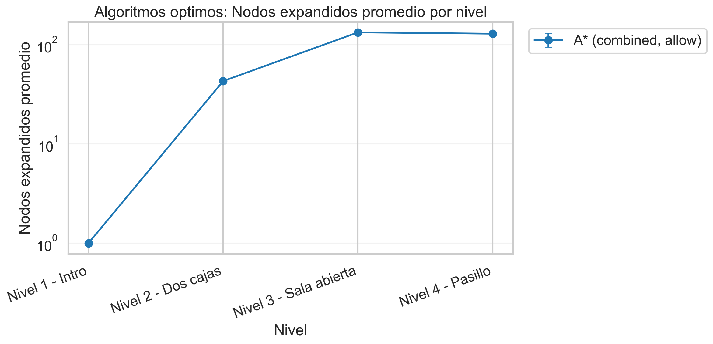

**Qué muestra.** La figura solo contiene `A* (combined, allow)`. En `results_benchmark_levels` esto pasa porque la corrida quedó reducida a `A* (combined, allow)` con una sola iteración por nivel.

**Por qué importa.** La dejaría fuera de la presentación principal porque el archivo existe por el generador genérico, pero no agrega comparación sustantiva para esta suite.

### `results_benchmark_levels/optimal_time_by_level.png`

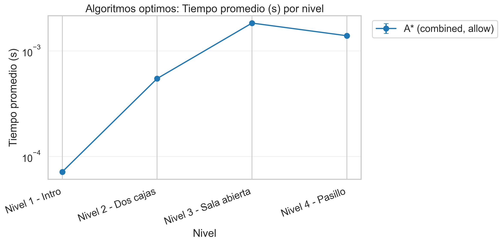

**Qué muestra.** La figura solo contiene `A* (combined, allow)`. En `results_benchmark_levels` esto pasa porque la corrida quedó reducida a `A* (combined, allow)` con una sola iteración por nivel.

**Por qué importa.** La dejaría fuera de la presentación principal porque el archivo existe por el generador genérico, pero no agrega comparación sustantiva para esta suite.

## `results_optimal_allow_deadlocks`

Comparativa de algoritmos óptimos con deadlocks permitidos: `BFS` contra `A*` con tres heurísticas. Es una carpeta clave para mostrar cómo la información heurística reduce búsqueda manteniendo optimalidad.

Todas las corridas resumidas en esta carpeta tuvieron `success_rate = 1.0`. La tabla siguiente consolida los promedios globales por solver:

| Solver | Tiempo medio | Nodos expandidos | Frontera final | Costo |
|---|---:|---:|---:|---:|
| A* (combined) | 0.001182 s | 86 | 45.50 | 9 |
| A* (static_deadlock) | 0.001566 s | 231.75 | 71.50 | 9 |
| A* (min_matching) | 0.002646 s | 202.50 | 153.50 | 9 |
| BFS | 0.009230 s | 1212.75 | 306 | 9 |

### `results_optimal_allow_deadlocks/cost_mean_by_alternative.png`

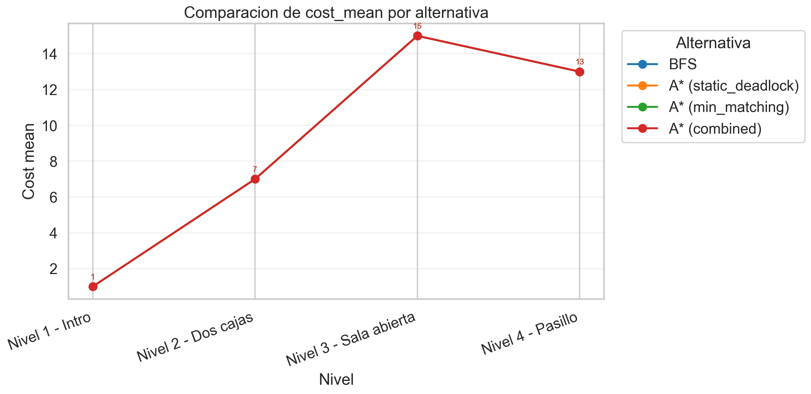

**Qué muestra.** Todas las alternativas empatan en costo medio (9); la barra solo confirma que la comparación de interés no está en calidad de solución sino en eficiencia.

**Por qué importa.** Es una buena figura de apoyo cuando querés decir “todos resuelven con el mismo costo, así que ahora miremos nodos y tiempo”. No la usaría sola como evidencia principal.

### `results_optimal_allow_deadlocks/optimal_frontier_count_by_level.png`

**Qué muestra.** `A* (combined)` es el mejor promedio global en frontera final (45.50) y gana 4/4 niveles, mientras que `BFS` queda último con 306. Frente a `BFS`, `A* (combined)` logra 85.1% menos en promedio.

**Por qué importa.** En teoría clásica, con heurísticas admisibles A* debería mantener costo óptimo y reducir exploración respecto de BFS. Acá se cumple: todos los métodos óptimos mantienen el mismo costo por nivel y lo que cambia es cuánta búsqueda pagan para llegar a esa solución. El patrón acompaña la intuición de eficiencia espacial, aunque en este trabajo la “frontera” guardada es la frontera al finalizar, no el pico de memoria.

### `results_optimal_allow_deadlocks/optimal_nodes_expanded_by_level.png`

**Qué muestra.** `A* (combined)` es el mejor promedio global en nodos expandidos (86) y gana 4/4 niveles, mientras que `BFS` queda último con 1212.75. Frente a `BFS`, `A* (combined)` logra 92.9% menos en promedio.

**Por qué importa.** En teoría clásica, con heurísticas admisibles A* debería mantener costo óptimo y reducir exploración respecto de BFS. Acá se cumple: todos los métodos óptimos mantienen el mismo costo por nivel y lo que cambia es cuánta búsqueda pagan para llegar a esa solución. Esta es una de las figuras más alineadas con la teoría, porque las expansiones sí reflejan directamente calidad heurística.

### `results_optimal_allow_deadlocks/optimal_time_by_level.png`

**Qué muestra.** `A* (combined)` es el mejor promedio global en tiempo (0.001182 s) y gana 2/4 niveles, mientras que `BFS` queda último con 0.009230 s. Frente a `BFS`, `A* (combined)` logra 87.2% menos en promedio.

**Por qué importa.** En teoría clásica, con heurísticas admisibles A* debería mantener costo óptimo y reducir exploración respecto de BFS. Acá se cumple: todos los métodos óptimos mantienen el mismo costo por nivel y lo que cambia es cuánta búsqueda pagan para llegar a esa solución. No conviene sobreinterpretar `Nivel 1 - Intro`: las diferencias ahí son de microsegundos.

## `results_optimal_bfs_prune_deadlocks`

Comparativa mixta entre `BFS (prune)` y `A* (allow)`. Es útil, pero hay que aclarar que mezcla algoritmo y política de deadlocks, así que no es una comparación “limpia” de estrategia de búsqueda.

Todas las corridas resumidas en esta carpeta tuvieron `success_rate = 1.0`. La tabla siguiente consolida los promedios globales por solver:

| Solver | Tiempo medio | Nodos expandidos | Frontera final | Costo |
|---|---:|---:|---:|---:|
| A* (combined, allow) | 0.001128 s | 86 | 45.50 | 9 |
| BFS (prune) | 0.001382 s | 247.50 | 70.50 | 9 |
| A* (static_deadlock, allow) | 0.001760 s | 231.75 | 71.50 | 9 |
| A* (min_matching, allow) | 0.004331 s | 202.50 | 153.50 | 9 |

### `results_optimal_bfs_prune_deadlocks/optimal_frontier_count_by_level.png`

**Qué muestra.** `A* (combined, allow)` es el mejor promedio global en frontera final (45.50) y gana 4/4 niveles, mientras que `A* (min_matching, allow)` queda último con 153.50. En esta suite mixta, `A* (combined, allow)` no se compara en igualdad de condiciones con `BFS (prune)`, así que la lectura correcta es estrategia + poda, no estrategia sola.

**Por qué importa.** En teoría clásica, con heurísticas admisibles A* debería mantener costo óptimo y reducir exploración respecto de BFS. Acá se cumple: todos los métodos óptimos mantienen el mismo costo por nivel y lo que cambia es cuánta búsqueda pagan para llegar a esa solución. El patrón acompaña la intuición de eficiencia espacial, aunque en este trabajo la “frontera” guardada es la frontera al finalizar, no el pico de memoria.

### `results_optimal_bfs_prune_deadlocks/optimal_nodes_expanded_by_level.png`

**Qué muestra.** `A* (combined, allow)` es el mejor promedio global en nodos expandidos (86) y gana 4/4 niveles, mientras que `BFS (prune)` queda último con 247.50. En esta suite mixta, `A* (combined, allow)` no se compara en igualdad de condiciones con `BFS (prune)`, así que la lectura correcta es estrategia + poda, no estrategia sola.

**Por qué importa.** En teoría clásica, con heurísticas admisibles A* debería mantener costo óptimo y reducir exploración respecto de BFS. Acá se cumple: todos los métodos óptimos mantienen el mismo costo por nivel y lo que cambia es cuánta búsqueda pagan para llegar a esa solución. Esta es una de las figuras más alineadas con la teoría, porque las expansiones sí reflejan directamente calidad heurística.

### `results_optimal_bfs_prune_deadlocks/optimal_time_by_level.png`

**Qué muestra.** `A* (combined, allow)` es el mejor promedio global en tiempo (0.001128 s) y gana 1/4 niveles, mientras que `A* (min_matching, allow)` queda último con 0.004331 s. En esta suite mixta, `A* (combined, allow)` no se compara en igualdad de condiciones con `BFS (prune)`, así que la lectura correcta es estrategia + poda, no estrategia sola.

**Por qué importa.** En teoría clásica, con heurísticas admisibles A* debería mantener costo óptimo y reducir exploración respecto de BFS. Acá se cumple: todos los métodos óptimos mantienen el mismo costo por nivel y lo que cambia es cuánta búsqueda pagan para llegar a esa solución. No conviene sobreinterpretar `Nivel 1 - Intro`: las diferencias ahí son de microsegundos.

## `results_dfs_allow_deadlocks`

Comparativa entre `DFS (allow)` y `Greedy` con distintas heurísticas. Mide qué pasa cuando se deja a DFS caer en callejones sin salida.

Todas las corridas resumidas en esta carpeta tuvieron `success_rate = 1.0`. La tabla siguiente consolida los promedios globales por solver:

| Solver | Tiempo medio | Nodos expandidos | Frontera final | Costo |
|---|---:|---:|---:|---:|
| Greedy (combined, allow) | 0.000191 s | 20 | 14.75 | 9 |
| Greedy (min_matching, allow) | 0.000199 s | 22.50 | 17.50 | 10 |
| Greedy (static_deadlock, allow) | 0.000389 s | 74.25 | 37 | 15.25 |
| DFS (allow) | 0.009662 s | 2334 | 52.50 | 65 |

### `results_dfs_allow_deadlocks/bfs_vs_dfs_nodes_expanded_errorbars.png`

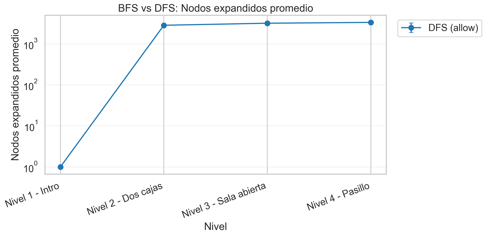

**Qué muestra.** La carpeta no contiene a la vez `BFS` y `DFS`, así que esta figura es un remanente del generador y no una comparación real.

**Por qué importa.** La dejaría fuera de la presentación principal porque el archivo existe por el generador genérico, pero no agrega comparación sustantiva para esta suite.

### `results_dfs_allow_deadlocks/bfs_vs_dfs_time_errorbars.png`

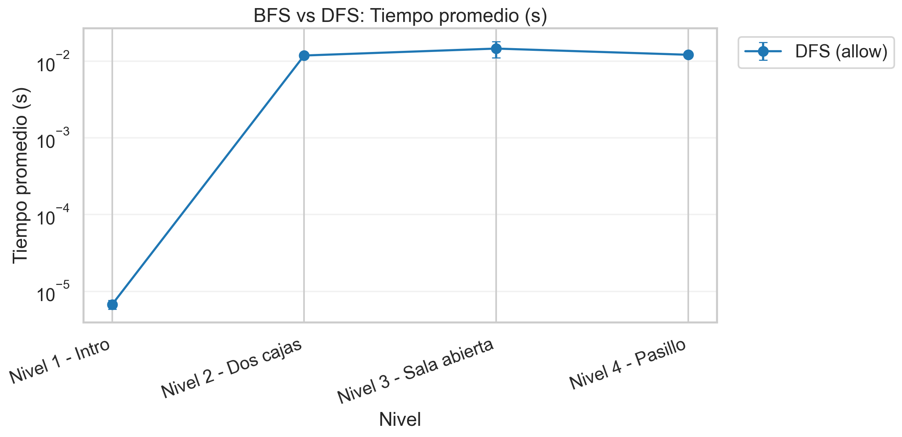

**Qué muestra.** La carpeta no contiene a la vez `BFS` y `DFS`, así que esta figura es un remanente del generador y no una comparación real.

**Por qué importa.** La dejaría fuera de la presentación principal porque el archivo existe por el generador genérico, pero no agrega comparación sustantiva para esta suite.

### `results_dfs_allow_deadlocks/boxplot_cost.png`

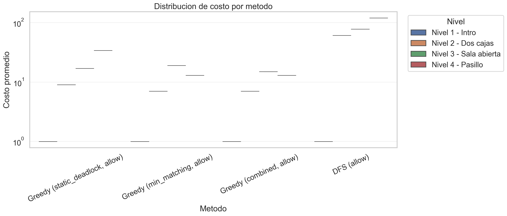

**Qué muestra.** Resume la dispersión de la métrica por método a lo largo de las iteraciones y niveles.

**Por qué importa.** Esta figura es metodológicamente débil para la presentación: como el pipeline es determinista, la caja colapsa casi por completo y lo que ves repite un valor fijo por nivel. La dejaría afuera salvo que quieras mostrar explícitamente que no hubo variación entre corridas.

### `results_dfs_allow_deadlocks/boxplot_frontier_count.png`

**Qué muestra.** Resume la dispersión de la métrica por método a lo largo de las iteraciones y niveles.

**Por qué importa.** Esta figura es metodológicamente débil para la presentación: como el pipeline es determinista, la caja colapsa casi por completo y lo que ves repite un valor fijo por nivel. La dejaría afuera salvo que quieras mostrar explícitamente que no hubo variación entre corridas.

### `results_dfs_allow_deadlocks/boxplot_nodes_expanded.png`

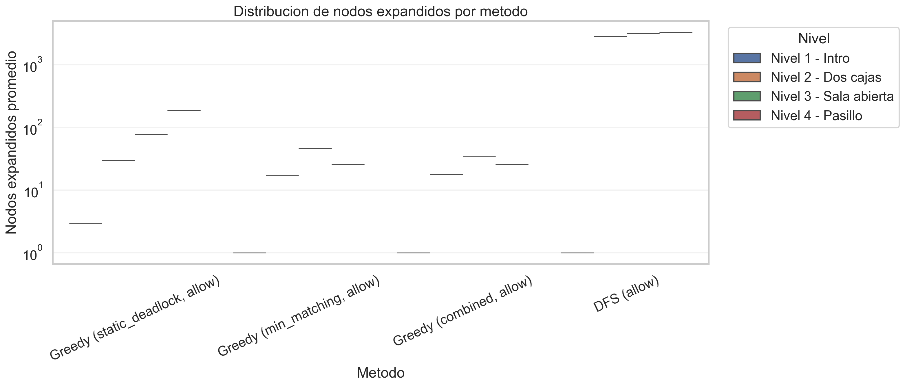

**Qué muestra.** Resume la dispersión de la métrica por método a lo largo de las iteraciones y niveles.

**Por qué importa.** Esta figura es metodológicamente débil para la presentación: como el pipeline es determinista, la caja colapsa casi por completo y lo que ves repite un valor fijo por nivel. La dejaría afuera salvo que quieras mostrar explícitamente que no hubo variación entre corridas.

### `results_dfs_allow_deadlocks/boxplot_time.png`

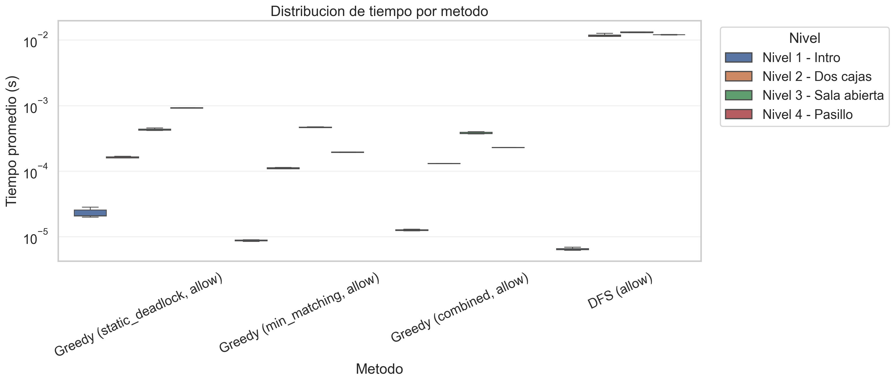

**Qué muestra.** Resume la dispersión de la métrica por método a lo largo de las iteraciones y niveles.

**Por qué importa.** En este proyecto la búsqueda es determinista: los nodos expandidos, la frontera final y el costo no varían entre iteraciones; solo fluctúa el tiempo por ruido de ejecución. Por eso este boxplot sí sirve para hablar de estabilidad temporal, pero no para inferir aleatoriedad algorítmica.

### `results_dfs_allow_deadlocks/cost_by_level_errorbars.png`

**Qué muestra.** `Greedy (combined, allow)` tiene el mejor costo medio global (9) y `DFS (allow)` el peor (65). En esta carpeta la figura funciona más como ranking interno de calidad de solución que como comparación entre familias óptimas y no óptimas.

**Por qué importa.** El costo es la métrica más cercana a lo que pide el enunciado como calidad de solución. Para la presentación, esta figura es la que te permite separar “rápido” de “bueno”: DFS puede ser veloz, pero si infla el camino no está resolviendo mejor.

### `results_dfs_allow_deadlocks/cost_mean_by_alternative.png`

**Qué muestra.** Ordena el costo medio por alternativa y deja muy visible que `Greedy (combined, allow)` queda en 9 mientras `DFS (allow)` sube a 65.

**Por qué importa.** Para una slide es más directa que el errorbar por nivel: sintetiza la idea de calidad de solución en un vistazo. En particular, ayuda a contar que `static_deadlock` sola no es una heurística de ranking fuerte; funciona mejor como detector/poda que como guía principal.

### `results_dfs_allow_deadlocks/greedy_vs_astar_nodes_expanded_errorbars.png`

**Qué muestra.** La carpeta no contiene simultáneamente familias `Greedy` y `A*`, así que el archivo no aporta una comparación genuina.

**Por qué importa.** La dejaría fuera de la presentación principal porque el archivo existe por el generador genérico, pero no agrega comparación sustantiva para esta suite.

### `results_dfs_allow_deadlocks/greedy_vs_astar_time_errorbars.png`

**Qué muestra.** La carpeta no contiene simultáneamente familias `Greedy` y `A*`, así que el archivo no aporta una comparación genuina.

**Por qué importa.** La dejaría fuera de la presentación principal porque el archivo existe por el generador genérico, pero no agrega comparación sustantiva para esta suite.

### `results_dfs_allow_deadlocks/non_optimal_frontier_count_by_level.png`

**Qué muestra.** `Greedy (combined, allow)` lidera en frontera final con 14.75 y `DFS (allow)` cierra la tabla con 52.50. El reparto de victorias por nivel favorece a `Greedy (combined, allow)` en 3/4 niveles.

**Por qué importa.** En teoría, Greedy debería explorar menos que DFS porque usa información heurística, pero puede pagar eso con peores decisiones de costo. Cuando `Greedy (combined)` gana, está actuando como una versión pragmática de A*: conserva una guía fuerte pero deja de lado la corrección de costo acumulado.

### `results_dfs_allow_deadlocks/non_optimal_nodes_expanded_by_level.png`

**Qué muestra.** `Greedy (combined, allow)` lidera en nodos expandidos con 20 y `DFS (allow)` cierra la tabla con 2334. El reparto de victorias por nivel favorece a `Greedy (combined, allow)` en 2/4 niveles.

**Por qué importa.** En teoría, Greedy debería explorar menos que DFS porque usa información heurística, pero puede pagar eso con peores decisiones de costo. Cuando `Greedy (combined)` gana, está actuando como una versión pragmática de A*: conserva una guía fuerte pero deja de lado la corrección de costo acumulado.

### `results_dfs_allow_deadlocks/non_optimal_time_by_level.png`

**Qué muestra.** `Greedy (combined, allow)` lidera en tiempo con 0.000191 s y `DFS (allow)` cierra la tabla con 0.009662 s. El reparto de victorias por nivel favorece a `Greedy (combined, allow)` en 1/4 niveles.

**Por qué importa.** En teoría, Greedy debería explorar menos que DFS porque usa información heurística, pero puede pagar eso con peores decisiones de costo. Cuando `Greedy (combined)` gana, está actuando como una versión pragmática de A*: conserva una guía fuerte pero deja de lado la corrección de costo acumulado.

## `results_dfs_prune_deadlocks`

Comparativa entre `DFS (prune)` y `Greedy (allow)`. Muestra cuánto mejora DFS cuando se lo protege de deadlocks, aunque sigue cargando su sesgo no óptimo.

Todas las corridas resumidas en esta carpeta tuvieron `success_rate = 1.0`. La tabla siguiente consolida los promedios globales por solver:

| Solver | Tiempo medio | Nodos expandidos | Frontera final | Costo |
|---|---:|---:|---:|---:|
| Greedy (combined, allow) | 0.000193 s | 20 | 14.75 | 9 |
| Greedy (min_matching, allow) | 0.000208 s | 22.50 | 17.50 | 10 |
| Greedy (static_deadlock, allow) | 0.000397 s | 74.25 | 37 | 15.25 |
| DFS (prune) | 0.000408 s | 108.25 | 50.25 | 65 |

### `results_dfs_prune_deadlocks/bfs_vs_dfs_nodes_expanded_errorbars.png`

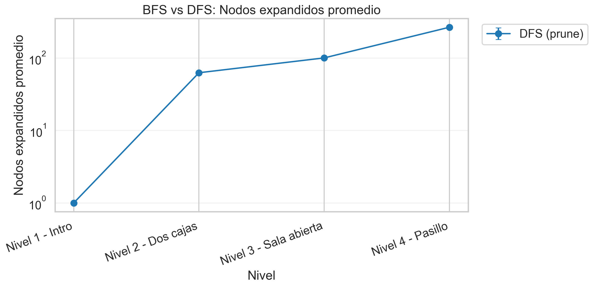

**Qué muestra.** La carpeta no contiene a la vez `BFS` y `DFS`, así que esta figura es un remanente del generador y no una comparación real.

**Por qué importa.** La dejaría fuera de la presentación principal porque el archivo existe por el generador genérico, pero no agrega comparación sustantiva para esta suite.

### `results_dfs_prune_deadlocks/bfs_vs_dfs_time_errorbars.png`

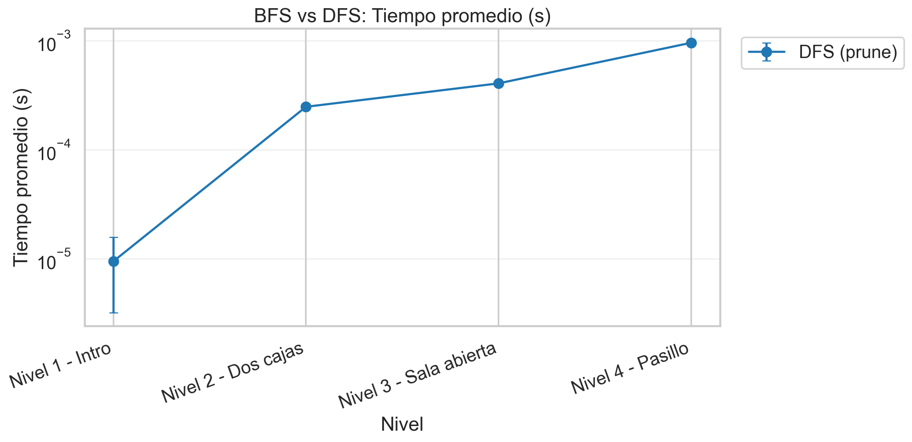

**Qué muestra.** La carpeta no contiene a la vez `BFS` y `DFS`, así que esta figura es un remanente del generador y no una comparación real.

**Por qué importa.** La dejaría fuera de la presentación principal porque el archivo existe por el generador genérico, pero no agrega comparación sustantiva para esta suite.

### `results_dfs_prune_deadlocks/boxplot_cost.png`

**Qué muestra.** Resume la dispersión de la métrica por método a lo largo de las iteraciones y niveles.

**Por qué importa.** Esta figura es metodológicamente débil para la presentación: como el pipeline es determinista, la caja colapsa casi por completo y lo que ves repite un valor fijo por nivel. La dejaría afuera salvo que quieras mostrar explícitamente que no hubo variación entre corridas.

### `results_dfs_prune_deadlocks/boxplot_frontier_count.png`

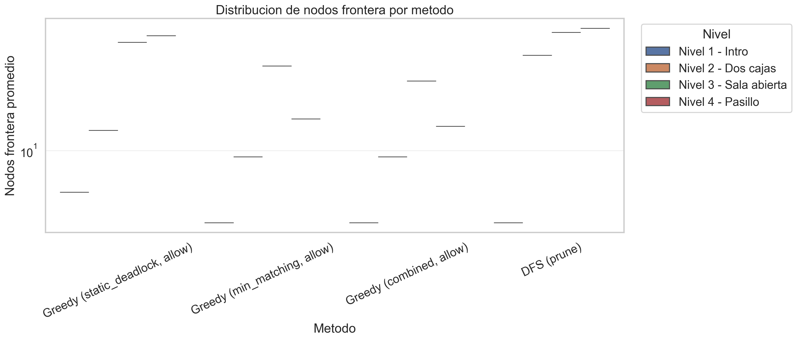

**Qué muestra.** Resume la dispersión de la métrica por método a lo largo de las iteraciones y niveles.

**Por qué importa.** Esta figura es metodológicamente débil para la presentación: como el pipeline es determinista, la caja colapsa casi por completo y lo que ves repite un valor fijo por nivel. La dejaría afuera salvo que quieras mostrar explícitamente que no hubo variación entre corridas.

### `results_dfs_prune_deadlocks/boxplot_nodes_expanded.png`

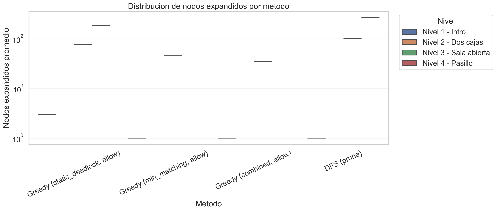

**Qué muestra.** Resume la dispersión de la métrica por método a lo largo de las iteraciones y niveles.

**Por qué importa.** Esta figura es metodológicamente débil para la presentación: como el pipeline es determinista, la caja colapsa casi por completo y lo que ves repite un valor fijo por nivel. La dejaría afuera salvo que quieras mostrar explícitamente que no hubo variación entre corridas.

### `results_dfs_prune_deadlocks/boxplot_time.png`

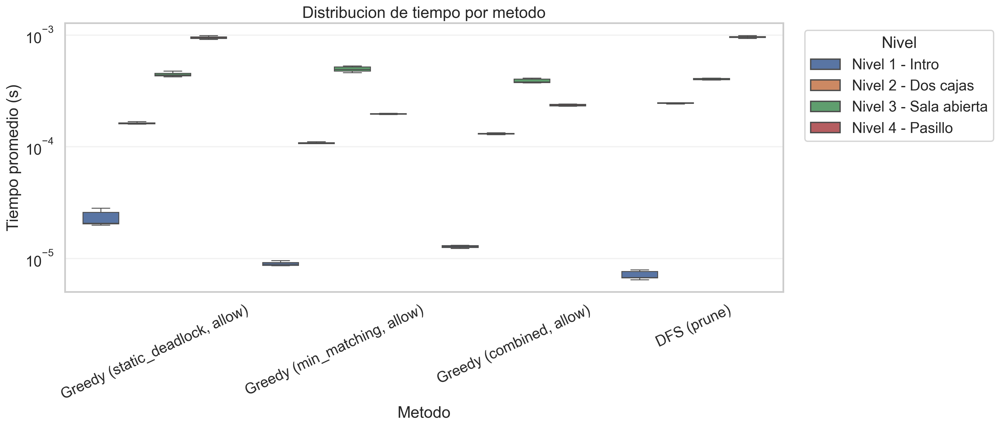

**Qué muestra.** Resume la dispersión de la métrica por método a lo largo de las iteraciones y niveles.

**Por qué importa.** En este proyecto la búsqueda es determinista: los nodos expandidos, la frontera final y el costo no varían entre iteraciones; solo fluctúa el tiempo por ruido de ejecución. Por eso este boxplot sí sirve para hablar de estabilidad temporal, pero no para inferir aleatoriedad algorítmica.

### `results_dfs_prune_deadlocks/cost_by_level_errorbars.png`

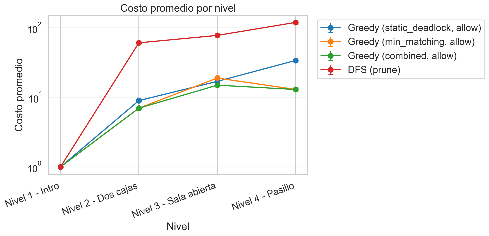

**Qué muestra.** `Greedy (combined, allow)` tiene el mejor costo medio global (9) y `DFS (prune)` el peor (65). En esta carpeta la figura funciona más como ranking interno de calidad de solución que como comparación entre familias óptimas y no óptimas.

**Por qué importa.** El costo es la métrica más cercana a lo que pide el enunciado como calidad de solución. Para la presentación, esta figura es la que te permite separar “rápido” de “bueno”: DFS puede ser veloz, pero si infla el camino no está resolviendo mejor.

### `results_dfs_prune_deadlocks/cost_mean_by_alternative.png`

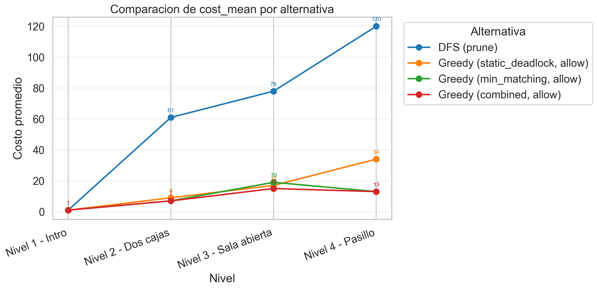

**Qué muestra.** Ordena el costo medio por alternativa y deja muy visible que `Greedy (combined, allow)` queda en 9 mientras `DFS (prune)` sube a 65.

**Por qué importa.** Para una slide es más directa que el errorbar por nivel: sintetiza la idea de calidad de solución en un vistazo. En particular, ayuda a contar que `static_deadlock` sola no es una heurística de ranking fuerte; funciona mejor como detector/poda que como guía principal.

### `results_dfs_prune_deadlocks/greedy_vs_astar_nodes_expanded_errorbars.png`

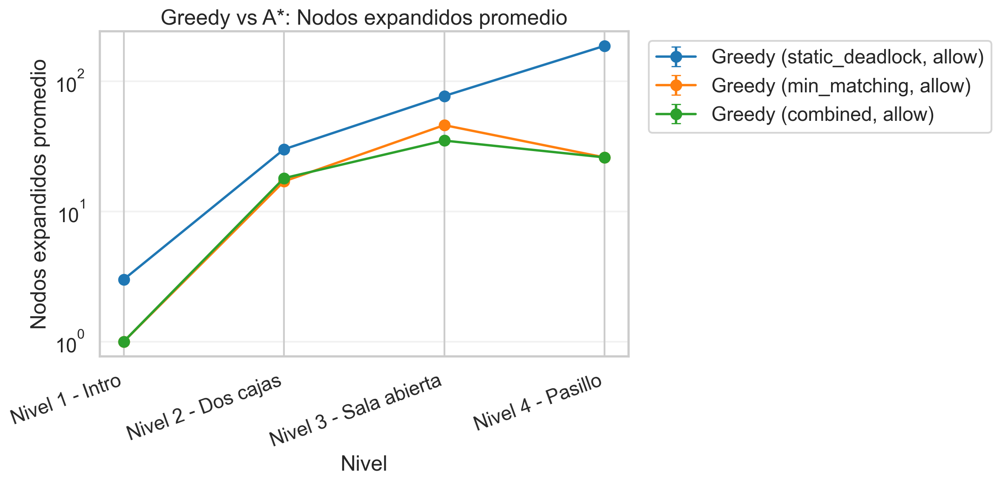

**Qué muestra.** La carpeta no contiene simultáneamente familias `Greedy` y `A*`, así que el archivo no aporta una comparación genuina.

**Por qué importa.** La dejaría fuera de la presentación principal porque el archivo existe por el generador genérico, pero no agrega comparación sustantiva para esta suite.

### `results_dfs_prune_deadlocks/greedy_vs_astar_time_errorbars.png`

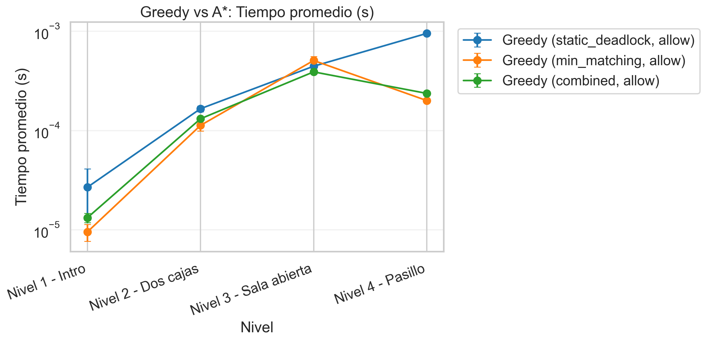

**Qué muestra.** La carpeta no contiene simultáneamente familias `Greedy` y `A*`, así que el archivo no aporta una comparación genuina.

**Por qué importa.** La dejaría fuera de la presentación principal porque el archivo existe por el generador genérico, pero no agrega comparación sustantiva para esta suite.

### `results_dfs_prune_deadlocks/non_optimal_frontier_count_by_level.png`

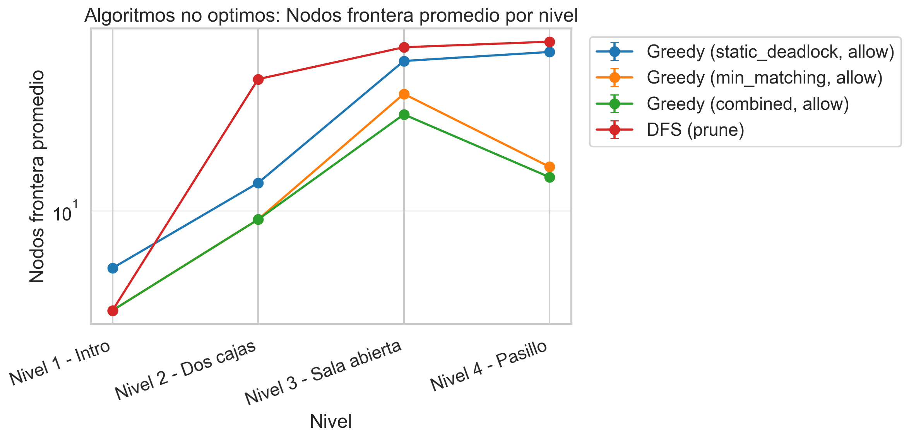

**Qué muestra.** `Greedy (combined, allow)` lidera en frontera final con 14.75 y `DFS (prune)` cierra la tabla con 50.25. El reparto de victorias por nivel favorece a `Greedy (combined, allow)` en 3/4 niveles.

**Por qué importa.** En teoría, Greedy debería explorar menos que DFS porque usa información heurística, pero puede pagar eso con peores decisiones de costo. Cuando `Greedy (combined)` gana, está actuando como una versión pragmática de A*: conserva una guía fuerte pero deja de lado la corrección de costo acumulado.

### `results_dfs_prune_deadlocks/non_optimal_nodes_expanded_by_level.png`

**Qué muestra.** `Greedy (combined, allow)` lidera en nodos expandidos con 20 y `DFS (prune)` cierra la tabla con 108.25. El reparto de victorias por nivel favorece a `Greedy (combined, allow)` en 2/4 niveles.

**Por qué importa.** En teoría, Greedy debería explorar menos que DFS porque usa información heurística, pero puede pagar eso con peores decisiones de costo. Cuando `Greedy (combined)` gana, está actuando como una versión pragmática de A*: conserva una guía fuerte pero deja de lado la corrección de costo acumulado.

### `results_dfs_prune_deadlocks/non_optimal_time_by_level.png`

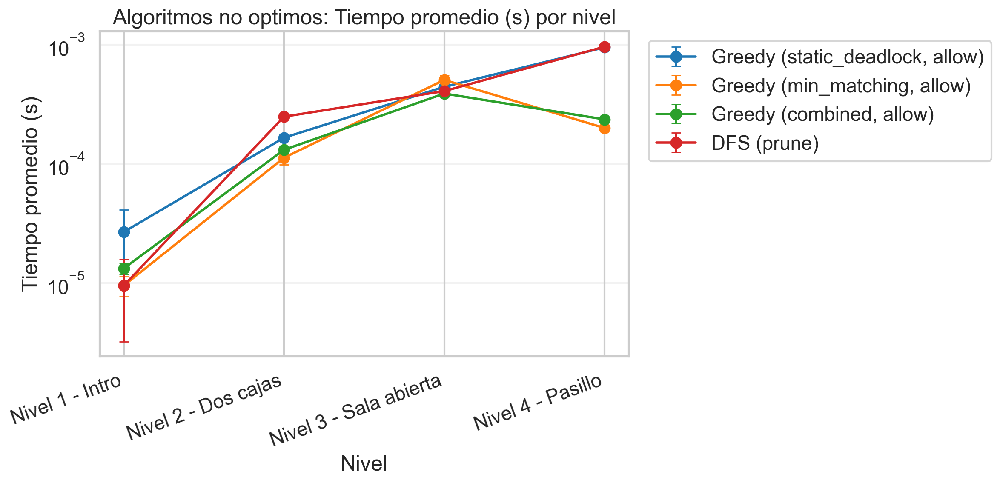

**Qué muestra.** `Greedy (combined, allow)` lidera en tiempo con 0.000193 s y `DFS (prune)` cierra la tabla con 0.000408 s. El reparto de victorias por nivel favorece a `Greedy (combined, allow)` en 1/4 niveles.

**Por qué importa.** En teoría, Greedy debería explorar menos que DFS porque usa información heurística, pero puede pagar eso con peores decisiones de costo. Cuando `Greedy (combined)` gana, está actuando como una versión pragmática de A*: conserva una guía fuerte pero deja de lado la corrección de costo acumulado.

## `results_dfs_vs_bfs_allow_deadlocks`

Comparativa directa `BFS` vs `DFS` dejando deadlocks permitidos. Es una buena foto del trade-off clásico entre calidad de solución y costo de exploración.

Todas las corridas resumidas en esta carpeta tuvieron `success_rate = 1.0`. La tabla siguiente consolida los promedios globales por solver:

| Solver | Tiempo medio | Nodos expandidos | Frontera final | Costo |
|---|---:|---:|---:|---:|
| BFS (allow) | 0.006694 s | 1212.75 | 306 | 9 |
| DFS (allow) | 0.011508 s | 2334 | 52.50 | 65 |

### `results_dfs_vs_bfs_allow_deadlocks/bfs_vs_dfs_allow_cost_by_level.png`

**Qué muestra.** Desglosa por nivel la comparación directa entre `BFS (allow)` y `DFS (allow)`. Globalmente gana `BFS (allow)` en costo (9 contra 65).

**Por qué importa.** Es más legible para slides que las curvas con error bars porque permite señalar nivel por nivel dónde BFS paga amplitud y dónde DFS paga mala calidad de rama. Si la usás, acompañala con el costo: sin esa métrica, DFS puede parecer mejor de lo que realmente es.

### `results_dfs_vs_bfs_allow_deadlocks/bfs_vs_dfs_allow_nodes_expanded_by_level.png`

**Qué muestra.** Desglosa por nivel la comparación directa entre `BFS (allow)` y `DFS (allow)`. Globalmente gana `BFS (allow)` en nodos expandidos (1212.75 contra 2334).

**Por qué importa.** Es más legible para slides que las curvas con error bars porque permite señalar nivel por nivel dónde BFS paga amplitud y dónde DFS paga mala calidad de rama. Si la usás, acompañala con el costo: sin esa métrica, DFS puede parecer mejor de lo que realmente es.

### `results_dfs_vs_bfs_allow_deadlocks/bfs_vs_dfs_allow_time_seconds_by_level.png`

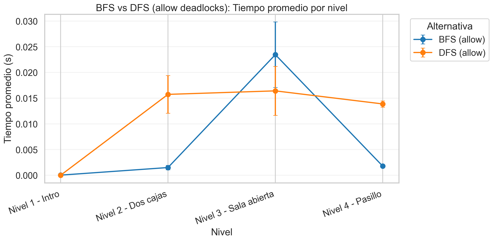

**Qué muestra.** Desglosa por nivel la comparación directa entre `BFS (allow)` y `DFS (allow)`. Globalmente gana `BFS (allow)` en tiempo (0.006694 s contra 0.011508 s).

**Por qué importa.** Es más legible para slides que las curvas con error bars porque permite señalar nivel por nivel dónde BFS paga amplitud y dónde DFS paga mala calidad de rama. Si la usás, acompañala con el costo: sin esa métrica, DFS puede parecer mejor de lo que realmente es.

### `results_dfs_vs_bfs_allow_deadlocks/bfs_vs_dfs_nodes_expanded_errorbars.png`

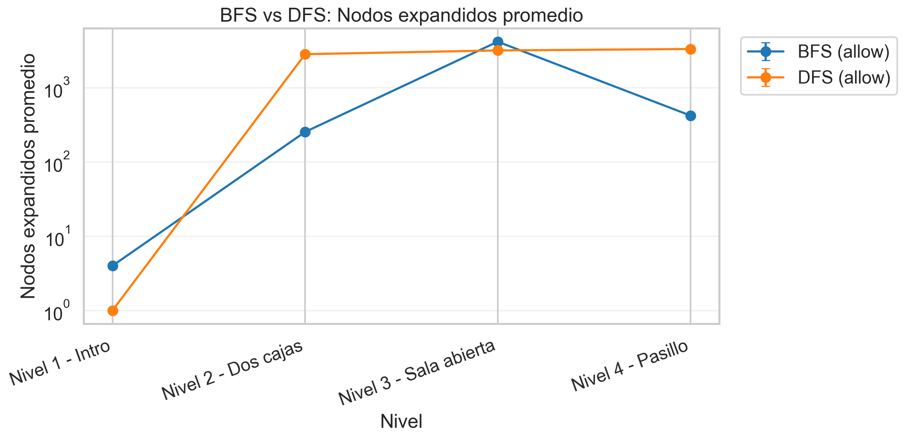

**Qué muestra.** `BFS` tiene mejor promedio de nodos expandidos que `DFS` (1212.75 contra 2334).

**Por qué importa.** Es una comparación clásica de IA. `BFS` gana en esta suite, pero la conclusión correcta no es “uno domina siempre”, sino que el comportamiento depende fuerte de la estructura del nivel y de la política de deadlocks. Acá la teoría se ve mejor: la cantidad de expansiones depende muchísimo de si el orden profundo de DFS cae o no en zonas estériles. La poda cambia esa historia por completo.

### `results_dfs_vs_bfs_allow_deadlocks/bfs_vs_dfs_time_errorbars.png`

**Qué muestra.** `BFS` tiene mejor promedio de tiempo que `DFS` (0.006694 s contra 0.011508 s).

**Por qué importa.** Es una comparación clásica de IA. `BFS` gana en esta suite, pero la conclusión correcta no es “uno domina siempre”, sino que el comportamiento depende fuerte de la estructura del nivel y de la política de deadlocks. Con deadlocks permitidos, `DFS` puede parecer competitivo por encontrar rápido una primera solución, pero esa rapidez convive con costos de solución muy altos.

### `results_dfs_vs_bfs_allow_deadlocks/boxplot_cost.png`

**Qué muestra.** Resume la dispersión de la métrica por método a lo largo de las iteraciones y niveles.

**Por qué importa.** Esta figura es metodológicamente débil para la presentación: como el pipeline es determinista, la caja colapsa casi por completo y lo que ves repite un valor fijo por nivel. La dejaría afuera salvo que quieras mostrar explícitamente que no hubo variación entre corridas.

### `results_dfs_vs_bfs_allow_deadlocks/boxplot_frontier_count.png`

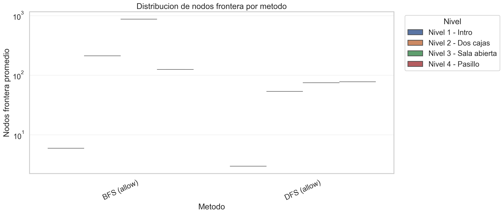

**Qué muestra.** Resume la dispersión de la métrica por método a lo largo de las iteraciones y niveles.

**Por qué importa.** Esta figura es metodológicamente débil para la presentación: como el pipeline es determinista, la caja colapsa casi por completo y lo que ves repite un valor fijo por nivel. La dejaría afuera salvo que quieras mostrar explícitamente que no hubo variación entre corridas.

### `results_dfs_vs_bfs_allow_deadlocks/boxplot_nodes_expanded.png`

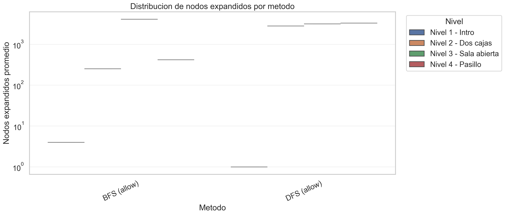

**Qué muestra.** Resume la dispersión de la métrica por método a lo largo de las iteraciones y niveles.

**Por qué importa.** Esta figura es metodológicamente débil para la presentación: como el pipeline es determinista, la caja colapsa casi por completo y lo que ves repite un valor fijo por nivel. La dejaría afuera salvo que quieras mostrar explícitamente que no hubo variación entre corridas.

### `results_dfs_vs_bfs_allow_deadlocks/boxplot_time.png`

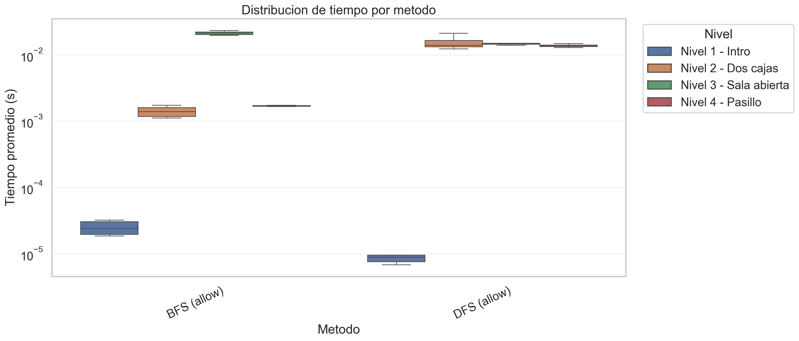

**Qué muestra.** Resume la dispersión de la métrica por método a lo largo de las iteraciones y niveles.

**Por qué importa.** En este proyecto la búsqueda es determinista: los nodos expandidos, la frontera final y el costo no varían entre iteraciones; solo fluctúa el tiempo por ruido de ejecución. Por eso este boxplot sí sirve para hablar de estabilidad temporal, pero no para inferir aleatoriedad algorítmica.

### `results_dfs_vs_bfs_allow_deadlocks/cost_by_level_errorbars.png`

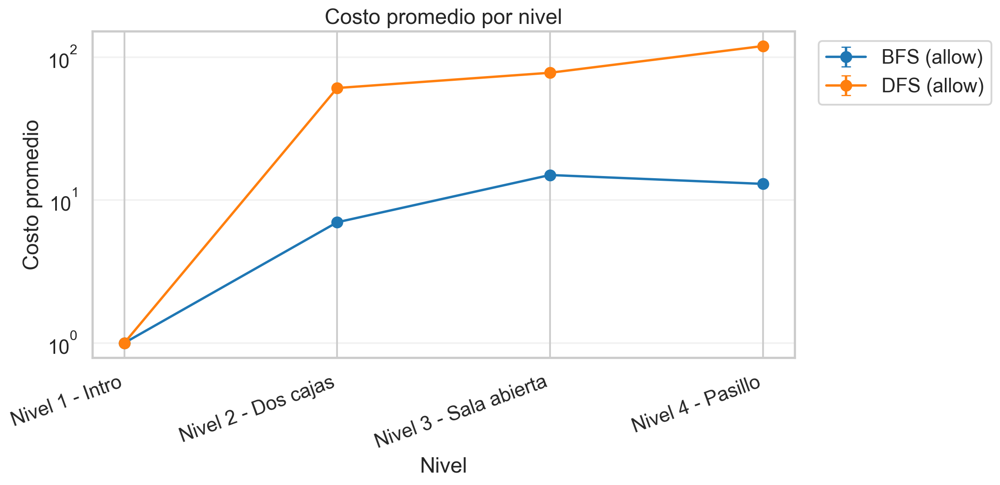

**Qué muestra.** `BFS (allow)` tiene el mejor costo medio global (9) y `DFS (allow)` el peor (65). Además, `Greedy (combined)` empata el costo óptimo en 0/4 niveles, algo muy bueno para estos tableros pero no garantizado en general.

**Por qué importa.** El costo es la métrica más cercana a lo que pide el enunciado como calidad de solución. Para la presentación, esta figura es la que te permite separar “rápido” de “bueno”: DFS puede ser veloz, pero si infla el camino no está resolviendo mejor.

## `results_dfs_vs_bfs_prune_deadlocks`

Comparativa directa `BFS` vs `DFS` podando deadlocks. Acá aparece con claridad cuánto cambia el comportamiento de ambos métodos cuando el espacio de estados se limpia.

Todas las corridas resumidas en esta carpeta tuvieron `success_rate = 1.0`. La tabla siguiente consolida los promedios globales por solver:

| Solver | Tiempo medio | Nodos expandidos | Frontera final | Costo |
|---|---:|---:|---:|---:|
| DFS (prune) | 0.000543 s | 108.25 | 50.25 | 65 |
| BFS (prune) | 0.001762 s | 247.50 | 70.50 | 9 |

### `results_dfs_vs_bfs_prune_deadlocks/bfs_vs_dfs_nodes_expanded_errorbars.png`

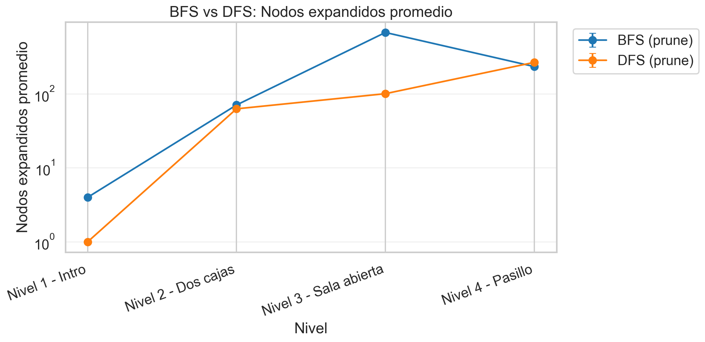

**Qué muestra.** `DFS` tiene mejor promedio de nodos expandidos que `BFS` (108.25 contra 247.50).

**Por qué importa.** Es una comparación clásica de IA. `DFS` gana en esta suite, pero la conclusión correcta no es “uno domina siempre”, sino que el comportamiento depende fuerte de la estructura del nivel y de la política de deadlocks. Acá la teoría se ve mejor: la cantidad de expansiones depende muchísimo de si el orden profundo de DFS cae o no en zonas estériles. La poda cambia esa historia por completo.

### `results_dfs_vs_bfs_prune_deadlocks/bfs_vs_dfs_prune_cost_by_level.png`

**Qué muestra.** Desglosa por nivel la comparación directa entre `BFS (prune)` y `DFS (prune)`. Globalmente gana `BFS (prune)` en costo (9 contra 65).

**Por qué importa.** Es más legible para slides que las curvas con error bars porque permite señalar nivel por nivel dónde BFS paga amplitud y dónde DFS paga mala calidad de rama. Si la usás, acompañala con el costo: sin esa métrica, DFS puede parecer mejor de lo que realmente es.

### `results_dfs_vs_bfs_prune_deadlocks/bfs_vs_dfs_prune_nodes_expanded_by_level.png`

**Qué muestra.** Desglosa por nivel la comparación directa entre `BFS (prune)` y `DFS (prune)`. Globalmente gana `DFS (prune)` en nodos expandidos (108.25 contra 247.50).

**Por qué importa.** Es más legible para slides que las curvas con error bars porque permite señalar nivel por nivel dónde BFS paga amplitud y dónde DFS paga mala calidad de rama. Si la usás, acompañala con el costo: sin esa métrica, DFS puede parecer mejor de lo que realmente es.

### `results_dfs_vs_bfs_prune_deadlocks/bfs_vs_dfs_prune_time_seconds_by_level.png`

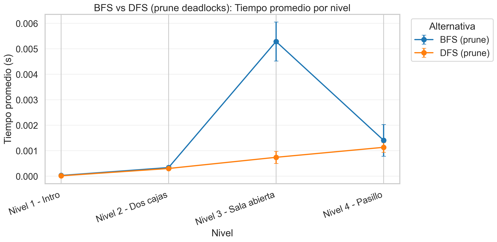

**Qué muestra.** Desglosa por nivel la comparación directa entre `BFS (prune)` y `DFS (prune)`. Globalmente gana `DFS (prune)` en tiempo (0.000543 s contra 0.001762 s).

**Por qué importa.** Es más legible para slides que las curvas con error bars porque permite señalar nivel por nivel dónde BFS paga amplitud y dónde DFS paga mala calidad de rama. Si la usás, acompañala con el costo: sin esa métrica, DFS puede parecer mejor de lo que realmente es.

### `results_dfs_vs_bfs_prune_deadlocks/bfs_vs_dfs_time_errorbars.png`

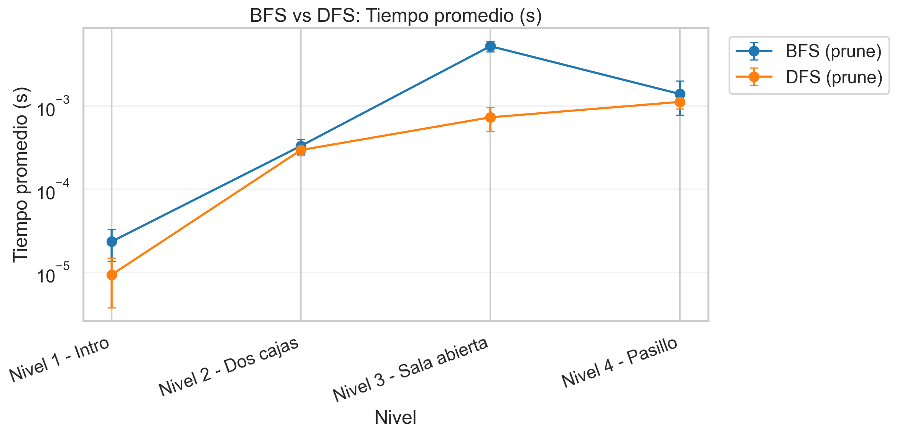

**Qué muestra.** `DFS` tiene mejor promedio de tiempo que `BFS` (0.000543 s contra 0.001762 s).

**Por qué importa.** Es una comparación clásica de IA. `DFS` gana en esta suite, pero la conclusión correcta no es “uno domina siempre”, sino que el comportamiento depende fuerte de la estructura del nivel y de la política de deadlocks. Con poda, `DFS` pasa a ser realmente muy rápido porque deja de hundirse en ramas muertas; ahí el viejo prejuicio “DFS siempre explora poco” se vuelve mucho más cierto.

### `results_dfs_vs_bfs_prune_deadlocks/boxplot_cost.png`

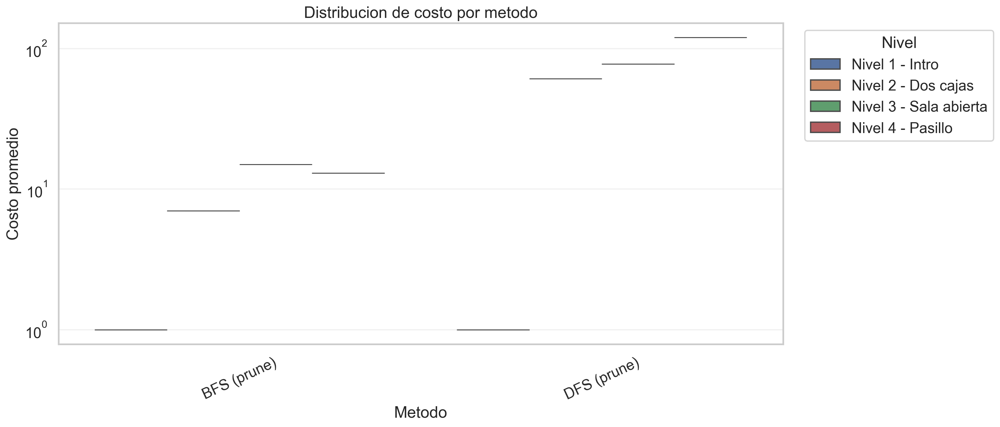

**Qué muestra.** Resume la dispersión de la métrica por método a lo largo de las iteraciones y niveles.

**Por qué importa.** Esta figura es metodológicamente débil para la presentación: como el pipeline es determinista, la caja colapsa casi por completo y lo que ves repite un valor fijo por nivel. La dejaría afuera salvo que quieras mostrar explícitamente que no hubo variación entre corridas.

### `results_dfs_vs_bfs_prune_deadlocks/boxplot_frontier_count.png`

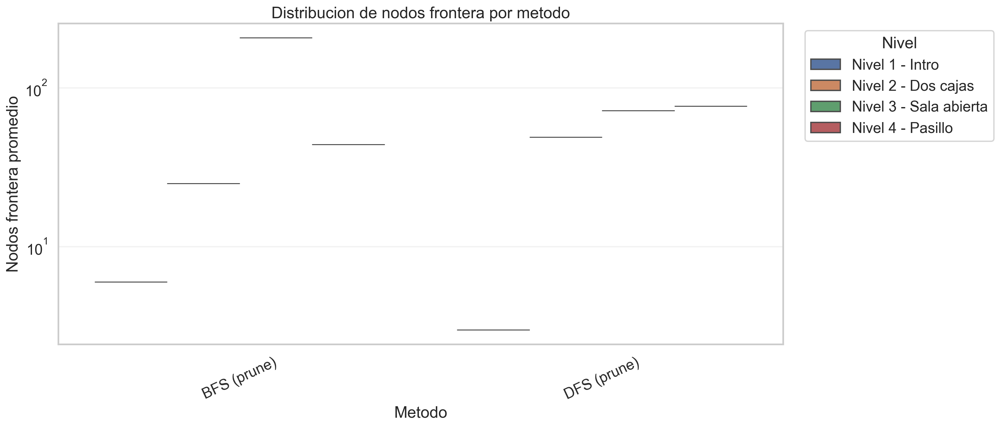

**Qué muestra.** Resume la dispersión de la métrica por método a lo largo de las iteraciones y niveles.

**Por qué importa.** Esta figura es metodológicamente débil para la presentación: como el pipeline es determinista, la caja colapsa casi por completo y lo que ves repite un valor fijo por nivel. La dejaría afuera salvo que quieras mostrar explícitamente que no hubo variación entre corridas.

### `results_dfs_vs_bfs_prune_deadlocks/boxplot_nodes_expanded.png`

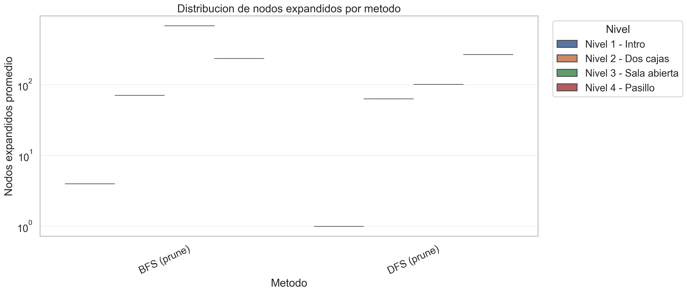

**Qué muestra.** Resume la dispersión de la métrica por método a lo largo de las iteraciones y niveles.

**Por qué importa.** Esta figura es metodológicamente débil para la presentación: como el pipeline es determinista, la caja colapsa casi por completo y lo que ves repite un valor fijo por nivel. La dejaría afuera salvo que quieras mostrar explícitamente que no hubo variación entre corridas.

### `results_dfs_vs_bfs_prune_deadlocks/boxplot_time.png`

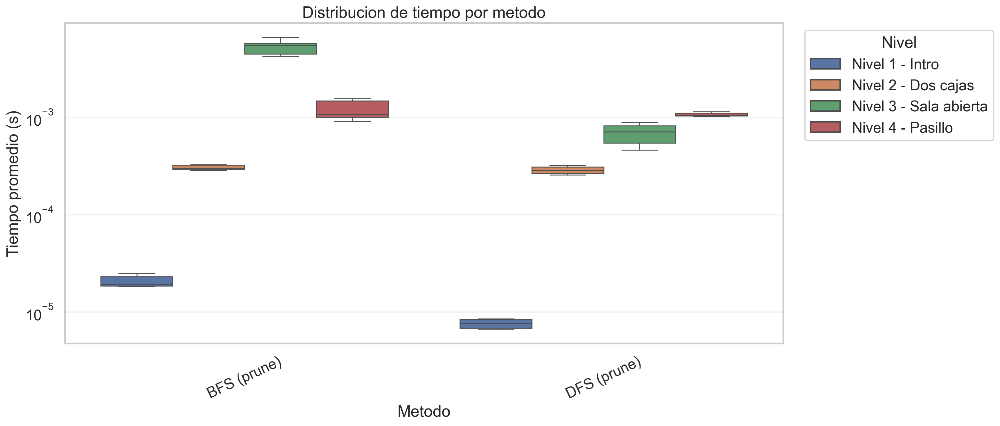

**Qué muestra.** Resume la dispersión de la métrica por método a lo largo de las iteraciones y niveles.

**Por qué importa.** En este proyecto la búsqueda es determinista: los nodos expandidos, la frontera final y el costo no varían entre iteraciones; solo fluctúa el tiempo por ruido de ejecución. Por eso este boxplot sí sirve para hablar de estabilidad temporal, pero no para inferir aleatoriedad algorítmica.

### `results_dfs_vs_bfs_prune_deadlocks/cost_by_level_errorbars.png`

**Qué muestra.** `BFS (prune)` tiene el mejor costo medio global (9) y `DFS (prune)` el peor (65). Además, `Greedy (combined)` empata el costo óptimo en 0/4 niveles, algo muy bueno para estos tableros pero no garantizado en general.

**Por qué importa.** El costo es la métrica más cercana a lo que pide el enunciado como calidad de solución. Para la presentación, esta figura es la que te permite separar “rápido” de “bueno”: DFS puede ser veloz, pero si infla el camino no está resolviendo mejor.

### `results_dfs_vs_bfs_prune_deadlocks/greedy_vs_astar_nodes_expanded_errorbars.png`

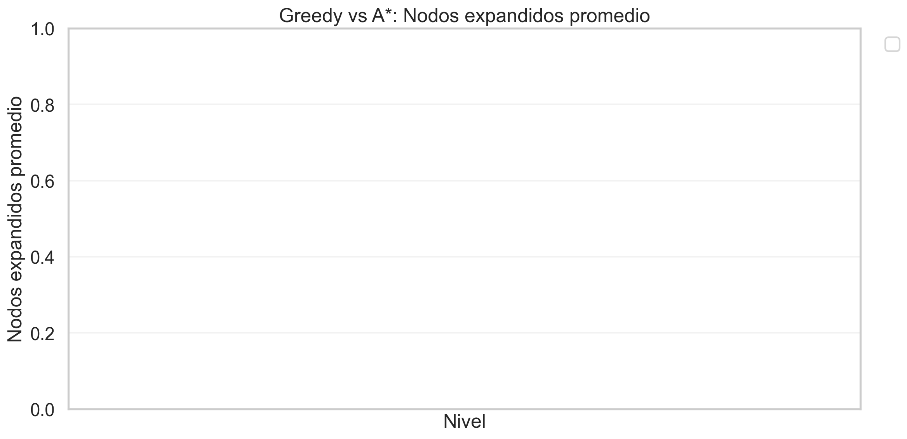

**Qué muestra.** La carpeta no contiene simultáneamente familias `Greedy` y `A*`, así que el archivo no aporta una comparación genuina.

**Por qué importa.** La dejaría fuera de la presentación principal porque el archivo existe por el generador genérico, pero no agrega comparación sustantiva para esta suite.

### `results_dfs_vs_bfs_prune_deadlocks/greedy_vs_astar_time_errorbars.png`

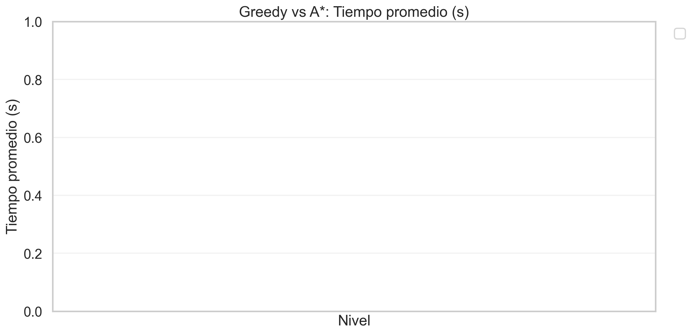

**Qué muestra.** La carpeta no contiene simultáneamente familias `Greedy` y `A*`, así que el archivo no aporta una comparación genuina.

**Por qué importa.** La dejaría fuera de la presentación principal porque el archivo existe por el generador genérico, pero no agrega comparación sustantiva para esta suite.

### `results_dfs_vs_bfs_prune_deadlocks/non_optimal_frontier_count_by_level.png`

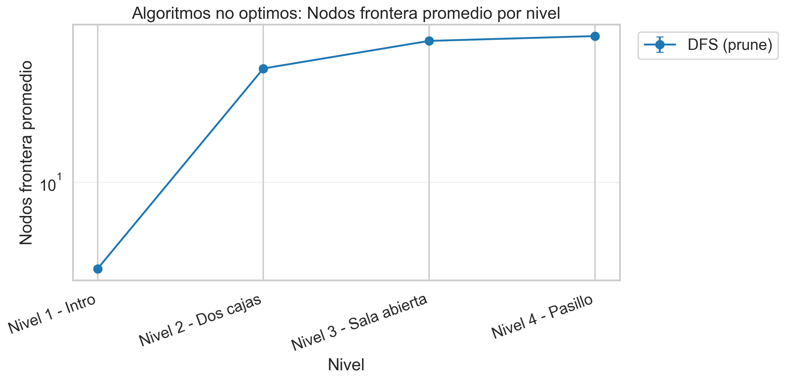

**Qué muestra.** La figura no compara realmente varios métodos no óptimos: solo aparecen `DFS (prune)`.

**Por qué importa.** La dejaría fuera de la presentación principal porque el archivo existe por el generador genérico, pero no agrega comparación sustantiva para esta suite.

### `results_dfs_vs_bfs_prune_deadlocks/non_optimal_nodes_expanded_by_level.png`

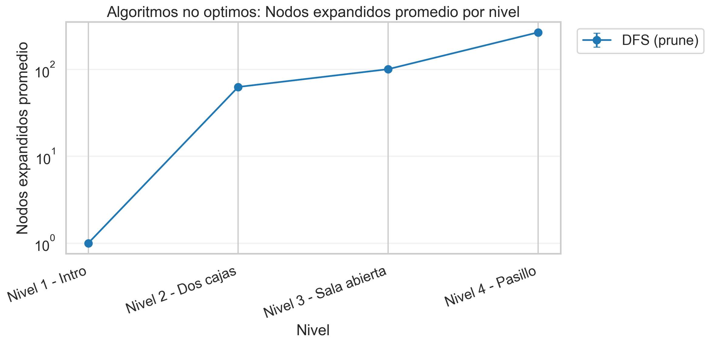

**Qué muestra.** La figura no compara realmente varios métodos no óptimos: solo aparecen `DFS (prune)`.

**Por qué importa.** La dejaría fuera de la presentación principal porque el archivo existe por el generador genérico, pero no agrega comparación sustantiva para esta suite.

### `results_dfs_vs_bfs_prune_deadlocks/non_optimal_time_by_level.png`

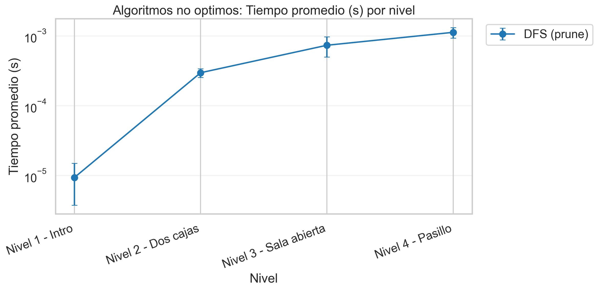

**Qué muestra.** La figura no compara realmente varios métodos no óptimos: solo aparecen `DFS (prune)`.

**Por qué importa.** La dejaría fuera de la presentación principal porque el archivo existe por el generador genérico, pero no agrega comparación sustantiva para esta suite.

### `results_dfs_vs_bfs_prune_deadlocks/optimal_frontier_count_by_level.png`

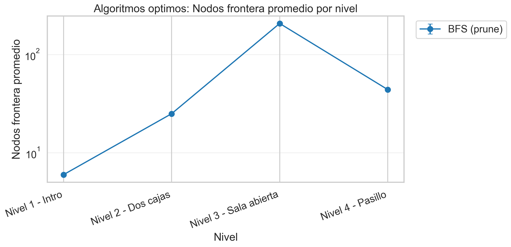

**Qué muestra.** La figura solo contiene `BFS (prune)`. En `results_benchmark_levels` esto pasa porque la corrida quedó reducida a `A* (combined, allow)` con una sola iteración por nivel.

**Por qué importa.** La dejaría fuera de la presentación principal porque el archivo existe por el generador genérico, pero no agrega comparación sustantiva para esta suite.

### `results_dfs_vs_bfs_prune_deadlocks/optimal_nodes_expanded_by_level.png`

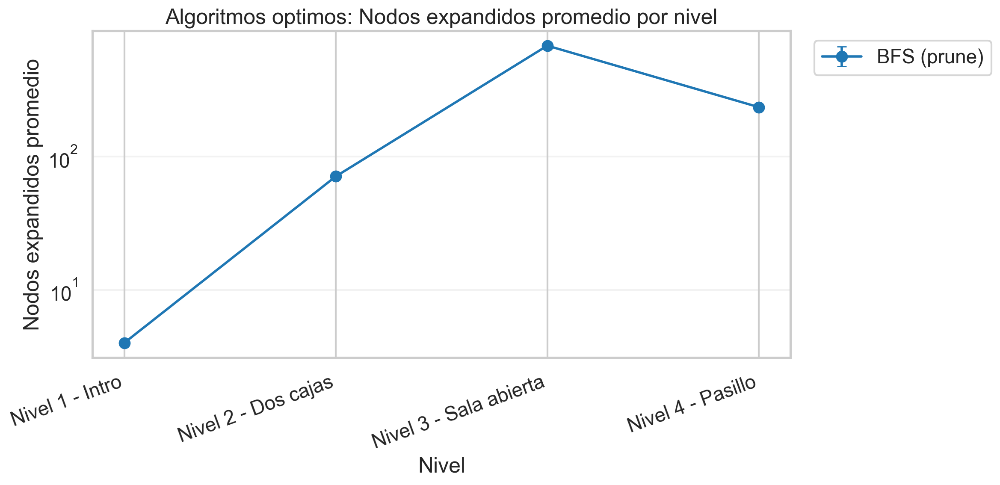

**Qué muestra.** La figura solo contiene `BFS (prune)`. En `results_benchmark_levels` esto pasa porque la corrida quedó reducida a `A* (combined, allow)` con una sola iteración por nivel.

**Por qué importa.** La dejaría fuera de la presentación principal porque el archivo existe por el generador genérico, pero no agrega comparación sustantiva para esta suite.

### `results_dfs_vs_bfs_prune_deadlocks/optimal_time_by_level.png`

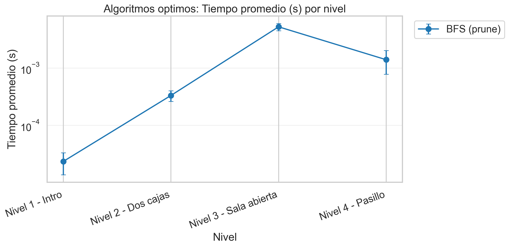

**Qué muestra.** La figura solo contiene `BFS (prune)`. En `results_benchmark_levels` esto pasa porque la corrida quedó reducida a `A* (combined, allow)` con una sola iteración por nivel.

**Por qué importa.** La dejaría fuera de la presentación principal porque el archivo existe por el generador genérico, pero no agrega comparación sustantiva para esta suite.

## `results_greedy_vs_a_star`

Comparativa central entre `Greedy` y `A*` con tres heurísticas admisibles. Es el bloque más rico para discutir heurísticas, optimalidad y costo computacional.

Todas las corridas resumidas en esta carpeta tuvieron `success_rate = 1.0`. La tabla siguiente consolida los promedios globales por solver:

| Solver | Tiempo medio | Nodos expandidos | Frontera final | Costo |
|---|---:|---:|---:|---:|
| Greedy (combined, allow) | 0.000331 s | 20 | 14.75 | 9 |
| Greedy (min_matching, allow) | 0.000352 s | 22.50 | 17.50 | 10 |
| Greedy (static_deadlock, allow) | 0.000507 s | 74.25 | 37 | 15.25 |
| A* (combined, allow) | 0.001170 s | 86 | 45.50 | 9 |
| A* (static_deadlock, allow) | 0.001924 s | 231.75 | 71.50 | 9 |
| A* (min_matching, allow) | 0.002670 s | 202.50 | 153.50 | 9 |

### `results_greedy_vs_a_star/bfs_vs_dfs_nodes_expanded_errorbars.png`

**Qué muestra.** La carpeta no contiene a la vez `BFS` y `DFS`, así que esta figura es un remanente del generador y no una comparación real.

**Por qué importa.** La dejaría fuera de la presentación principal porque el archivo existe por el generador genérico, pero no agrega comparación sustantiva para esta suite.

### `results_greedy_vs_a_star/bfs_vs_dfs_time_errorbars.png`

**Qué muestra.** La carpeta no contiene a la vez `BFS` y `DFS`, así que esta figura es un remanente del generador y no una comparación real.

**Por qué importa.** La dejaría fuera de la presentación principal porque el archivo existe por el generador genérico, pero no agrega comparación sustantiva para esta suite.

### `results_greedy_vs_a_star/boxplot_cost.png`

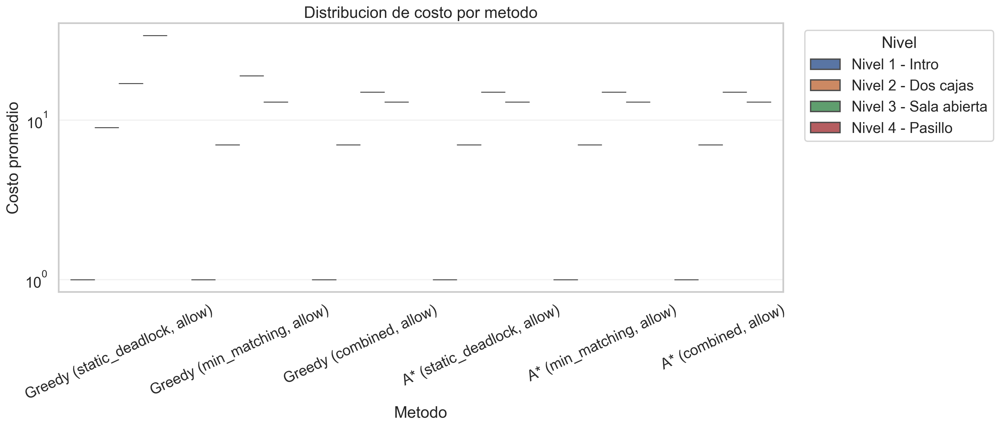

**Qué muestra.** Resume la dispersión de la métrica por método a lo largo de las iteraciones y niveles.

**Por qué importa.** Esta figura es metodológicamente débil para la presentación: como el pipeline es determinista, la caja colapsa casi por completo y lo que ves repite un valor fijo por nivel. La dejaría afuera salvo que quieras mostrar explícitamente que no hubo variación entre corridas.

### `results_greedy_vs_a_star/boxplot_frontier_count.png`

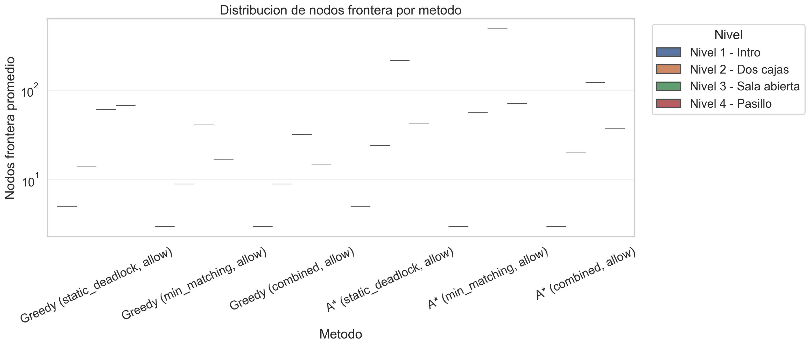

**Qué muestra.** Resume la dispersión de la métrica por método a lo largo de las iteraciones y niveles.

**Por qué importa.** Esta figura es metodológicamente débil para la presentación: como el pipeline es determinista, la caja colapsa casi por completo y lo que ves repite un valor fijo por nivel. La dejaría afuera salvo que quieras mostrar explícitamente que no hubo variación entre corridas.

### `results_greedy_vs_a_star/boxplot_nodes_expanded.png`

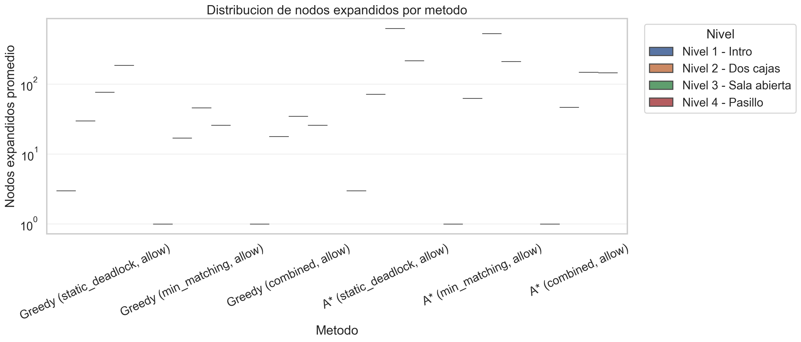

**Qué muestra.** Resume la dispersión de la métrica por método a lo largo de las iteraciones y niveles.

**Por qué importa.** Esta figura es metodológicamente débil para la presentación: como el pipeline es determinista, la caja colapsa casi por completo y lo que ves repite un valor fijo por nivel. La dejaría afuera salvo que quieras mostrar explícitamente que no hubo variación entre corridas.

### `results_greedy_vs_a_star/boxplot_time.png`

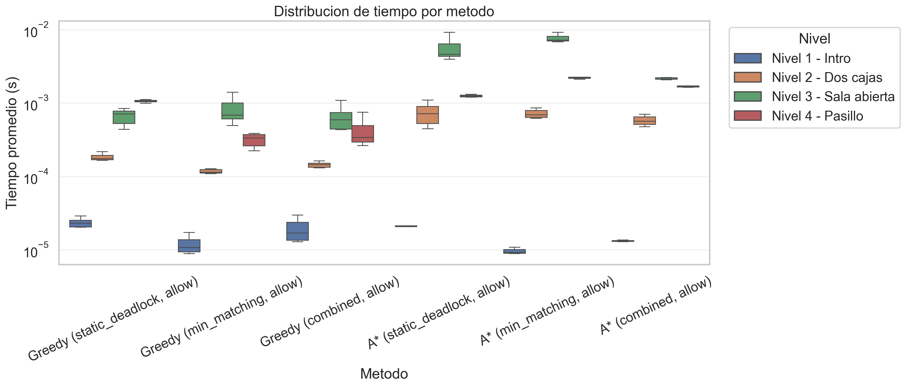

**Qué muestra.** Resume la dispersión de la métrica por método a lo largo de las iteraciones y niveles.

**Por qué importa.** En este proyecto la búsqueda es determinista: los nodos expandidos, la frontera final y el costo no varían entre iteraciones; solo fluctúa el tiempo por ruido de ejecución. Por eso este boxplot sí sirve para hablar de estabilidad temporal, pero no para inferir aleatoriedad algorítmica.

### `results_greedy_vs_a_star/cost_by_level_errorbars.png`

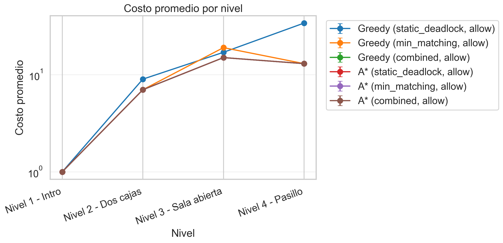

**Qué muestra.** `Greedy (combined, allow)` tiene el mejor costo medio global (9) y `Greedy (static_deadlock, allow)` el peor (15.25). Además, `Greedy (combined)` empata el costo óptimo en 4/4 niveles, algo muy bueno para estos tableros pero no garantizado en general.

**Por qué importa.** El costo es la métrica más cercana a lo que pide el enunciado como calidad de solución. Para la presentación, esta figura es la que te permite separar “rápido” de “bueno”: DFS puede ser veloz, pero si infla el camino no está resolviendo mejor.

### `results_greedy_vs_a_star/greedy_vs_a_star_allow_cost_by_level.png`

**Qué muestra.** Junta las seis variantes informadas por nivel. `Greedy (combined, allow)` es la mejor en promedio de costo y `Greedy (static_deadlock, allow)` la peor.

**Por qué importa.** Esta es una figura fuerte para presentar heurísticas. Acá aparece el dato más interesante de toda la suite: `A*` mantiene costo óptimo con cualquier heurística admisible, mientras que `Greedy (combined)` logra empatarlo en estos cuatro niveles y `Greedy (static_deadlock)` se despega para peor.

### `results_greedy_vs_a_star/greedy_vs_a_star_allow_nodes_expanded_by_level.png`

**Qué muestra.** Junta las seis variantes informadas por nivel. `Greedy (combined, allow)` es la mejor en promedio de nodos expandidos y `A* (static_deadlock, allow)` la peor.

**Por qué importa.** Esta es una figura fuerte para presentar heurísticas. Se ve muy claro que `combined` domina dentro de cada familia: al sumar poder informativo del matching y detección de deadlocks, evita expansiones inútiles sin romper la teoría de admisibilidad en A*.

### `results_greedy_vs_a_star/greedy_vs_a_star_allow_time_seconds_by_level.png`

**Qué muestra.** Junta las seis variantes informadas por nivel. `Greedy (combined, allow)` es la mejor en promedio de tiempo y `A* (min_matching, allow)` la peor.

**Por qué importa.** Esta es una figura fuerte para presentar heurísticas. Se ve muy claro que `combined` domina dentro de cada familia: al sumar poder informativo del matching y detección de deadlocks, evita expansiones inútiles sin romper la teoría de admisibilidad en A*.

### `results_greedy_vs_a_star/greedy_vs_astar_nodes_expanded_errorbars.png`

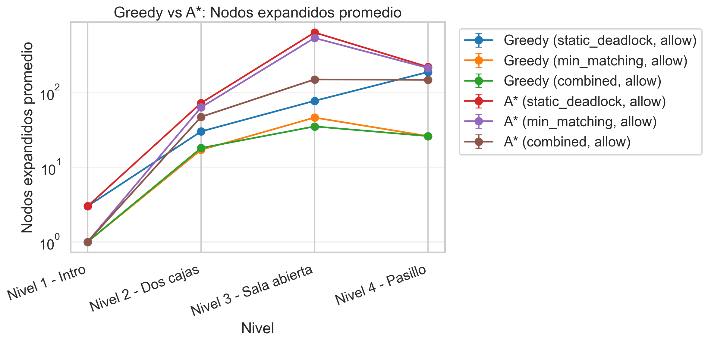

**Qué muestra.** La familia `Greedy` tiene mejor promedio de nodos expandidos y la variante más fuerte es `Greedy (combined, allow)` con 20.

**Por qué importa.** Esta figura sirve para explicar la diferencia conceptual entre “llegar rápido a alguna solución” y “llegar de manera informada a la mejor solución”. Que Greedy expanda menos nodos no contradice la teoría: justamente está siendo más agresivo, no más correcto. La pregunta es si esa agresividad rompe el costo.

### `results_greedy_vs_a_star/greedy_vs_astar_time_errorbars.png`

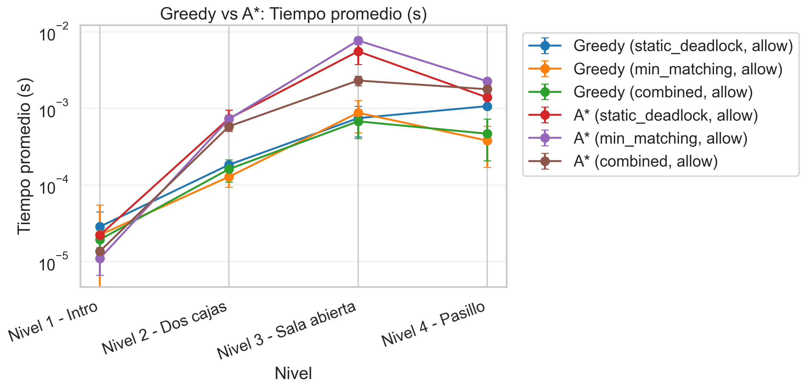

**Qué muestra.** La familia `Greedy` tiene mejor promedio de tiempo y la variante más fuerte es `Greedy (combined, allow)` con 0.000331 s.

**Por qué importa.** Esta figura sirve para explicar la diferencia conceptual entre “llegar rápido a alguna solución” y “llegar de manera informada a la mejor solución”. Greedy suele ganar en tiempo porque prioriza solo `h(n)`, mientras que A* paga más cómputo para garantizar costo óptimo.

### `results_greedy_vs_a_star/non_optimal_frontier_count_by_level.png`

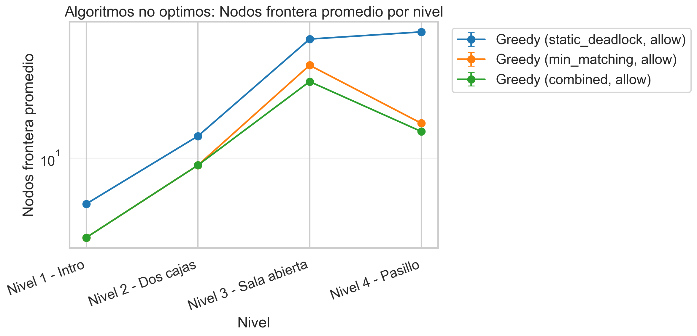

**Qué muestra.** `Greedy (combined, allow)` lidera en frontera final con 14.75 y `Greedy (static_deadlock, allow)` cierra la tabla con 37. El reparto de victorias por nivel favorece a `Greedy (combined, allow)` en 4/4 niveles.

**Por qué importa.** La comparación es interna a la familia no óptima. Cuando `Greedy (combined)` gana, está actuando como una versión pragmática de A*: conserva una guía fuerte pero deja de lado la corrección de costo acumulado.

### `results_greedy_vs_a_star/non_optimal_nodes_expanded_by_level.png`

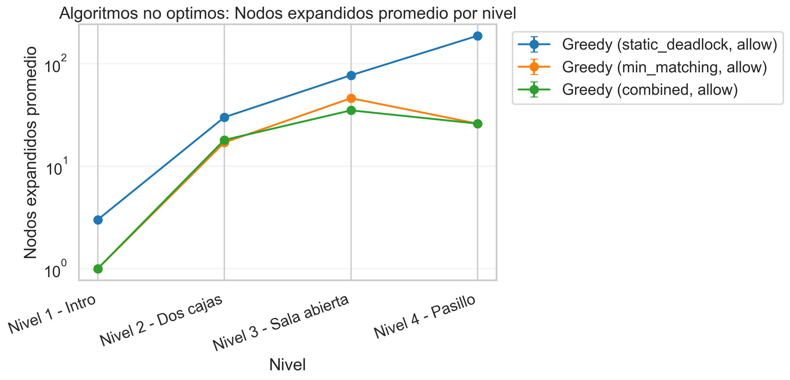

**Qué muestra.** `Greedy (combined, allow)` lidera en nodos expandidos con 20 y `Greedy (static_deadlock, allow)` cierra la tabla con 74.25. El reparto de victorias por nivel favorece a `Greedy (combined, allow)` en 3/4 niveles.

**Por qué importa.** La comparación es interna a la familia no óptima. Cuando `Greedy (combined)` gana, está actuando como una versión pragmática de A*: conserva una guía fuerte pero deja de lado la corrección de costo acumulado.

### `results_greedy_vs_a_star/non_optimal_time_by_level.png`

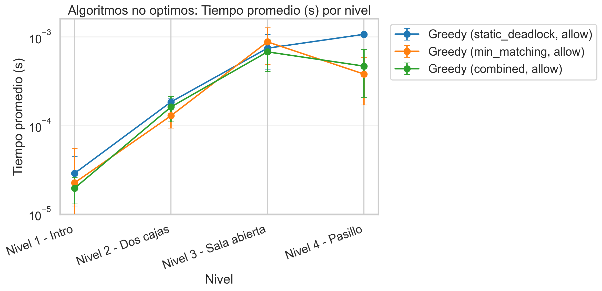

**Qué muestra.** `Greedy (combined, allow)` lidera en tiempo con 0.000331 s y `Greedy (static_deadlock, allow)` cierra la tabla con 0.000507 s. El reparto de victorias por nivel favorece a `Greedy (combined, allow)` en 2/4 niveles.

**Por qué importa.** La comparación es interna a la familia no óptima. Cuando `Greedy (combined)` gana, está actuando como una versión pragmática de A*: conserva una guía fuerte pero deja de lado la corrección de costo acumulado.

### `results_greedy_vs_a_star/optimal_frontier_count_by_level.png`

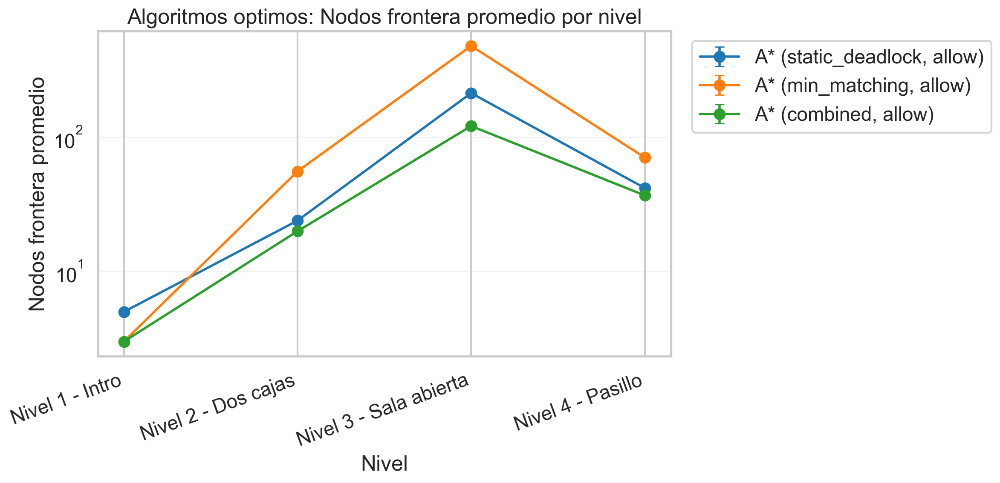

**Qué muestra.** `A* (combined, allow)` es el mejor promedio global en frontera final (45.50) y gana 4/4 niveles, mientras que `A* (min_matching, allow)` queda último con 153.50.

**Por qué importa.** La comparación es interna a la familia óptima. Acá se cumple: todos los métodos óptimos mantienen el mismo costo por nivel y lo que cambia es cuánta búsqueda pagan para llegar a esa solución. El patrón acompaña la intuición de eficiencia espacial, aunque en este trabajo la “frontera” guardada es la frontera al finalizar, no el pico de memoria.

### `results_greedy_vs_a_star/optimal_nodes_expanded_by_level.png`

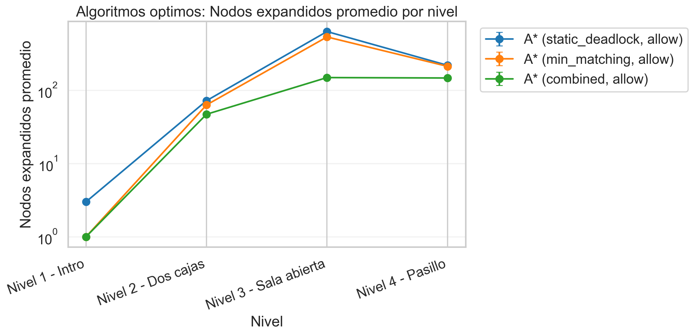

**Qué muestra.** `A* (combined, allow)` es el mejor promedio global en nodos expandidos (86) y gana 4/4 niveles, mientras que `A* (static_deadlock, allow)` queda último con 231.75.

**Por qué importa.** La comparación es interna a la familia óptima. Acá se cumple: todos los métodos óptimos mantienen el mismo costo por nivel y lo que cambia es cuánta búsqueda pagan para llegar a esa solución. Esta es una de las figuras más alineadas con la teoría, porque las expansiones sí reflejan directamente calidad heurística.

### `results_greedy_vs_a_star/optimal_time_by_level.png`

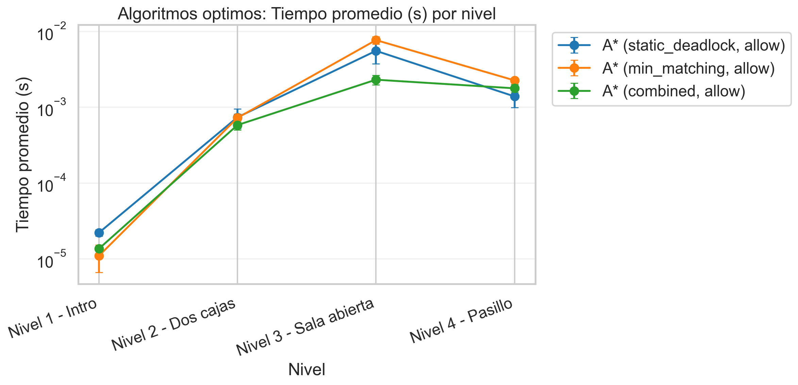

**Qué muestra.** `A* (combined, allow)` es el mejor promedio global en tiempo (0.001170 s) y gana 2/4 niveles, mientras que `A* (min_matching, allow)` queda último con 0.002670 s.

**Por qué importa.** La comparación es interna a la familia óptima. Acá se cumple: todos los métodos óptimos mantienen el mismo costo por nivel y lo que cambia es cuánta búsqueda pagan para llegar a esa solución. No conviene sobreinterpretar `Nivel 1 - Intro`: las diferencias ahí son de microsegundos.

## `results_bfs_dfs_prune_vs_allow`

Comparativas de sensibilidad a la política de deadlocks para `BFS` y `DFS`. Son figuras cortas y muy potentes para la presentación.

### `results_bfs_dfs_prune_vs_allow/bfs_frontier_count_prune_vs_allow_by_level.png`

**Qué muestra.** Compara `BFS (allow)` contra `BFS (prune)` por nivel. En promedio, podar deadlocks deja 77.0% menos en frontera final; la mejora más fuerte aparece en `Nivel 2 - Dos cajas` con 88.3% menos.

**Por qué importa.** En BFS esto era esperable: la poda evita generar capas enteras de estados muertos, así que baja mucho la explosión combinatoria. Son de las mejores figuras para una slide de “lección aprendida”, porque muestran un efecto causal claro con costo de solución idéntico.

### `results_bfs_dfs_prune_vs_allow/bfs_nodes_expanded_prune_vs_allow_by_level.png`

**Qué muestra.** Compara `BFS (allow)` contra `BFS (prune)` por nivel. En promedio, podar deadlocks deja 79.6% menos en nodos expandidos; la mejora más fuerte aparece en `Nivel 3 - Sala abierta` con 83.7% menos.

**Por qué importa.** En BFS esto era esperable: la poda evita generar capas enteras de estados muertos, así que baja mucho la explosión combinatoria. Son de las mejores figuras para una slide de “lección aprendida”, porque muestran un efecto causal claro con costo de solución idéntico.

### `results_bfs_dfs_prune_vs_allow/dfs_frontier_count_prune_vs_allow_by_level.png`

**Qué muestra.** Compara `DFS (allow)` contra `DFS (prune)` por nivel. En promedio, podar deadlocks deja 4.3% menos en frontera final; la mejora más fuerte aparece en `Nivel 2 - Dos cajas` con 9.3% menos.

**Por qué importa.** En DFS la señal es todavía más interesante: la frontera casi no cambia, pero los nodos expandidos sí caen en picada, lo que sugiere que la poda evita excursiones profundas en ramas malas más que ahorrar memoria estructural. Son de las mejores figuras para una slide de “lección aprendida”, porque muestran un efecto causal claro con costo de solución idéntico.

### `results_bfs_dfs_prune_vs_allow/dfs_nodes_expanded_prune_vs_allow_by_level.png`

**Qué muestra.** Compara `DFS (allow)` contra `DFS (prune)` por nivel. En promedio, podar deadlocks deja 95.4% menos en nodos expandidos; la mejora más fuerte aparece en `Nivel 2 - Dos cajas` con 97.8% menos.

**Por qué importa.** En DFS la señal es todavía más interesante: la frontera casi no cambia, pero los nodos expandidos sí caen en picada, lo que sugiere que la poda evita excursiones profundas en ramas malas más que ahorrar memoria estructural. Son de las mejores figuras para una slide de “lección aprendida”, porque muestran un efecto causal claro con costo de solución idéntico.

## `results_barras`

Suite de barras derivada de las carpetas anteriores. Reorganiza los mismos datos en comparativas más legibles para slides y cierre de conclusiones.

Estas figuras no agregan datos nuevos, pero sí reempaquetan la evidencia en formatos más cómodos para una presentación oral. En general, si querés slides limpias, conviene priorizar esta carpeta por sobre algunas curvas originales.

### `results_barras/a_star_heuristics_global_cost_global.png`

**Qué muestra.** `A*: heurísticas comparadas` condensado en una sola barra por alternativa. `A* (combined, allow)` es el mejor promedio global de costo y `A* (combined, allow)` el peor.

**Por qué importa.** Esta versión global sirve para cierre de presentación. La igualdad de costos no es casual: con heurísticas admisibles, A* debe conservar optimalidad. Entonces la discusión real pasa a tiempo, nodos y frontera.

### `results_barras/a_star_heuristics_global_frontier_count_global.png`

**Qué muestra.** `A*: heurísticas comparadas` condensado en una sola barra por alternativa. `A* (combined, allow)` es el mejor promedio global de frontera final y `A* (min_matching, allow)` el peor.

**Por qué importa.** Esta versión global sirve para cierre de presentación. Compara heurísticas admisibles dentro de A*, donde la teoría predice mismo costo final pero distinta eficiencia.

### `results_barras/a_star_heuristics_global_nodes_expanded_global.png`

**Qué muestra.** `A*: heurísticas comparadas` condensado en una sola barra por alternativa. `A* (combined, allow)` es el mejor promedio global de nodos expandidos y `A* (static_deadlock, allow)` el peor.

**Por qué importa.** Esta versión global sirve para cierre de presentación. Compara heurísticas admisibles dentro de A*, donde la teoría predice mismo costo final pero distinta eficiencia.

### `results_barras/a_star_heuristics_global_time_seconds_global.png`

**Qué muestra.** `A*: heurísticas comparadas` condensado en una sola barra por alternativa. `A* (combined, allow)` es el mejor promedio global de tiempo y `A* (min_matching, allow)` el peor.

**Por qué importa.** Esta versión global sirve para cierre de presentación. Compara heurísticas admisibles dentro de A*, donde la teoría predice mismo costo final pero distinta eficiencia.

### `results_barras/bfs_policy_sensitivity_cost_by_level.png`

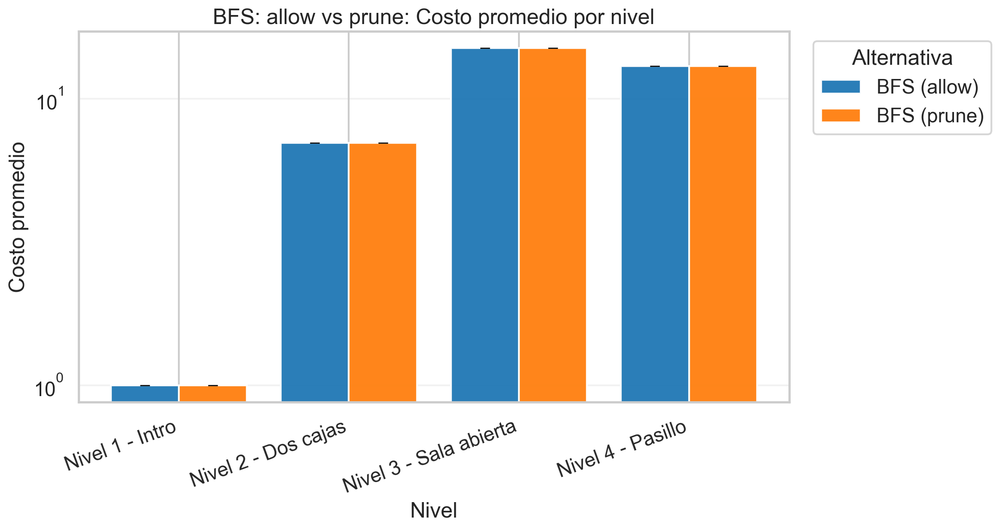

**Qué muestra.** Contrasta `BFS (allow)` contra `BFS (prune)` por nivel. `BFS (prune)` deja prácticamente igual en promedio respecto de `BFS (allow)` para la métrica costo.

**Por qué importa.** La señal fuerte acá es que el costo no cambia: la poda está recortando trabajo inútil, no sacrificando calidad.

### `results_barras/bfs_policy_sensitivity_frontier_count_by_level.png`

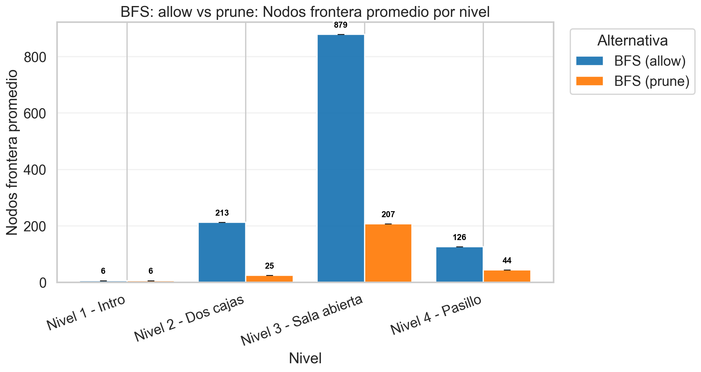

**Qué muestra.** Contrasta `BFS (allow)` contra `BFS (prune)` por nivel. `BFS (prune)` deja 77.0% menos en promedio respecto de `BFS (allow)` para la métrica frontera final.

**Por qué importa.** En BFS la poda recorta amplitud real del árbol, por eso la mejora es especialmente visible en nodos y tiempo.

### `results_barras/bfs_policy_sensitivity_nodes_expanded_by_level.png`

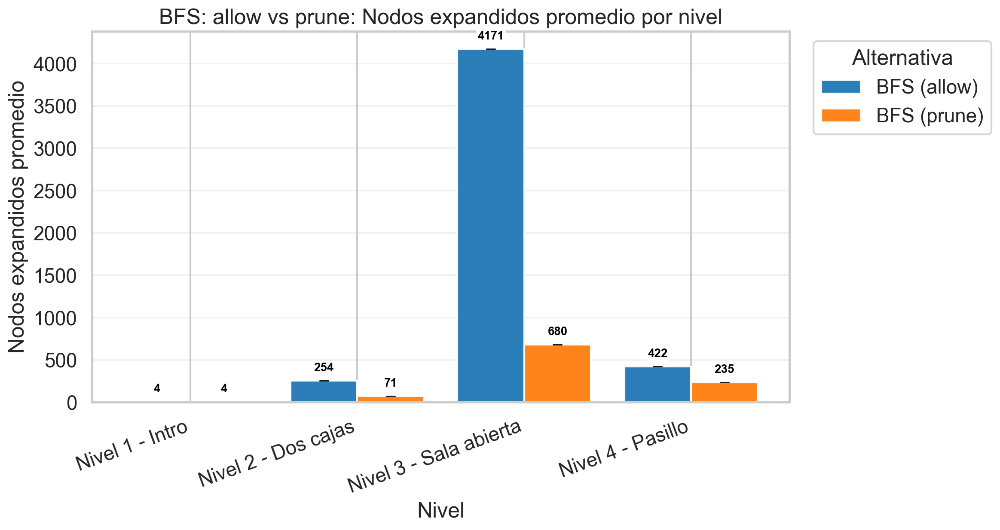

**Qué muestra.** Contrasta `BFS (allow)` contra `BFS (prune)` por nivel. `BFS (prune)` deja 79.6% menos en promedio respecto de `BFS (allow)` para la métrica nodos expandidos.

**Por qué importa.** En BFS la poda recorta amplitud real del árbol, por eso la mejora es especialmente visible en nodos y tiempo.

### `results_barras/bfs_policy_sensitivity_time_seconds_by_level.png`

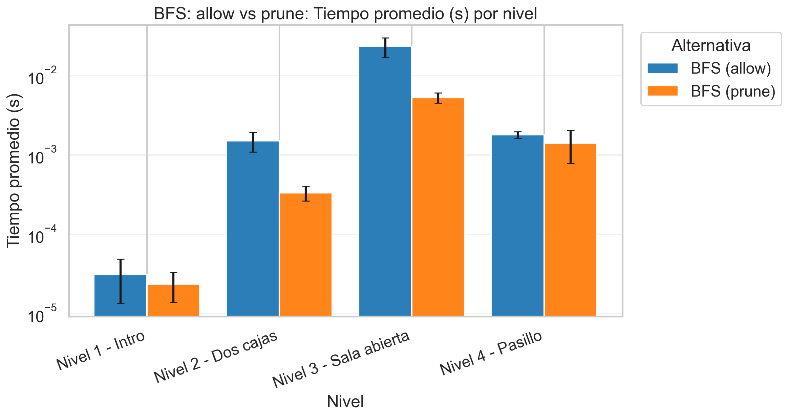

**Qué muestra.** Contrasta `BFS (allow)` contra `BFS (prune)` por nivel. `BFS (prune)` deja 73.7% menos en promedio respecto de `BFS (allow)` para la métrica tiempo.

**Por qué importa.** En BFS la poda recorta amplitud real del árbol, por eso la mejora es especialmente visible en nodos y tiempo.

### `results_barras/bfs_vs_a_star_allow_cost_by_level.png`

**Qué muestra.** `BFS vs A* (allow deadlocks)` por nivel. Globalmente, `A* (combined)` marca el mejor promedio de costo y `A* (combined)` el más alto.

**Por qué importa.** Contrasta una búsqueda óptima no informada con variantes de A* admisibles bajo la misma política de deadlocks permitidos.

### `results_barras/bfs_vs_a_star_allow_frontier_count_by_level.png`

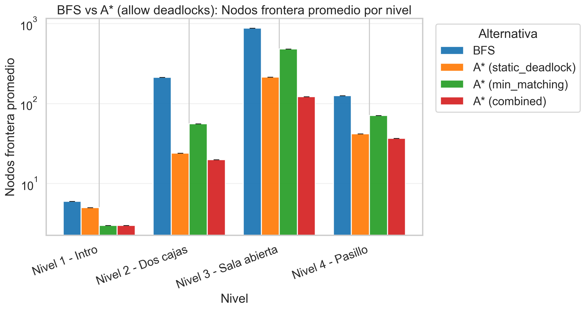

**Qué muestra.** `BFS vs A* (allow deadlocks)` por nivel. Globalmente, `A* (combined)` marca el mejor promedio de frontera final y `BFS` el más alto.

**Por qué importa.** Contrasta una búsqueda óptima no informada con variantes de A* admisibles bajo la misma política de deadlocks permitidos.

### `results_barras/bfs_vs_a_star_allow_nodes_expanded_by_level.png`

**Qué muestra.** `BFS vs A* (allow deadlocks)` por nivel. Globalmente, `A* (combined)` marca el mejor promedio de nodos expandidos y `BFS` el más alto.

**Por qué importa.** Contrasta una búsqueda óptima no informada con variantes de A* admisibles bajo la misma política de deadlocks permitidos.

### `results_barras/bfs_vs_a_star_allow_time_seconds_by_level.png`

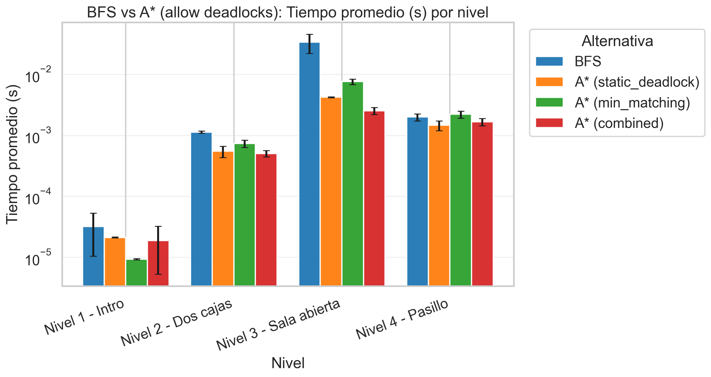

**Qué muestra.** `BFS vs A* (allow deadlocks)` por nivel. Globalmente, `A* (combined)` marca el mejor promedio de tiempo y `BFS` el más alto.

**Por qué importa.** Contrasta una búsqueda óptima no informada con variantes de A* admisibles bajo la misma política de deadlocks permitidos.

### `results_barras/bfs_vs_a_star_prune_cost_by_level.png`

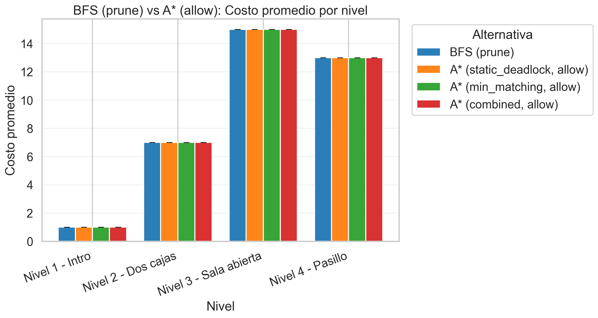

**Qué muestra.** `BFS (prune) vs A* (allow)` por nivel. Globalmente, `A* (combined, allow)` marca el mejor promedio de costo y `A* (combined, allow)` el más alto.

**Por qué importa.** La figura es útil si explicás explícitamente que `BFS` recibe ayuda extra de la poda y `A*` no. Si no, puede inducir una conclusión injusta sobre el algoritmo.

### `results_barras/bfs_vs_a_star_prune_frontier_count_by_level.png`

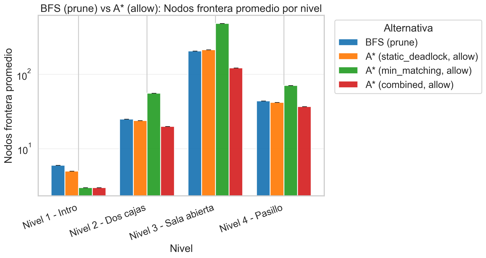

**Qué muestra.** `BFS (prune) vs A* (allow)` por nivel. Globalmente, `A* (combined, allow)` marca el mejor promedio de frontera final y `A* (min_matching, allow)` el más alto.

**Por qué importa.** La figura es útil si explicás explícitamente que `BFS` recibe ayuda extra de la poda y `A*` no. Si no, puede inducir una conclusión injusta sobre el algoritmo.

### `results_barras/bfs_vs_a_star_prune_nodes_expanded_by_level.png`

**Qué muestra.** `BFS (prune) vs A* (allow)` por nivel. Globalmente, `A* (combined, allow)` marca el mejor promedio de nodos expandidos y `BFS (prune)` el más alto.

**Por qué importa.** La figura es útil si explicás explícitamente que `BFS` recibe ayuda extra de la poda y `A*` no. Si no, puede inducir una conclusión injusta sobre el algoritmo.

### `results_barras/bfs_vs_a_star_prune_time_seconds_by_level.png`

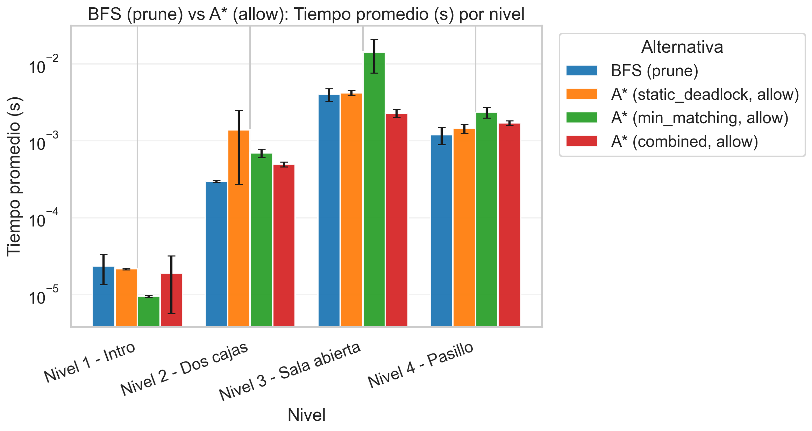

**Qué muestra.** `BFS (prune) vs A* (allow)` por nivel. Globalmente, `A* (combined, allow)` marca el mejor promedio de tiempo y `A* (min_matching, allow)` el más alto.

**Por qué importa.** La figura es útil si explicás explícitamente que `BFS` recibe ayuda extra de la poda y `A*` no. Si no, puede inducir una conclusión injusta sobre el algoritmo.

### `results_barras/bfs_vs_dfs_allow_cost_by_level.png`

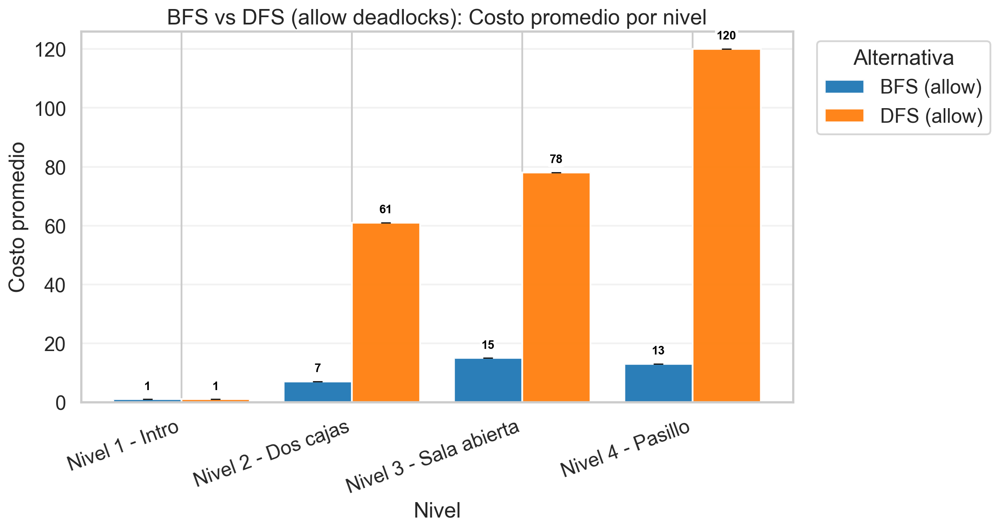

**Qué muestra.** `BFS vs DFS (allow deadlocks)` por nivel. Globalmente, `BFS (allow)` marca el mejor promedio de costo y `DFS (allow)` el más alto.

**Por qué importa.** Es una comparación clásica de amplitud contra profundidad; combinada con costo, cuenta muy bien la teoría del capítulo de búsquedas desinformadas.

### `results_barras/bfs_vs_dfs_allow_frontier_count_by_level.png`

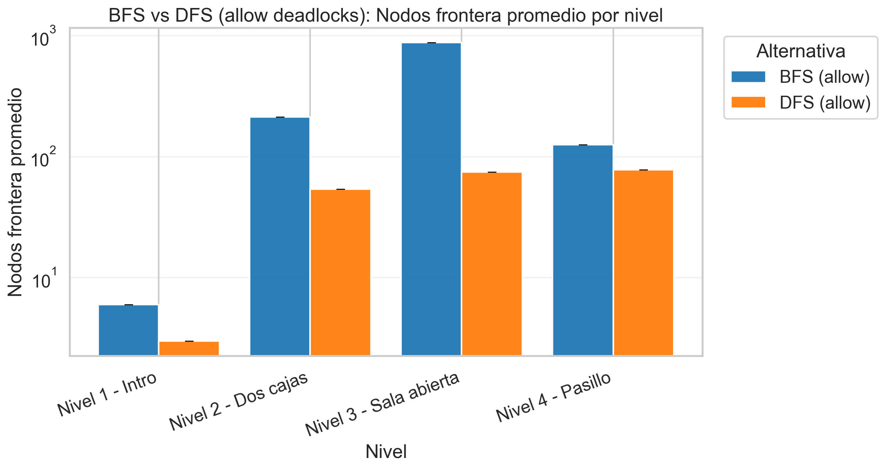

**Qué muestra.** `BFS vs DFS (allow deadlocks)` por nivel. Globalmente, `DFS (allow)` marca el mejor promedio de frontera final y `BFS (allow)` el más alto.

**Por qué importa.** Es una comparación clásica de amplitud contra profundidad; combinada con costo, cuenta muy bien la teoría del capítulo de búsquedas desinformadas.

### `results_barras/bfs_vs_dfs_allow_nodes_expanded_by_level.png`

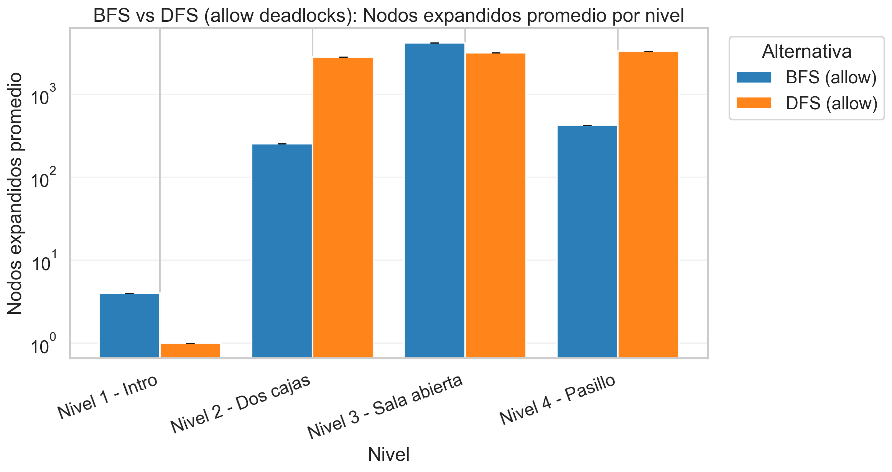

**Qué muestra.** `BFS vs DFS (allow deadlocks)` por nivel. Globalmente, `BFS (allow)` marca el mejor promedio de nodos expandidos y `DFS (allow)` el más alto.

**Por qué importa.** Es una comparación clásica de amplitud contra profundidad; combinada con costo, cuenta muy bien la teoría del capítulo de búsquedas desinformadas.

### `results_barras/bfs_vs_dfs_allow_time_seconds_by_level.png`

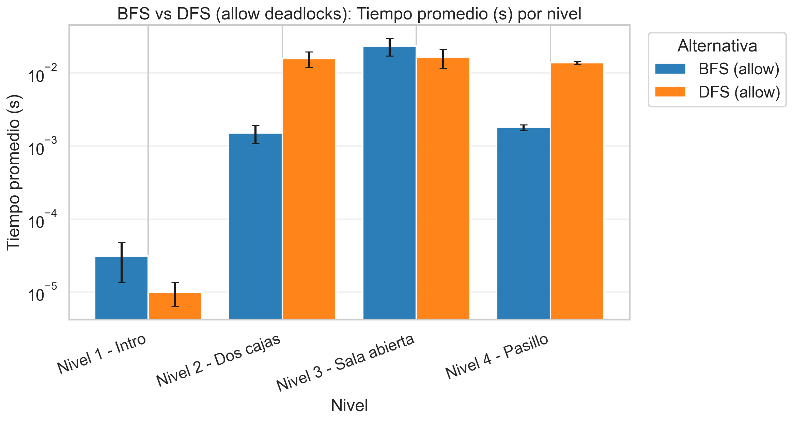

**Qué muestra.** `BFS vs DFS (allow deadlocks)` por nivel. Globalmente, `BFS (allow)` marca el mejor promedio de tiempo y `DFS (allow)` el más alto.

**Por qué importa.** Es una comparación clásica de amplitud contra profundidad; combinada con costo, cuenta muy bien la teoría del capítulo de búsquedas desinformadas.

### `results_barras/bfs_vs_dfs_prune_cost_by_level.png`

**Qué muestra.** `BFS vs DFS (prune deadlocks)` por nivel. Globalmente, `BFS (prune)` marca el mejor promedio de costo y `DFS (prune)` el más alto.

**Por qué importa.** Es una comparación clásica de amplitud contra profundidad; combinada con costo, cuenta muy bien la teoría del capítulo de búsquedas desinformadas.

### `results_barras/bfs_vs_dfs_prune_frontier_count_by_level.png`

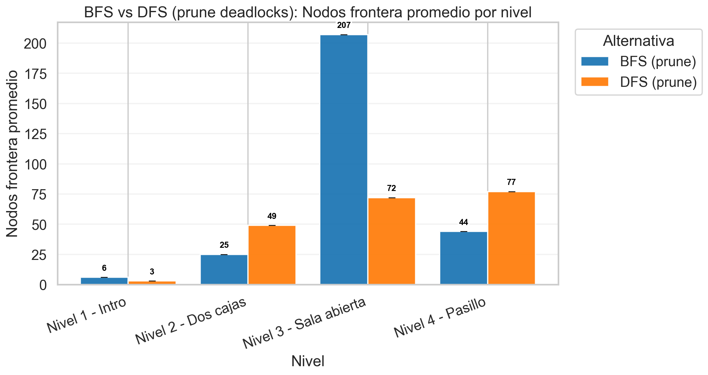

**Qué muestra.** `BFS vs DFS (prune deadlocks)` por nivel. Globalmente, `DFS (prune)` marca el mejor promedio de frontera final y `BFS (prune)` el más alto.

**Por qué importa.** Es una comparación clásica de amplitud contra profundidad; combinada con costo, cuenta muy bien la teoría del capítulo de búsquedas desinformadas.

### `results_barras/bfs_vs_dfs_prune_nodes_expanded_by_level.png`

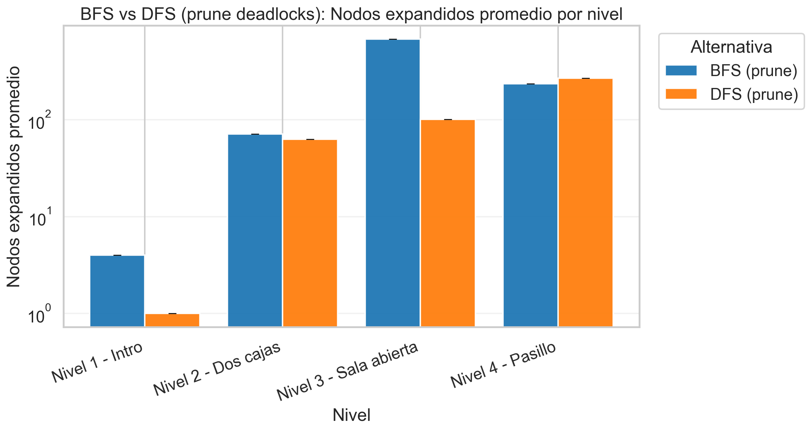

**Qué muestra.** `BFS vs DFS (prune deadlocks)` por nivel. Globalmente, `DFS (prune)` marca el mejor promedio de nodos expandidos y `BFS (prune)` el más alto.

**Por qué importa.** Es una comparación clásica de amplitud contra profundidad; combinada con costo, cuenta muy bien la teoría del capítulo de búsquedas desinformadas.

### `results_barras/bfs_vs_dfs_prune_time_seconds_by_level.png`

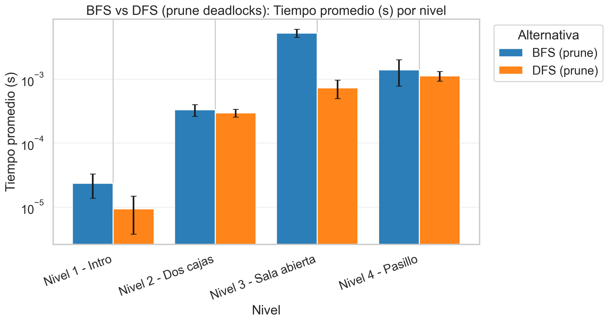

**Qué muestra.** `BFS vs DFS (prune deadlocks)` por nivel. Globalmente, `DFS (prune)` marca el mejor promedio de tiempo y `BFS (prune)` el más alto.

**Por qué importa.** Es una comparación clásica de amplitud contra profundidad; combinada con costo, cuenta muy bien la teoría del capítulo de búsquedas desinformadas.

### `results_barras/dfs_policy_sensitivity_cost_by_level.png`

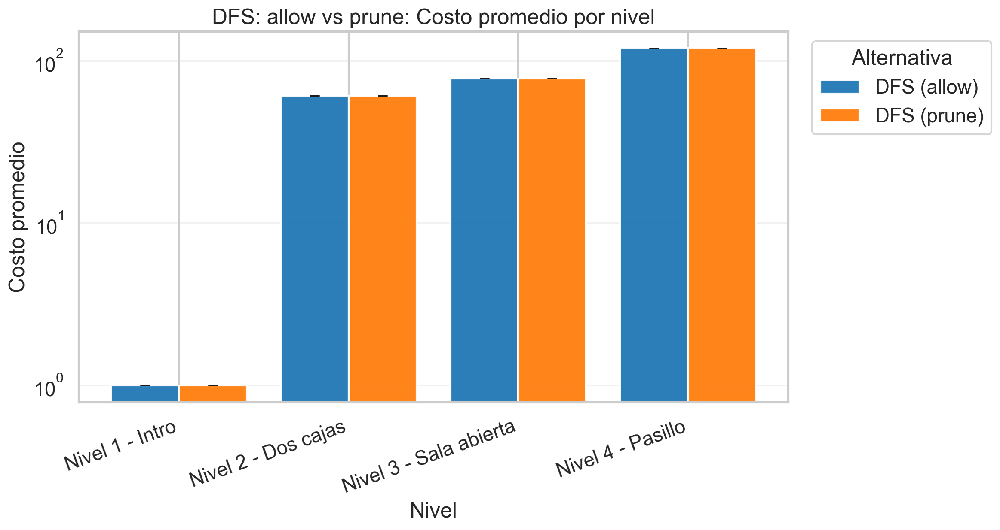

**Qué muestra.** Contrasta `DFS (allow)` contra `DFS (prune)` por nivel. `DFS (prune)` deja prácticamente igual en promedio respecto de `DFS (allow)` para la métrica costo.

**Por qué importa.** La señal fuerte acá es que el costo no cambia: la poda está recortando trabajo inútil, no sacrificando calidad.

### `results_barras/dfs_policy_sensitivity_frontier_count_by_level.png`

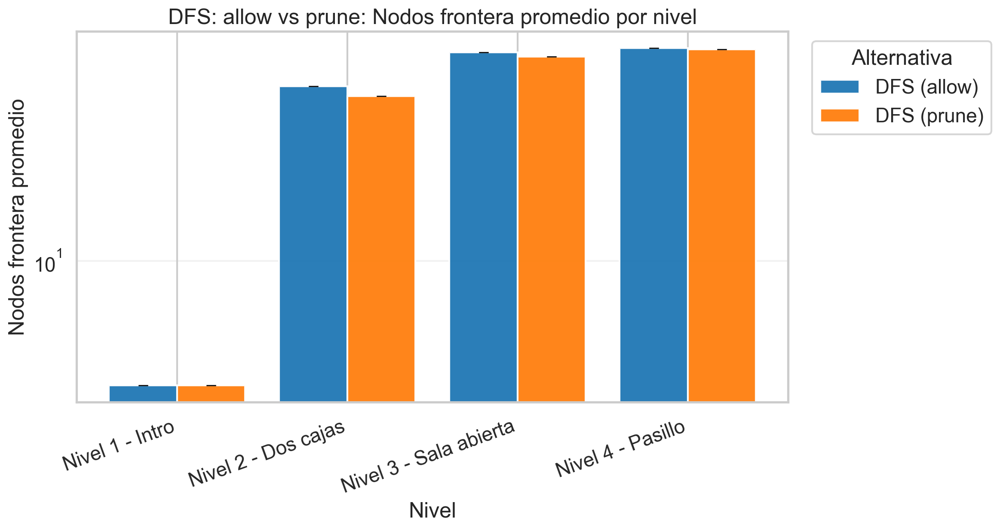

**Qué muestra.** Contrasta `DFS (allow)` contra `DFS (prune)` por nivel. `DFS (prune)` deja 4.3% menos en promedio respecto de `DFS (allow)` para la métrica frontera final.

**Por qué importa.** En DFS la poda es casi una corrección de comportamiento: evita que el orden de acciones lo arrastre por regiones estériles.

### `results_barras/dfs_policy_sensitivity_nodes_expanded_by_level.png`

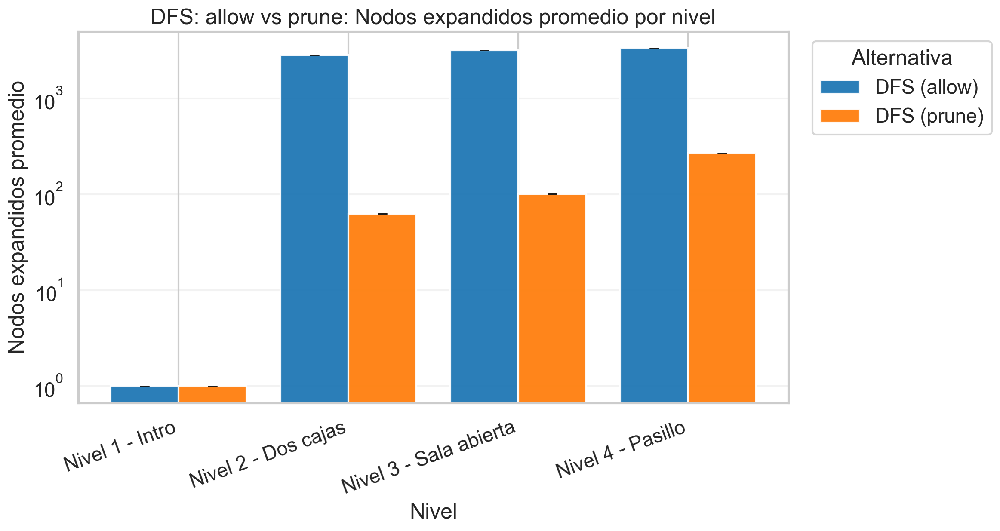

**Qué muestra.** Contrasta `DFS (allow)` contra `DFS (prune)` por nivel. `DFS (prune)` deja 95.4% menos en promedio respecto de `DFS (allow)` para la métrica nodos expandidos.

**Por qué importa.** En DFS la poda es casi una corrección de comportamiento: evita que el orden de acciones lo arrastre por regiones estériles.

### `results_barras/dfs_policy_sensitivity_time_seconds_by_level.png`

**Qué muestra.** Contrasta `DFS (allow)` contra `DFS (prune)` por nivel. `DFS (prune)` deja 95.3% menos en promedio respecto de `DFS (allow)` para la métrica tiempo.

**Por qué importa.** En DFS la poda es casi una corrección de comportamiento: evita que el orden de acciones lo arrastre por regiones estériles.

### `results_barras/dfs_vs_greedy_allow_cost_by_level.png`

**Qué muestra.** `DFS (allow) vs Greedy (allow)` por nivel. Globalmente, `Greedy (combined, allow)` marca el mejor promedio de costo y `DFS (allow)` el más alto.

**Por qué importa.** Sirve para mostrar que una heurística razonable vale más que explorar profundo “a ciegas”, aun cuando el método siga siendo no óptimo.

### `results_barras/dfs_vs_greedy_allow_frontier_count_by_level.png`

**Qué muestra.** `DFS (allow) vs Greedy (allow)` por nivel. Globalmente, `Greedy (combined, allow)` marca el mejor promedio de frontera final y `DFS (allow)` el más alto.

**Por qué importa.** Sirve para mostrar que una heurística razonable vale más que explorar profundo “a ciegas”, aun cuando el método siga siendo no óptimo.

### `results_barras/dfs_vs_greedy_allow_nodes_expanded_by_level.png`

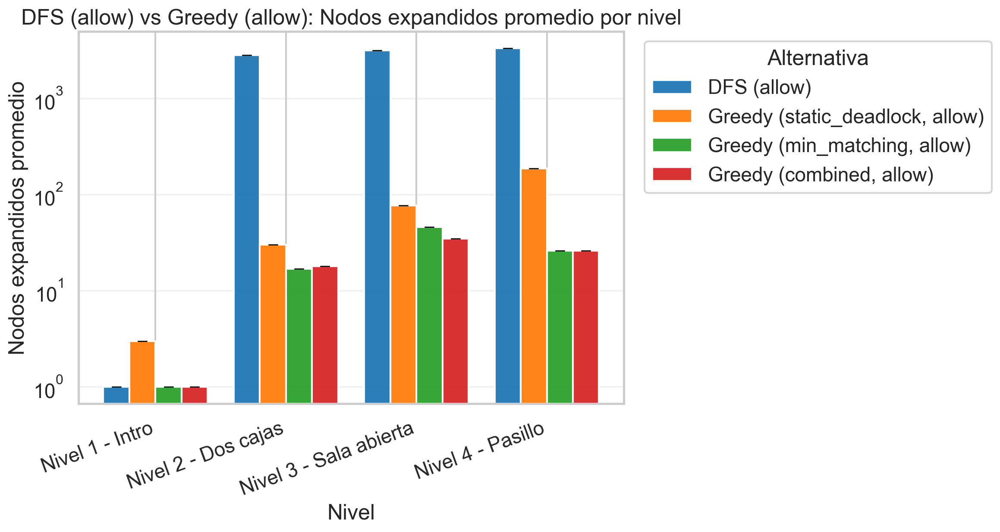

**Qué muestra.** `DFS (allow) vs Greedy (allow)` por nivel. Globalmente, `Greedy (combined, allow)` marca el mejor promedio de nodos expandidos y `DFS (allow)` el más alto.

**Por qué importa.** Sirve para mostrar que una heurística razonable vale más que explorar profundo “a ciegas”, aun cuando el método siga siendo no óptimo.

### `results_barras/dfs_vs_greedy_allow_time_seconds_by_level.png`

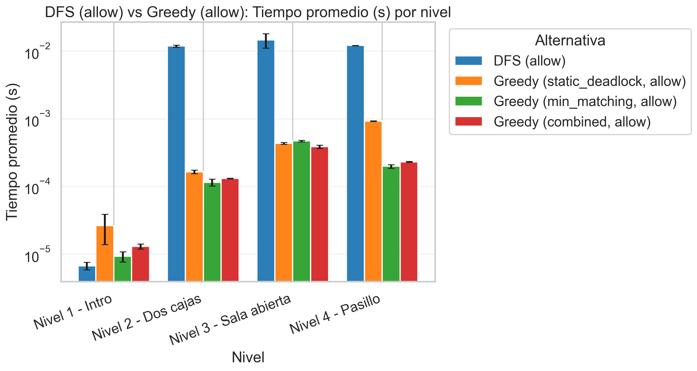

**Qué muestra.** `DFS (allow) vs Greedy (allow)` por nivel. Globalmente, `Greedy (combined, allow)` marca el mejor promedio de tiempo y `DFS (allow)` el más alto.

**Por qué importa.** Sirve para mostrar que una heurística razonable vale más que explorar profundo “a ciegas”, aun cuando el método siga siendo no óptimo.

### `results_barras/dfs_vs_greedy_prune_cost_by_level.png`

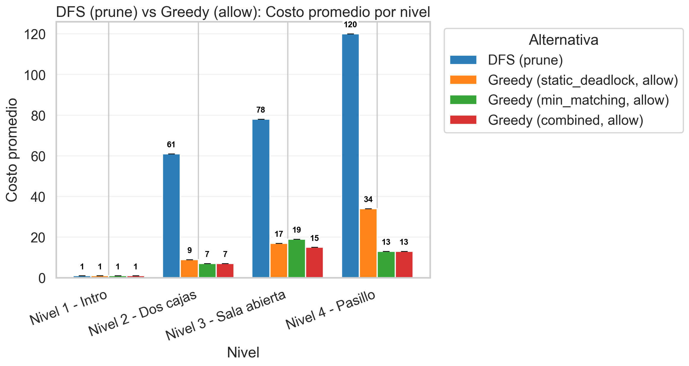

**Qué muestra.** `DFS (prune) vs Greedy (allow)` por nivel. Globalmente, `Greedy (combined, allow)` marca el mejor promedio de costo y `DFS (prune)` el más alto.

**Por qué importa.** Sirve para mostrar que una heurística razonable vale más que explorar profundo “a ciegas”, aun cuando el método siga siendo no óptimo.

### `results_barras/dfs_vs_greedy_prune_frontier_count_by_level.png`

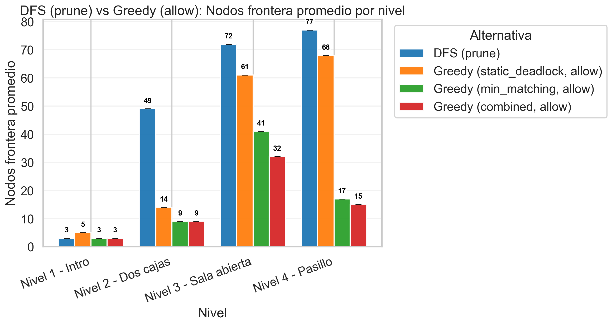

**Qué muestra.** `DFS (prune) vs Greedy (allow)` por nivel. Globalmente, `Greedy (combined, allow)` marca el mejor promedio de frontera final y `DFS (prune)` el más alto.

**Por qué importa.** Sirve para mostrar que una heurística razonable vale más que explorar profundo “a ciegas”, aun cuando el método siga siendo no óptimo.

### `results_barras/dfs_vs_greedy_prune_nodes_expanded_by_level.png`

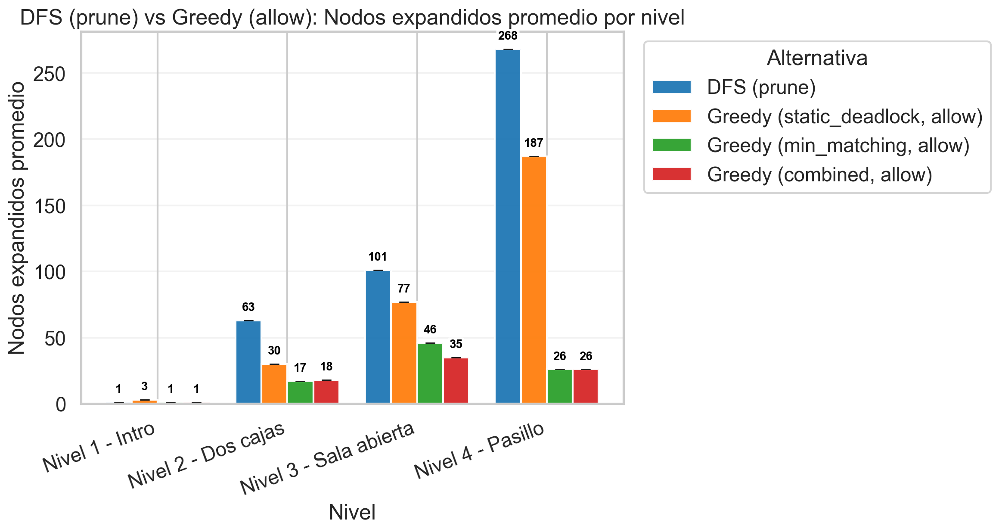

**Qué muestra.** `DFS (prune) vs Greedy (allow)` por nivel. Globalmente, `Greedy (combined, allow)` marca el mejor promedio de nodos expandidos y `DFS (prune)` el más alto.

**Por qué importa.** Sirve para mostrar que una heurística razonable vale más que explorar profundo “a ciegas”, aun cuando el método siga siendo no óptimo.

### `results_barras/dfs_vs_greedy_prune_time_seconds_by_level.png`

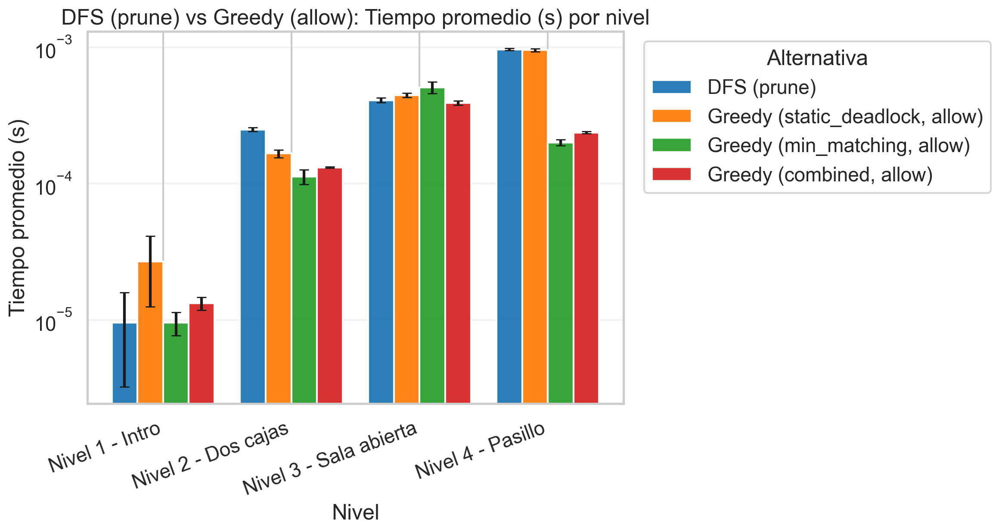

**Qué muestra.** `DFS (prune) vs Greedy (allow)` por nivel. Globalmente, `Greedy (combined, allow)` marca el mejor promedio de tiempo y `DFS (prune)` el más alto.

**Por qué importa.** Sirve para mostrar que una heurística razonable vale más que explorar profundo “a ciegas”, aun cuando el método siga siendo no óptimo.

### `results_barras/greedy_heuristics_global_cost_global.png`

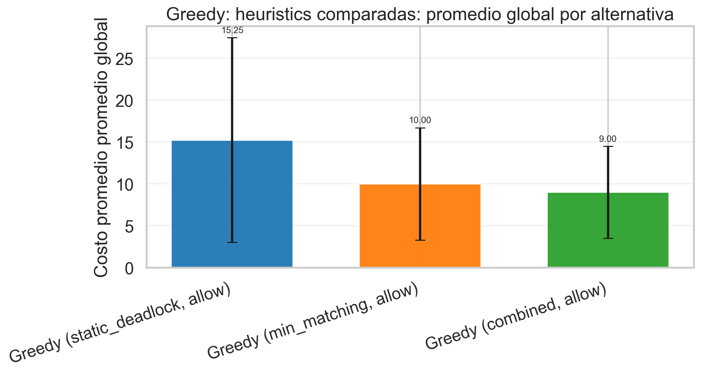

**Qué muestra.** `Greedy: heurísticas comparadas` condensado en una sola barra por alternativa. `Greedy (combined, allow)` es el mejor promedio global de costo y `Greedy (static_deadlock, allow)` el peor.

**Por qué importa.** Esta versión global sirve para cierre de presentación. Acá se ve bien por qué `static_deadlock` sola es floja como criterio de orden: detecta imposibles, pero no aproxima distancia a la meta.

### `results_barras/greedy_heuristics_global_frontier_count_global.png`

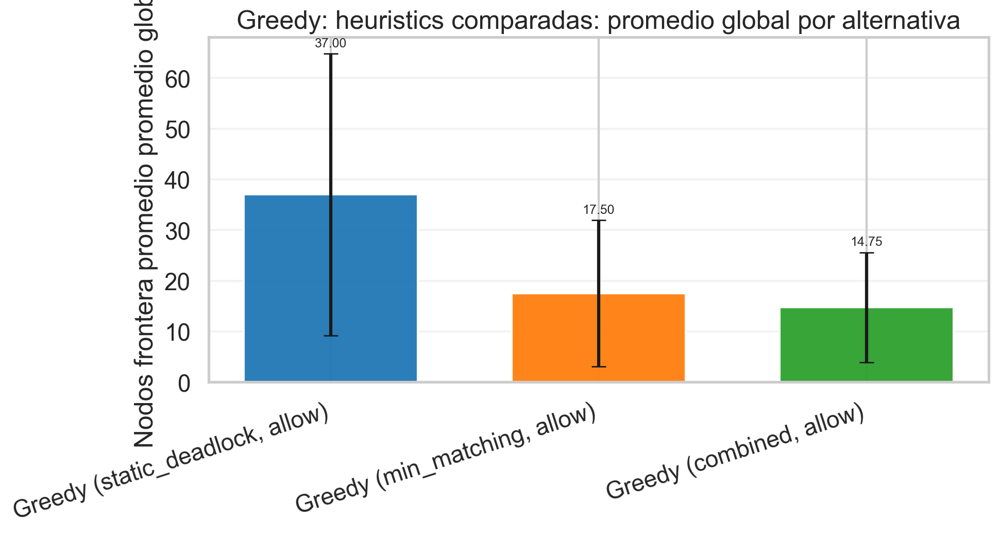

**Qué muestra.** `Greedy: heurísticas comparadas` condensado en una sola barra por alternativa. `Greedy (combined, allow)` es el mejor promedio global de frontera final y `Greedy (static_deadlock, allow)` el peor.

**Por qué importa.** Esta versión global sirve para cierre de presentación. Compara cuánto aporta cada heurística dentro de Greedy, donde la calidad del ranking h(n) es todo.

### `results_barras/greedy_heuristics_global_nodes_expanded_global.png`

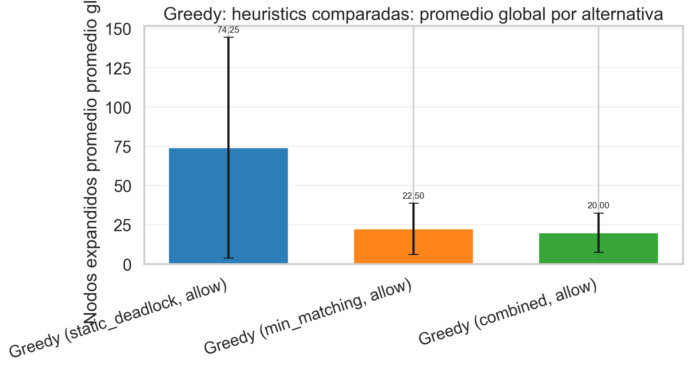

**Qué muestra.** `Greedy: heurísticas comparadas` condensado en una sola barra por alternativa. `Greedy (combined, allow)` es el mejor promedio global de nodos expandidos y `Greedy (static_deadlock, allow)` el peor.

**Por qué importa.** Esta versión global sirve para cierre de presentación. Compara cuánto aporta cada heurística dentro de Greedy, donde la calidad del ranking h(n) es todo.

### `results_barras/greedy_heuristics_global_time_seconds_global.png`

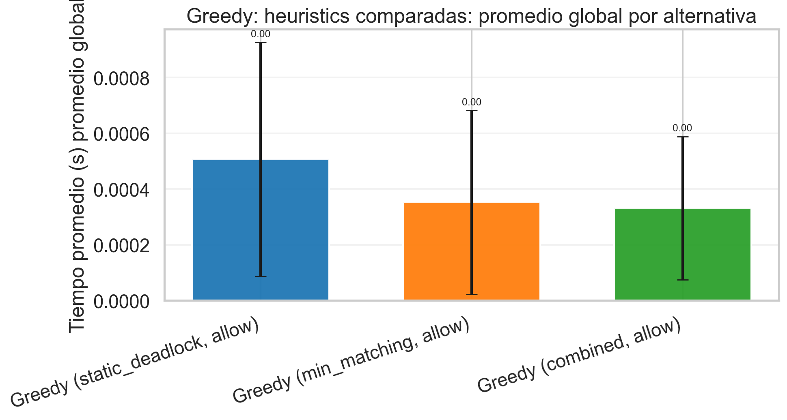

**Qué muestra.** `Greedy: heurísticas comparadas` condensado en una sola barra por alternativa. `Greedy (combined, allow)` es el mejor promedio global de tiempo y `Greedy (static_deadlock, allow)` el peor.

**Por qué importa.** Esta versión global sirve para cierre de presentación. Compara cuánto aporta cada heurística dentro de Greedy, donde la calidad del ranking h(n) es todo.

### `results_barras/greedy_vs_a_star_allow_cost_by_level.png`

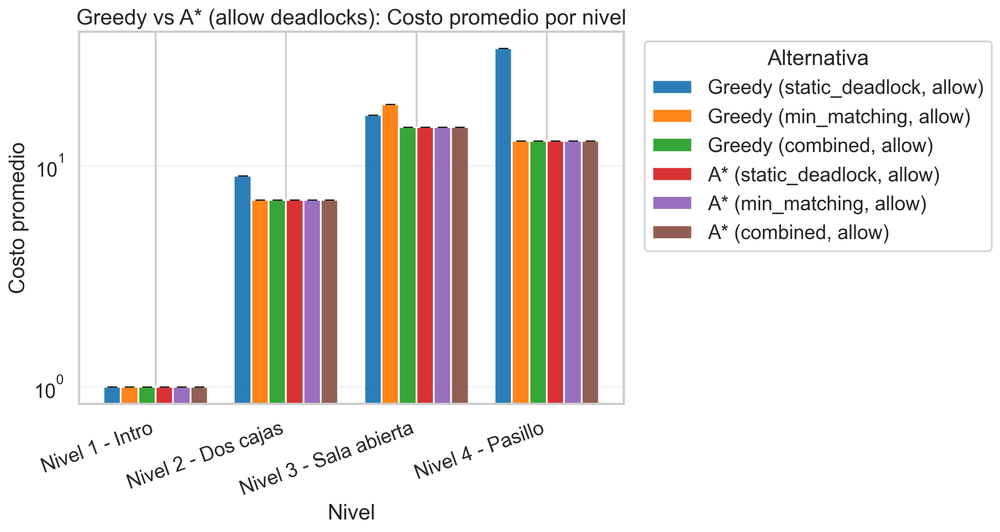

**Qué muestra.** `Greedy vs A* (allow deadlocks)` por nivel. Globalmente, `Greedy (combined, allow)` marca el mejor promedio de costo y `Greedy (static_deadlock, allow)` el más alto.

**Por qué importa.** Muy buena slide: deja ver que `A*` conserva optimalidad y que `Greedy (combined)` logra empatarla en este set acotado, algo prometedor pero no generalizable sin niveles más difíciles.

### `results_barras/greedy_vs_a_star_allow_frontier_count_by_level.png`

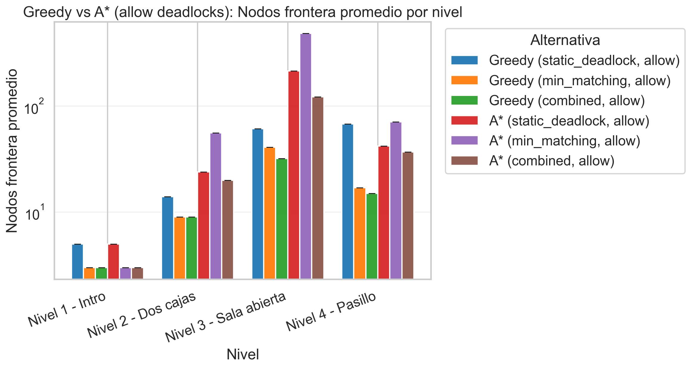

**Qué muestra.** `Greedy vs A* (allow deadlocks)` por nivel. Globalmente, `Greedy (combined, allow)` marca el mejor promedio de frontera final y `A* (min_matching, allow)` el más alto.

**Por qué importa.** Es la comparación conceptual más importante del trabajo: rapidez y agresividad de Greedy contra optimalidad garantizada de A*.

### `results_barras/greedy_vs_a_star_allow_nodes_expanded_by_level.png`

**Qué muestra.** `Greedy vs A* (allow deadlocks)` por nivel. Globalmente, `Greedy (combined, allow)` marca el mejor promedio de nodos expandidos y `A* (static_deadlock, allow)` el más alto.

**Por qué importa.** Es la comparación conceptual más importante del trabajo: rapidez y agresividad de Greedy contra optimalidad garantizada de A*.

### `results_barras/greedy_vs_a_star_allow_time_seconds_by_level.png`

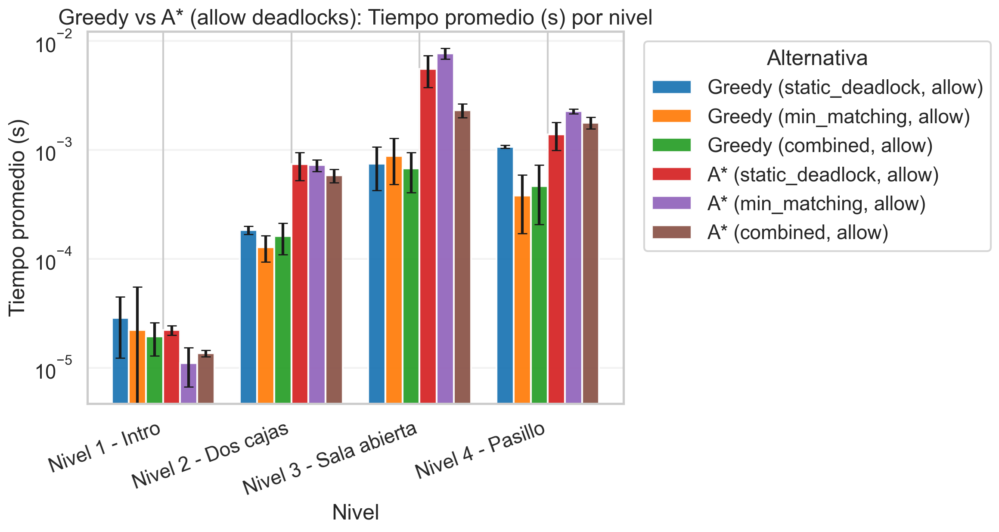

**Qué muestra.** `Greedy vs A* (allow deadlocks)` por nivel. Globalmente, `Greedy (combined, allow)` marca el mejor promedio de tiempo y `A* (min_matching, allow)` el más alto.

**Por qué importa.** Es la comparación conceptual más importante del trabajo: rapidez y agresividad de Greedy contra optimalidad garantizada de A*.

## Posibles Mejoras Y Nuevas Comparativas Para Generar

- Rehacer `results_benchmark_levels` con la grilla completa de 8 métodos y varias iteraciones; hoy es una corrida parcial de `A* (combined, allow)` y no sirve como benchmark comparativo.
- Agregar comparativas limpias `A* (allow) vs A* (prune)` y `Greedy (allow) vs Greedy (prune)` para aislar el efecto de la poda dentro del mismo algoritmo.
- Medir **pico de frontera** además de `frontier_count` final. Para presentación, memoria pico es mucho más defendible como complejidad espacial.
- Incorporar una métrica de **suboptimality gap** para los no óptimos: `(coste_metodo - coste_optimo) / coste_optimo`. Con este set mostraría que `Greedy (combined)` empata al óptimo y que `DFS` no.
- Mostrar factores de reducción (`x veces menos nodos`, `x veces menos tiempo`) en lugar de solo valores absolutos. Queda especialmente bien para `BFS allow vs prune` y `A* (combined) vs BFS`.
- Variar el orden de acciones `UP, DOWN, LEFT, RIGHT` o randomizar tie-breaks. Hoy `DFS` depende fuertemente de un orden fijo, así que parte del resultado es “sesgo de orden” y no solo propiedad del algoritmo.
- Añadir niveles más difíciles: más cajas, cuellos de botella y trampas. Con solo cuatro niveles y 100% de éxito, las diferencias de robustez quedan escondidas.
- Separar tiempo de evaluación heurística de tiempo de búsqueda, por ejemplo midiendo `tiempo / nodo expandido`. Eso mostraría mejor el overhead de `min_matching` y cuándo se amortiza.
- Incluir `IDDFS` si querés sumar una comparación clásica extra del enunciado. En Sokoban no necesariamente va a ganar, pero sirve mucho para la defensa teórica.
- Considerar presentar `static_deadlock` como mecanismo de poda y no como heurística “competidora” plena. Teóricamente tiene sentido porque casi no rankea estados; solo distingue imposibles de no imposibles.
- Si vas a mantener iteraciones con seeds distintas, introducir alguna fuente real de variación experimental; de lo contrario las barras de error de nodos, frontera y costo seguirán colapsadas a cero.

## Cierre

La historia más fuerte para contar en la presentación es: **la información heurística correcta importa más que la fuerza bruta**, y **la poda de deadlocks cambia radicalmente la eficiencia sin empeorar el costo**. Para una narrativa clara, yo priorizaría estas figuras: `results_greedy_vs_a_star`, `results_dfs_vs_bfs_allow_deadlocks`, `results_dfs_vs_bfs_prune_deadlocks`, `results_bfs_dfs_prune_vs_allow` y `results_barras` de sensibilidad/políticas y heurísticas globales.
