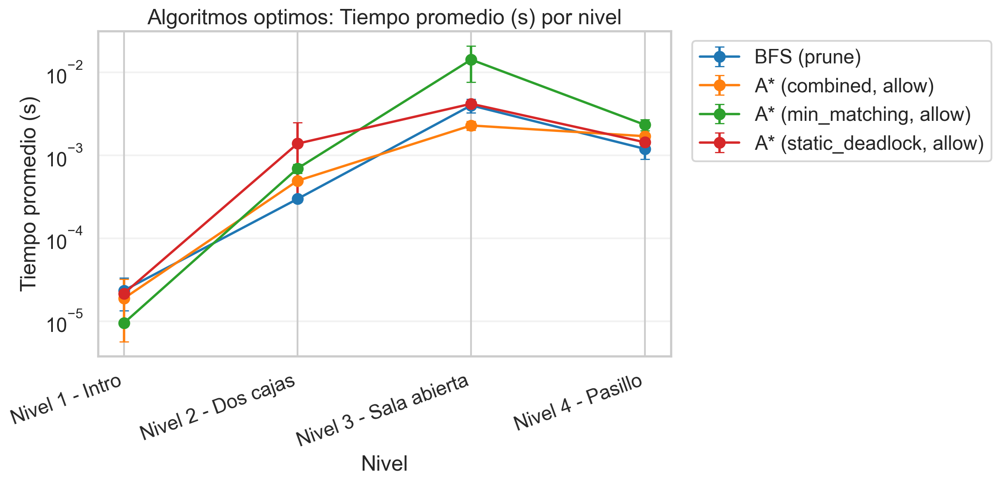

# dfs vs greedy, los algoritmos no optimos

### `results_dfs_allow_deadlocks/cost_mean_by_alternative.png`

### `results_dfs_allow_deadlocks/non_optimal_frontier_count_by_level.png`

`results_barras/dfs_vs_greedy_allow_frontier_count_by_level.png`

`results_dfs_allow_deadlocks/non_optimal_nodes_expanded_by_level.png`

`results_dfs_allow_deadlocks/non_optimal_time_by_level.png`

### `results_dfs_prune_deadlocks/non_optimal_nodes_expanded_by_level.png`

Conclusión General: La superioridad de la información heurística

**guiar la búsqueda con una heurística razonable (Greedy) es inmensamente superior a explorar a ciegas (DFS)**. Incluso cuando DFS cuenta con mecanismos de protección avanzados como la poda (_prune_), Greedy domina en absolutamente todas las métricas: calidad de solución, velocidad, uso de memoria y eficiencia de exploración.

# greedy vs a star, los algoritmos informados
### `results_greedy_vs_a_star/greedy_vs_a_star_allow_cost_by_level.png`

### `results_greedy_vs_a_star/greedy_vs_a_star_allow_nodes_expanded_by_level.png`

### `results_barras/greedy_vs_a_star_allow_nodes_expanded_by_level.png`

`results_greedy_vs_a_star/greedy_vs_a_star_allow_time_seconds_by_level.png`

El análisis comparativo entre los algoritmos A* y Greedy Search evidencia el clásico compromiso entre la garantía teórica de optimalidad y la eficiencia computacional empírica. Mientras que A* asegura invariablemente el hallazgo de la ruta de menor costo sin importar la heurística admisible empleada, lo hace a expensas de un mayor tiempo de ejecución y una expansión de nodos significativamente superior. Por su parte, la búsqueda Greedy demuestra una superioridad rotunda en velocidad y bajo consumo de memoria, aunque su éxito depende de forma crítica de la calidad de la información provista. Notablemente, la implementación de la heurística _combined_ permite a Greedy mitigar su naturaleza subóptima tradicional, logrando emparejar la calidad de solución de A* en los escenarios evaluados pero requiriendo una fracción mínima de sus recursos computacionales, consolidándose así como la alternativa pragmática más eficiente del experimento.

# bfs vs a_star, los dos optimos

results_optimal_allow_deadlocks/optimal_frontier_count_by_level.png`

**Qué muestra.** `A* (combined)` es el mejor promedio global en frontera final (45.50) y gana 4/4 niveles, mientras que `BFS` queda último con 306. Frente a `BFS`, `A* (combined)` logra 85.1% menos en promedio.

**Por qué importa.** En teoría clásica, con heurísticas admisibles A* debería mantener costo óptimo y reducir exploración respecto de BFS. Acá se cumple: todos los métodos óptimos mantienen el mismo costo por nivel y lo que cambia es cuánta búsqueda pagan para llegar a esa solución. El patrón acompaña la intuición de eficiencia espacial, aunque en este trabajo la “frontera” guardada es la frontera al finalizar, no el pico de memoria.
### `results_optimal_allow_deadlocks/optimal_nodes_expanded_by_level.png`

**Qué muestra.** `A* (combined)` es el mejor promedio global en nodos expandidos (86) y gana 4/4 niveles, mientras que `BFS` queda último con 1212.75. Frente a `BFS`, `A* (combined)` logra 92.9% menos en promedio.

**Por qué importa.** En teoría clásica, con heurísticas admisibles A* debería mantener costo óptimo y reducir exploración respecto de BFS. Acá se cumple: todos los métodos óptimos mantienen el mismo costo por nivel y lo que cambia es cuánta búsqueda pagan para llegar a esa solución. Esta es una de las figuras más alineadas con la teoría, porque las expansiones sí reflejan directamente calidad heurística.

### `results_optimal_allow_deadlocks/optimal_time_by_level.png`

**Qué muestra.** `A* (combined)` es el mejor promedio global en tiempo (0.001182 s) y gana 2/4 niveles, mientras que `BFS` queda último con 0.009230 s. Frente a `BFS`, `A* (combined)` logra 87.2% menos en promedio.

**Por qué importa.** En teoría clásica, con heurísticas admisibles A* debería mantener costo óptimo y reducir exploración respecto de BFS. Acá se cumple: todos los métodos óptimos mantienen el mismo costo por nivel y lo que cambia es cuánta búsqueda pagan para llegar a esa solución. No conviene sobreinterpretar `Nivel 1 - Intro`: las diferencias ahí son de microsegundos.

## `results_optimal_bfs_prune_deadlocks`

Comparativa mixta entre `BFS (prune)` y `A* (allow)`. Es útil, pero hay que aclarar que mezcla algoritmo y política de deadlocks, así que no es una comparación “limpia” de estrategia de búsqueda.

Todas las corridas resumidas en esta carpeta tuvieron `success_rate = 1.0`. La tabla siguiente consolida los promedios globales por solver:

| Solver | Tiempo medio | Nodos expandidos | Frontera final | Costo |
|---|---:|---:|---:|---:|
| A* (combined, allow) | 0.001128 s | 86 | 45.50 | 9 |
| BFS (prune) | 0.001382 s | 247.50 | 70.50 | 9 |
| A* (static_deadlock, allow) | 0.001760 s | 231.75 | 71.50 | 9 |
| A* (min_matching, allow) | 0.004331 s | 202.50 | 153.50 | 9 |

### `results_optimal_bfs_prune_deadlocks/optimal_frontier_count_by_level.png`

**Qué muestra.** `A* (combined, allow)` es el mejor promedio global en frontera final (45.50) y gana 4/4 niveles, mientras que `A* (min_matching, allow)` queda último con 153.50. En esta suite mixta, `A* (combined, allow)` no se compara en igualdad de condiciones con `BFS (prune)`, así que la lectura correcta es estrategia + poda, no estrategia sola.

**Por qué importa.** En teoría clásica, con heurísticas admisibles A* debería mantener costo óptimo y reducir exploración respecto de BFS. Acá se cumple: todos los métodos óptimos mantienen el mismo costo por nivel y lo que cambia es cuánta búsqueda pagan para llegar a esa solución. El patrón acompaña la intuición de eficiencia espacial, aunque en este trabajo la “frontera” guardada es la frontera al finalizar, no el pico de memoria.

### `results_optimal_bfs_prune_deadlocks/optimal_nodes_expanded_by_level.png`

**Qué muestra.** `A* (combined, allow)` es el mejor promedio global en nodos expandidos (86) y gana 4/4 niveles, mientras que `BFS (prune)` queda último con 247.50. En esta suite mixta, `A* (combined, allow)` no se compara en igualdad de condiciones con `BFS (prune)`, así que la lectura correcta es estrategia + poda, no estrategia sola.

**Por qué importa.** En teoría clásica, con heurísticas admisibles A* debería mantener costo óptimo y reducir exploración respecto de BFS. Acá se cumple: todos los métodos óptimos mantienen el mismo costo por nivel y lo que cambia es cuánta búsqueda pagan para llegar a esa solución. Esta es una de las figuras más alineadas con la teoría, porque las expansiones sí reflejan directamente calidad heurística.

### `results_optimal_bfs_prune_deadlocks/optimal_time_by_level.png`

**Qué muestra.** `A* (combined, allow)` es el mejor promedio global en tiempo (0.001128 s) y gana 1/4 niveles, mientras que `A* (min_matching, allow)` queda último con 0.004331 s. En esta suite mixta, `A* (combined, allow)` no se compara en igualdad de condiciones con `BFS (prune)`, así que la lectura correcta es estrategia + poda, no estrategia sola.

**Por qué importa.** En teoría clásica, con heurísticas admisibles A* debería mantener costo óptimo y reducir exploración respecto de BFS. Acá se cumple: todos los métodos óptimos mantienen el mismo costo por nivel y lo que cambia es cuánta búsqueda pagan para llegar a esa solución. No conviene sobreinterpretar `Nivel 1 - Intro`: las diferencias ahí son de microsegundos.
