# Informe Avanzado De Comparativas Sokoban

## Objetivo

Este informe rehace la narrativa comparativa de los informes previos, pero usando exclusivamente los resultados generados sobre [`advanced_benchmark_levels.txt`](../levels/advanced_benchmark_levels.txt). El objetivo no es solo describir los 32 graficos nuevos, sino convertirlos en una historia experimental util para la presentacion: que algoritmo conviene si buscamos optimalidad, cual conviene si priorizamos velocidad, cuanto aporta la poda de deadlocks y que nos dicen realmente las heuristicas implementadas.

## Metodologia Y Criterios De Lectura

Todas las figuras incluidas aqui provienen de las carpetas `results_*_advanced` generadas en la corrida nueva. Las suites comparan cinco niveles:

- `Nivel 1 - Puentes de dos cajas`
- `Nivel 2 - Galeria central`
- `Nivel 3 - Triangulo abierto`
- `Nivel 4 - Pasillo triple`
- `Nivel 5 - Cruce angosto`

Las corridas se hicieron con 10 iteraciones por alternativa. En todas las suites la `success_rate` fue `1.0`, asi que la discusion ya no pasa por "si resuelve o no", sino por cuatro ejes:

- `cost_mean`: calidad de solucion. Es la metrica principal cuando importa optimalidad.
- `nodes_expanded_mean`: trabajo real de busqueda. Es la mejor proxy de eficiencia algoritimica.
- `frontier_count_mean`: tamano de la frontera al terminar la busqueda. No es pico de memoria.
- `time_seconds_mean`: costo computacional total. Captura tanto el esfuerzo de busqueda como el overhead de la heuristica.

Hay dos cautelas metodologicas importantes:

- Las corridas son esencialmente deterministas en costo, nodos y frontera. La variacion entre iteraciones aparece sobre todo en tiempo por ruido de ejecucion.
- Los tiempos son plenamente comparables dentro de cada suite. Entre suites distintas puede haber pequeñas diferencias absolutas, pero los ordenes relativos se mantuvieron estables y son consistentes con los nodos expandidos.

## Hallazgos Transversales Y Calidad De Las Heuristicas A*

Pregunta de la seccion: antes de comparar familias de algoritmos, que nos dicen los resultados avanzados sobre la calidad relativa de las heuristicas de `A*`?

Los datos globales dejan cinco ideas muy fuertes:

- `A* (combined)` es la mejor variante optima del trabajo: frente a `BFS`, reduce `90.7%` los nodos expandidos, `95.0%` la frontera final y `66.5%` el tiempo medio, sin perder optimalidad.
- `static_deadlock` no funciona como heuristica de ranking fuerte. Su valor esta mas cerca de una politica de poda que de una funcion informativa completa.
- `min_matching` es admisible y razonable, pero en este benchmark avanzado queda claramente detras de `combined`: `75.1%` mas nodos y `74.1%` mas tiempo.
- El `Nivel 5 - Cruce angosto` es un caso muy interesante porque rompe la lectura simplista: ahi `static_deadlock` gana en tiempo y frontera final frente a `combined`, aunque sigue perdiendo en nodos expandidos.
- La moraleja no es "una sola metrica decide todo", sino "cuando el costo queda empatado, hay que mirar nodos, tiempo y la semantica real de frontera".

### Costo global de las heuristicas de A* (`a_star_heuristics_global_cost_global.png`)

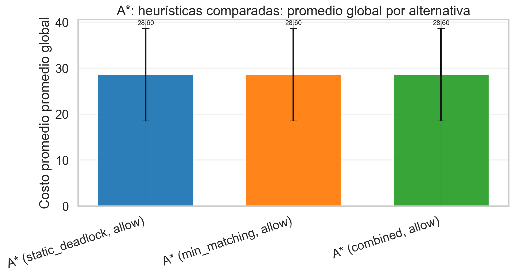

**Que muestra.** Las tres variantes de `A*` empatan en costo medio global: `28.6`. Esta es exactamente la lectura esperable cuando las tres heuristicas mantienen el caracter admisible y `A*` sigue resolviendo optimamente en los cinco niveles avanzados.

**Lectura critica e inferencia.** Este grafico es importante no porque discrimine, sino porque impide una mala conclusion. No hay una heuristica de `A*` que "encuentre mejores soluciones" que otra en este benchmark; toda la diferencia esta en cuanto trabajo paga cada una para llegar al mismo costo. Para la presentacion conviene usarlo como grafico bisagra: cierra la discusion sobre calidad de solucion dentro de `A*` y habilita la discusion correcta sobre eficiencia de exploracion.

### Frontera global de las heuristicas de A* (`a_star_heuristics_global_frontier_count_global.png`)

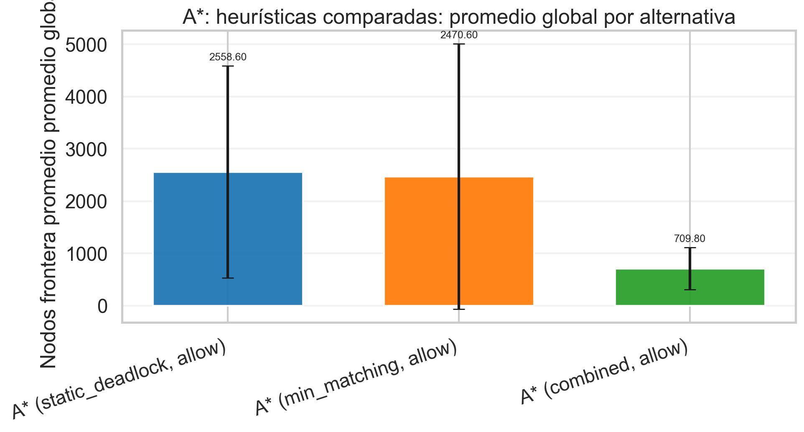

**Que muestra.** `A* (combined)` es la mejor alternativa global en frontera final, con mucha distancia respecto de `A* (min_matching)` y `A* (static_deadlock)`. La ventaja media de `combined` es de `71.3%` frente a `min_matching` y `72.3%` frente a `static_deadlock`.

**Lectura critica e inferencia.** La lectura interesante no es solo que `combined` gana, sino que `static_deadlock` queda incluso un poco peor que `min_matching` en promedio de frontera. Eso refuerza la idea de que detectar deadlocks no alcanza para ordenar bien los estados. Al mismo tiempo, el `Nivel 5` muestra una excepcion donde `static_deadlock` termina con menor frontera final que `combined`; esto recuerda que `frontier_count` no mide el pico de memoria ni resume por si sola la calidad de la busqueda. Es una metrica util, pero necesita ser leida junto con nodos y tiempo.

### Nodos expandidos globales de las heuristicas de A* (`a_star_heuristics_global_nodes_expanded_global.png`)

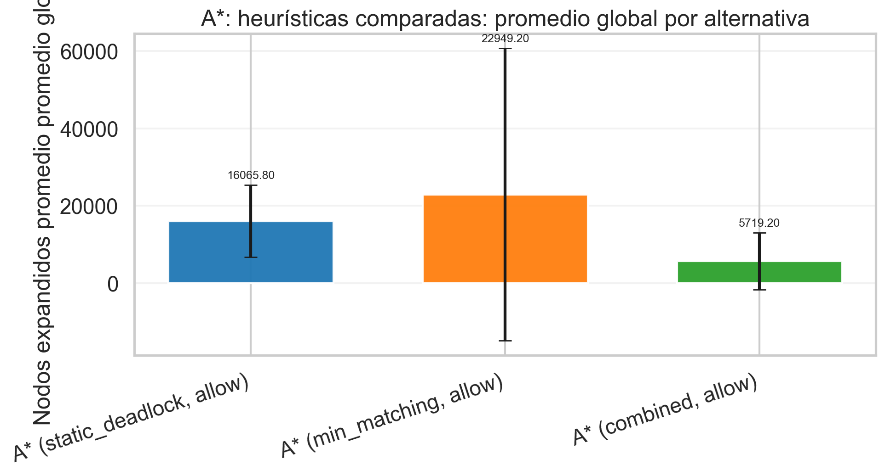

**Que muestra.** `A* (combined)` domina claramente la comparativa global de expansiones. Frente a `A* (static_deadlock)` expande `64.4%` menos nodos, y frente a `A* (min_matching)` `75.1%` menos.

**Lectura critica e inferencia.** Esta es la figura que mejor separa "heuristica que poda" de "heuristica que realmente guia". `combined` no solo evita estados muertos: tambien prioriza mejor. La pista fuerte aparece cuando se contrasta con otras secciones del informe: `A* (static_deadlock)` termina expandiendo exactamente la misma cantidad de nodos que `BFS (prune)` en los cinco niveles avanzados. La inferencia nueva es poderosa: `static_deadlock` se comporta experimentalmente como una poda acoplada a una estrategia casi desinformada; `combined`, en cambio, combina poda estructural con ranking util.

### Tiempo global de las heuristicas de A* (`a_star_heuristics_global_time_seconds_global.png`)

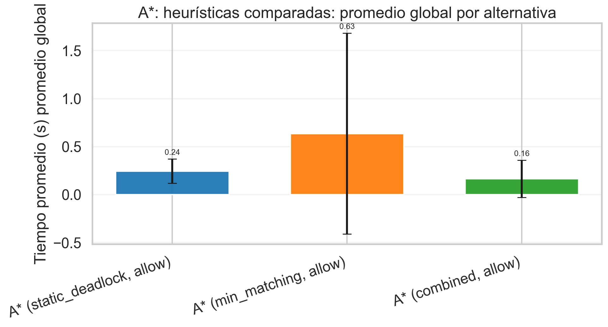

**Que muestra.** `A* (combined)` tambien gana globalmente en tiempo. Es mas rapido que `A* (static_deadlock)` y muy superior a `A* (min_matching)`, que queda como la variante mas cara de la familia.

**Lectura critica e inferencia.** Lo interesante es que esta victoria no es absoluta nivel por nivel. En `Nivel 1` y `Nivel 5`, `static_deadlock` logra ser mas rapido que `combined`, probablemente porque su evaluacion es mas barata y el tablero favorece mucho la deteccion temprana de estados muertos. Sin embargo, cuando se promedian los cinco niveles, `combined` vuelve a imponerse. La inferencia es que el overhead heuristico solo vale la pena si reduce suficientemente la exploracion, y en el benchmark avanzado `combined` logra justamente ese equilibrio.

**Sintesis de la seccion.** El bloque de heuristicas de `A*` deja una conclusion muy limpia para presentar: el costo de solucion queda empatado, asi que la comparativa real pasa por eficiencia. Ahi `combined` es la mejor heuristica integral del trabajo. `min_matching` conserva optimalidad pero paga demasiado overhead, y `static_deadlock` aporta mas como detector de estados inviables que como criterio de priorizacion.

## BFS vs A*. Los Optimos

Pregunta de la seccion: si `BFS` y `A*` encuentran soluciones optimas, cuanto gana realmente la informacion heuristica en el benchmark avanzado?

La respuesta global es fuerte: `A* (combined)` mantiene el mismo costo medio que `BFS` (`28.6`), pero reduce `90.7%` los nodos, `95.0%` la frontera final y `66.5%` el tiempo.

### Frontera por nivel en algoritmos optimos (`optimal_frontier_count_by_level.png`)

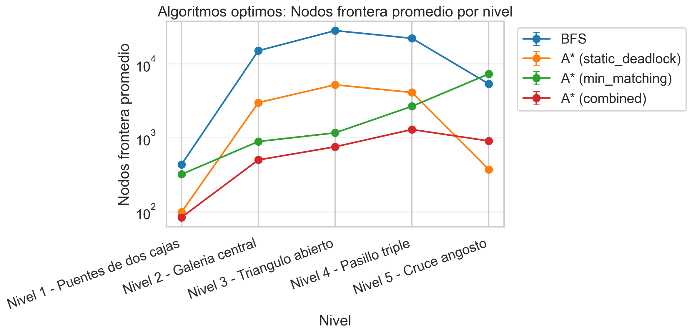

**Que muestra.** `BFS` queda muy por encima de las tres variantes de `A*` en frontera final a lo largo de casi todos los niveles. `A* (combined)` es el mejor en cuatro de los cinco niveles, y la unica excepcion es `Nivel 5`, donde `A* (static_deadlock)` termina con menor frontera final.

**Lectura critica e inferencia.** La moraleja principal es que la heuristica no solo ayuda a llegar antes, sino a mantener mucho mas contenida la exploracion lateral. La excepcion de `Nivel 5` vuelve a mostrar que la frontera final es una foto del ultimo instante, no una pelicula completa de la busqueda. Si se mirara solo este grafico, se podria sobredimensionar a `static_deadlock` en el nivel mas dificil; cuando se cruza con nodos y tiempo, queda claro que `combined` sigue siendo mas robusto.

### Nodos expandidos por nivel en algoritmos optimos (`optimal_nodes_expanded_by_level.png`)

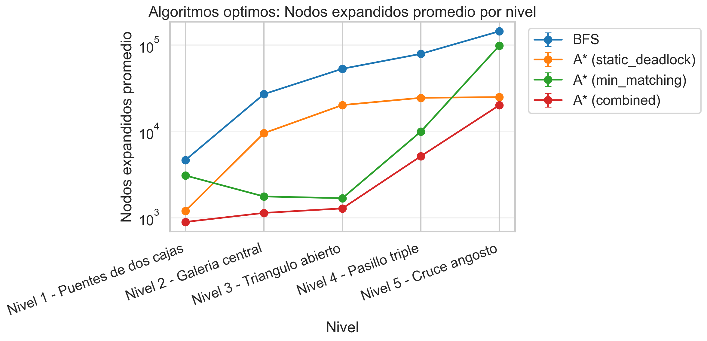

**Que muestra.** `A* (combined)` gana los cinco niveles avanzados en nodos expandidos. La diferencia con `BFS` es enorme y se vuelve especialmente visible en los niveles 3, 4 y 5, donde el branching o las restricciones estructurales disparan el costo de explorar a ciegas.

**Lectura critica e inferencia.** Este es el grafico mas convincente para defender `A*` frente a `BFS`. En promedio, `A* (combined)` expande `5719.2` nodos contra `61542.6` de `BFS`. La inferencia nueva es que el benchmark avanzado endurece el caso a favor de la informacion heuristica: incluso en `Cruce angosto`, donde el problema es especialmente hostil, `combined` sigue reduciendo la exploracion de manera muy marcada. No es una mejora marginal; es un cambio de escala.

### Tiempo por nivel en algoritmos optimos (`optimal_time_by_level.png`)

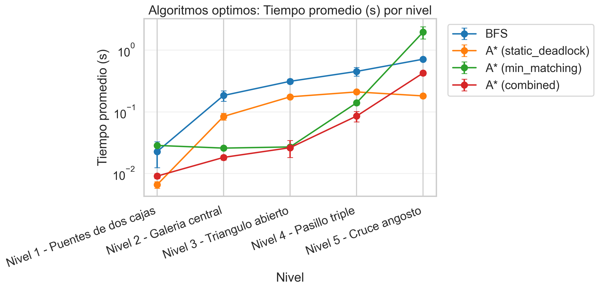

**Que muestra.** Ninguna variante de `A*` pierde globalmente contra `BFS` en tiempo. `A* (combined)` gana tres de los cinco niveles, `A* (static_deadlock)` gana dos, y `BFS` no domina ninguno.

**Lectura critica e inferencia.** Este grafico es muy valioso porque evita una lectura ingenua del tipo "menos nodos siempre implica menos tiempo". En `Nivel 1` y `Nivel 5`, `static_deadlock` resulta mas veloz que `combined`, aunque `combined` expande menos nodos. Eso sugiere que el costo de calcular la heuristica importa, sobre todo en niveles chicos o muy estructurados. Aun asi, cuando la historia se cuenta completa, `BFS` sigue quedando claramente atras. Para una presentacion, conviene remarcar que la mejora de `A*` no es solo teorica: tambien aparece en el reloj.

### Costo por nivel: BFS vs A* con deadlocks permitidos (`bfs_vs_a_star_allow_cost_by_level.png`)

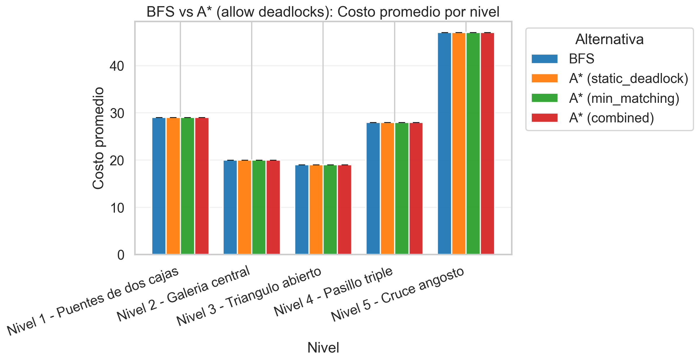

**Que muestra.** Este grouped bar resume algo central: `BFS` y las tres variantes de `A*` empatan en costo en los cinco niveles. Los valores son `29`, `20`, `19`, `28` y `47` segun el nivel, sin ninguna desviacion entre alternativas optimas.

**Lectura critica e inferencia.** Este grafico no aporta una diferencia nueva en datos, pero si aporta una narrativa mas clara para exponer. Visualiza de manera directa que la discusion `BFS vs A*` no es una discusion de calidad de solucion sino de eficiencia de busqueda. Sirve mucho como apoyo oral: permite decir "todos llegan igual de bien, pero no todos pagan lo mismo para llegar".

### Nodos expandidos por nivel: BFS vs A* con deadlocks permitidos (`bfs_vs_a_star_allow_nodes_expanded_by_level.png`)

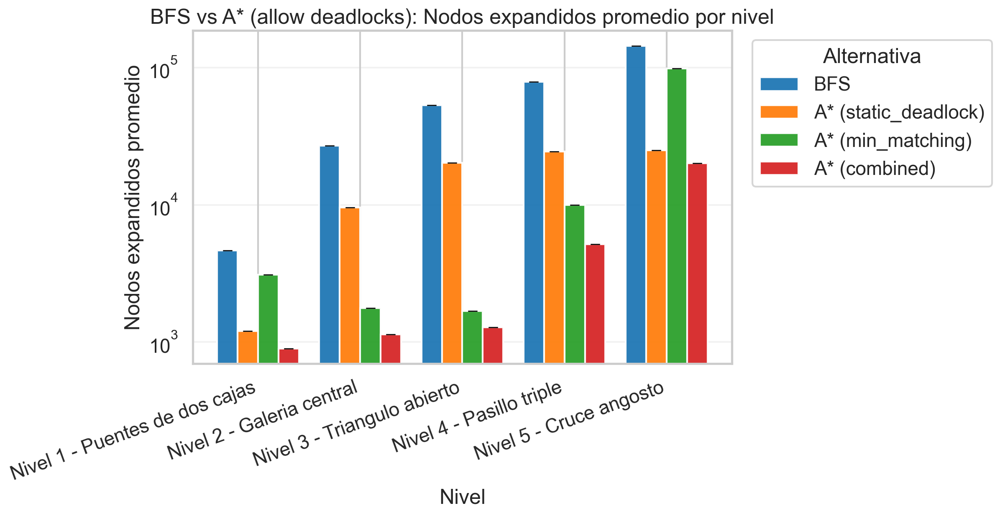

**Que muestra.** Las cuatro barras por nivel hacen visible que todas las variantes de `A*` superan a `BFS` en expansiones, pero no todas lo hacen con la misma contundencia. `A* (combined)` lidera siempre, `A* (min_matching)` queda segundo en los niveles 2, 3 y 4, y `A* (static_deadlock)` mejora a `BFS` pero con mucha menor consistencia.

**Lectura critica e inferencia.** Este grafico agrega una capa que el plot lineal no deja tan legible: "estar informado" ya da una ventaja fuerte frente a `BFS`, pero la calidad de la heuristica sigue importando mucho. La inferencia nueva es que hay dos escalones distintos de mejora. El primer escalon es pasar de desinformado a informado. El segundo escalon, mas fino, es pasar de una heuristica parcial a una heuristica bien compuesta.

**Sintesis de la seccion.** `BFS` sigue siendo el baseline correcto para defender optimalidad, pero experimentalmente queda muy lejos del mejor `A*`. En el benchmark avanzado, la informacion heuristica no compra una mejora cosmetica: compra un cambio profundo en exploracion y tiempo. Para la presentacion, la frase fuerte es esta: `A* (combined)` mantiene la garantia de `BFS`, pero a una fraccion del costo de busqueda.

## BFS Con Poda vs A*: Que Cambia

Pregunta de la seccion: si solo mejoramos a `BFS` con poda de deadlocks, alcanza para acercarse a `A*` o la heuristica fuerte sigue haciendo la diferencia?

Globalmente, `BFS (prune)` mejora muchisimo respecto de `BFS (allow)`: reduce `74.3%` la frontera final, `73.9%` los nodos y `80.2%` el tiempo. La pregunta interesante es contra quien pasa a competir.

### Frontera por nivel en la comparativa mixta (`optimal_frontier_count_by_level.png`)

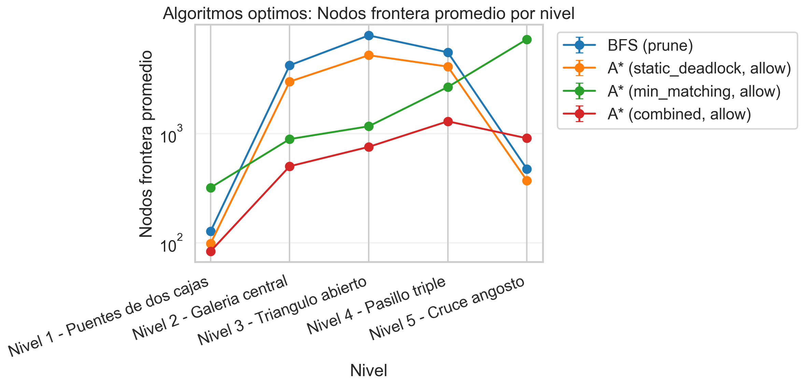

**Que muestra.** En esta suite mixta, `BFS (prune)` deja de parecer un baseline lejano y empieza a competir con las heuristicas mas flojas de `A*`. Sigue por detras de `A* (combined, allow)` en todos los niveles, pero ya no esta en el orden de magnitud de `BFS` sin poda.

**Lectura critica e inferencia.** El grafico tiene una sutileza importante: mezcla algoritmo y politica de deadlocks, asi que no compara estrategias puras. Aun asi, la foto es muy valiosa porque muestra hasta donde puede llegar una mejora "estructural" sin cambiar de familia de busqueda. La inferencia clave es que la poda sola no reemplaza a una buena heuristica, pero si achica dramaticamente la brecha con las heuristicas debiles. En un lenguaje de presentacion: primero conviene podar; despues conviene ordenar bien.

### Nodos expandidos por nivel: BFS con poda contra A* (`bfs_vs_a_star_prune_nodes_expanded_by_level.png`)

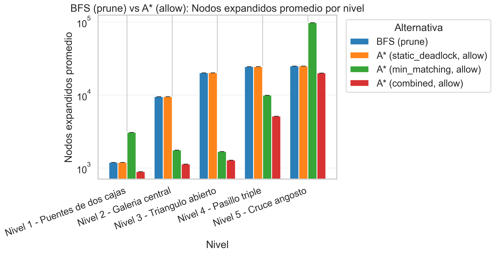

**Que muestra.** Este grafico es uno de los mas ricos del informe. `BFS (prune)` empata exactamente a `A* (static_deadlock, allow)` en nodos expandidos en los cinco niveles avanzados. Tambien supera claramente a `A* (min_matching, allow)` en `Nivel 5`, donde `min_matching` se dispara hasta `98244` nodos contra `24945` de `BFS (prune)`.

**Lectura critica e inferencia.** La inferencia nueva es muy fuerte y no surge tan claramente en los informes viejos: una poda buena puede valer mas que una heuristica admisible pero costosa y parcialmente desalineada. `BFS (prune)` no alcanza a `A* (combined, allow)`, que sigue siendo la referencia optima de eficiencia, pero si demuestra que parte de la ganancia atribuida a la "inteligencia heuristica" en realidad viene de evitar estados muertos. Este grafico ayuda a separar los dos fenomenos: podar y ordenar no son lo mismo, y ambos aportan.

**Sintesis de la seccion.** La poda de deadlocks vuelve a `BFS` muchisimo mas serio como competidor. No destrona a `A* (combined)`, pero si lo mueve desde el rol de baseline ingenuo al de algoritmo optimizado con resultados respetables. Para presentar, esta es la mejor seccion para mostrar que las mejoras estructurales del espacio de estados importan tanto como la estrategia de busqueda.

## DFS vs Greedy: Desinformado vs Informado

Pregunta de la seccion: entre los algoritmos no optimos, cuanto vale introducir informacion heuristica en lugar de explorar en profundidad a ciegas?

La respuesta global es extrema. Frente a `DFS (allow)`, `Greedy (combined, allow)` reduce `98.4%` el costo, `99.6%` los nodos, `95.7%` la frontera final y `97.5%` el tiempo. Incluso las variantes mas flojas de `Greedy` suelen dejar muy mal parado a `DFS`.

### Costo medio por alternativa no optima (`cost_mean_by_alternative.png`)

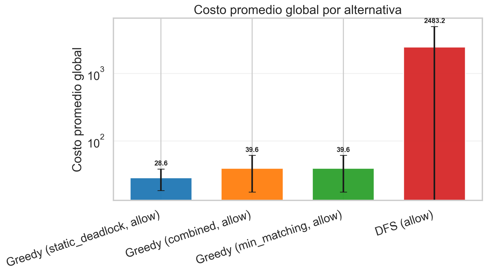

**Que muestra.** El grafico ordena las alternativas por costo medio y revela una tension importante. `Greedy (static_deadlock, allow)` logra el mejor costo medio global del bloque no optimo, `28.6`, exactamente igual al costo optimo del benchmark. `Greedy (combined, allow)` y `Greedy (min_matching, allow)` quedan en `39.6`, mientras que `DFS (allow)` se dispara hasta `2483.2`.

**Lectura critica e inferencia.** El hallazgo interesante es que el mejor `Greedy` en velocidad no es el mejor `Greedy` en costo. En este set avanzado, `static_deadlock` conserva soluciones de costo optimo en los cinco niveles, pero lo hace pagando muchisima exploracion. La inferencia es doble: por un lado, `DFS` queda completamente descartado si importa la calidad de solucion; por otro, "algoritmo informado" no es sinonimo de "mejor costo" si la heuristica que lo guia esta sesgada a detectar imposibles mas que a ordenar buenos candidatos.

### Frontera por nivel en algoritmos no optimos (`non_optimal_frontier_count_by_level.png`)

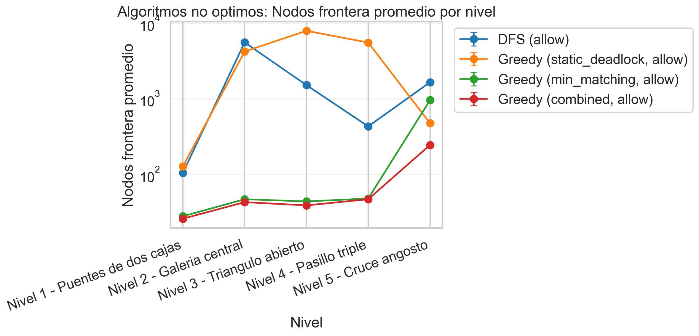

**Que muestra.** `Greedy (combined, allow)` lidera en frontera final en los cinco niveles. `Greedy (min_matching, allow)` queda muy cerca. `DFS (allow)` no aparece tan mal como podria esperarse, e incluso queda muy por debajo de `Greedy (static_deadlock, allow)` en promedio de frontera.

**Lectura critica e inferencia.** Esta es una de las figuras donde mas importa recordar la semantica de la metrica. El hecho de que `DFS (allow)` tenga menos frontera final que `Greedy (static_deadlock, allow)` no significa que use menos memoria total ni que explore mejor; significa solo que termina con una frontera mas angosta. La inferencia correcta es que `frontier_count` castiga mas a quienes dejan muchos candidatos pendientes y no refleja bien el costo de las excursiones profundas improductivas, que es precisamente el gran problema de `DFS`.

### Frontera por nivel: DFS vs Greedy (`dfs_vs_greedy_allow_frontier_count_by_level.png`)

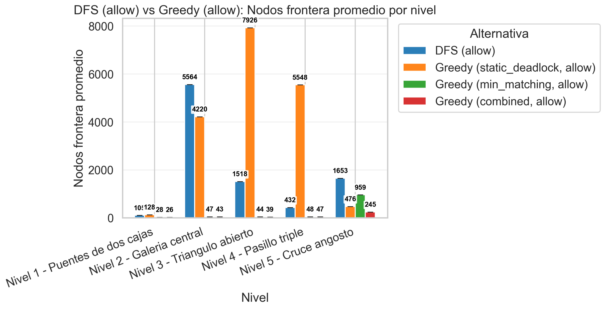

**Que muestra.** El grouped bar hace mucho mas visible la separacion entre familias. `Greedy (combined, allow)` y `Greedy (min_matching, allow)` quedan sistematicamente abajo, `DFS (allow)` aparece en una zona intermedia, y `Greedy (static_deadlock, allow)` queda como caso atipico con frontera muy alta.

**Lectura critica e inferencia.** Como grafico de presentacion, este vale mas que el line plot porque ordena mejor la historia visual. La inferencia interesante es que el problema de `static_deadlock` no es solo que no reduzca suficiente la exploracion, sino que deja una frontera final grande aun cuando logra buen costo. Eso refuerza la idea de que detectar deadlocks es util, pero incompleto como senal de direccion.

### Nodos expandidos por nivel en algoritmos no optimos (`non_optimal_nodes_expanded_by_level.png`)

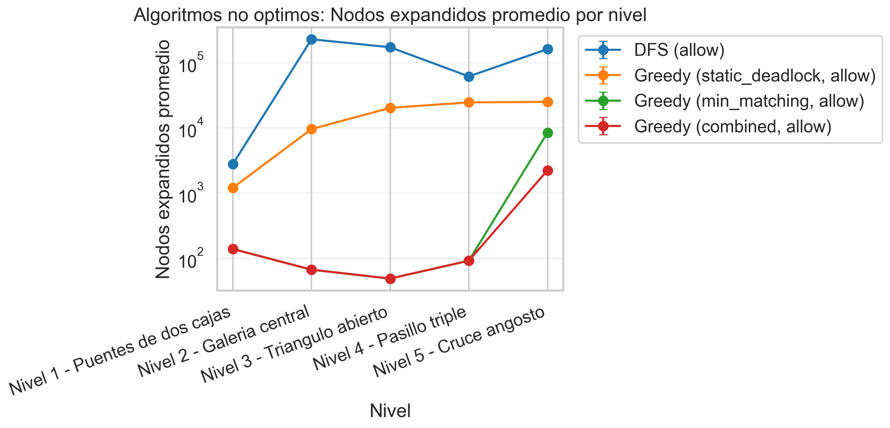

**Que muestra.** `Greedy (combined, allow)` gana los cinco niveles en nodos expandidos. `Greedy (min_matching, allow)` empata practicamente en los cuatro primeros niveles, pero en `Cruce angosto` crece mucho mas. `DFS (allow)` queda completamente desbordado: `124328` nodos de promedio contra `514.8` de `Greedy (combined, allow)`.

**Lectura critica e inferencia.** Este es probablemente el mejor grafico para defender el valor de una heuristica informada dentro de los no optimos. La diferencia no es un pequeno refinamiento; es de dos ordenes de magnitud. Ademas, el comportamiento de `min_matching` sugiere que su ranking es razonable en tableros faciles o medianos, pero pierde robustez en el nivel mas duro del set. `combined` aparece asi como la variante no optima mas estable.

### Tiempo por nivel en algoritmos no optimos (`non_optimal_time_by_level.png`)

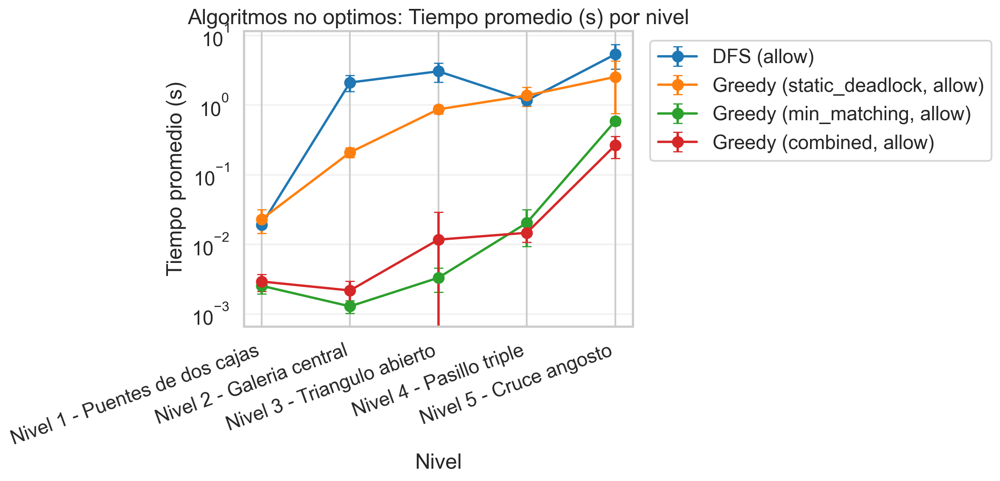

**Que muestra.** `Greedy (min_matching, allow)` es el mas rapido en los niveles 1, 2 y 3. `Greedy (combined, allow)` pasa a ser el mas rapido en los niveles 4 y 5. `DFS (allow)` queda ultimo por mucha diferencia en casi todo el benchmark.

**Lectura critica e inferencia.** Este grafico agrega una sutileza muy valiosa: cuando dos heuristicas expanden practicamente lo mismo, el tiempo queda dominado por el costo de evaluarlas. Eso explica por que `min_matching` puede ganarle a `combined` en los niveles mas chicos pese a no superarlo en nodos. Pero cuando el tablero se vuelve realmente dificil, `combined` recupera la punta porque su mejor ranking se traduce en menos trabajo global. La inferencia es que la heuristica "mas rapida" depende del regime del problema.

**Sintesis de la seccion.** `DFS (allow)` queda dominado experimentalmente por cualquier `Greedy` razonable. La informacion heuristica cambia por completo la escala de la busqueda y, salvo por la lectura engañosa de frontera final, no deja dudas. Para la presentacion, hay dos mensajes complementarios: `Greedy (combined)` es la mejor opcion practica si se acepta cierta suboptimalidad; `Greedy (static_deadlock)` muestra que buen costo y buena eficiencia no son automaticamente lo mismo.

## Greedy vs A*: Los Dos Informados

Pregunta de la seccion: cuando ambos algoritmos usan heuristicas, cuanto cuesta realmente exigir optimalidad en lugar de quedarnos con una decision puramente codiciosa?

La comparativa global mas reveladora es `Greedy (combined, allow)` contra `A* (combined, allow)`: `Greedy` es `92.0%` mas rapido, expande `91.0%` menos nodos y deja `88.7%` menos frontera final, pero paga un costo medio `38.5%` peor (`39.6` contra `28.6`).

### Costo por nivel: Greedy vs A* (`greedy_vs_a_star_allow_cost_by_level.png`)

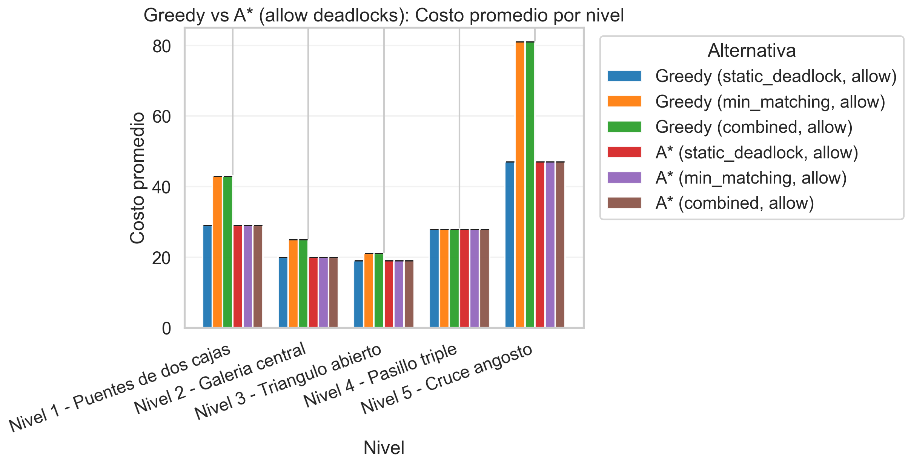

**Que muestra.** Los tres `A*` mantienen costo optimo en los cinco niveles. `Greedy (combined, allow)` y `Greedy (min_matching, allow)` quedan apenas por encima en los niveles 1, 2, 3 y 5. `Greedy (static_deadlock, allow)` empata el costo optimo en todos los niveles.

**Lectura critica e inferencia.** Este grafico es muy bueno para desmontar la oposicion simplista entre "Greedy = malo" y "A* = bueno". En estos niveles avanzados, una variante codiciosa puede igualar el costo optimo si la señal estructural del problema la favorece. Pero esa igualdad de costo no implica igualdad de estrategia: `Greedy (static_deadlock)` llega al mismo costo que `A*` con mucha mas exploracion que `Greedy (combined)` y sin la garantia general de optimalidad. La inferencia correcta es que este benchmark premia fuertemente la deteccion de deadlocks, aunque no la convierta automaticamente en la mejor heuristica.

### Nodos expandidos por nivel: Greedy vs A* (`greedy_vs_a_star_allow_nodes_expanded_by_level.png`)

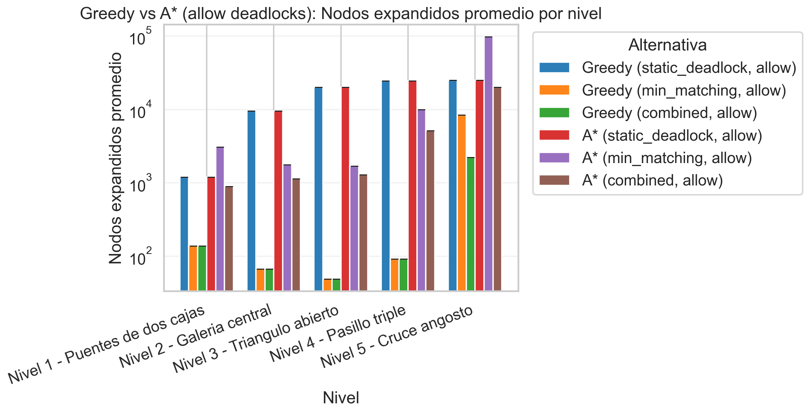

**Que muestra.** `Greedy (combined, allow)` es el ganador absoluto en nodos expandidos, seguido por `Greedy (min_matching, allow)`. Las tres variantes de `A*` quedan por encima, y `A* (combined, allow)` expande en promedio mas de once veces los nodos de `Greedy (combined, allow)`.

**Lectura critica e inferencia.** Este es el costo experimental de la optimalidad. `A*` no esta explorando "mal"; esta pagando deliberadamente por considerar tambien el costo acumulado y no solo la promesa heuristica inmediata. La inferencia nueva es que el benchmark avanzado hace muy visible el impuesto de optimalidad: si el criterio de eleccion fuera solo trabajo de busqueda, `Greedy (combined)` seria el campeon incuestionable del repo.

### Nodos expandidos por nivel: version grouped bar (`greedy_vs_a_star_allow_nodes_expanded_by_level.png`)

**Que muestra.** La figura repite la metrica de expansiones pero con un formato mas util para contrastar familias completas. Las barras muestran de un vistazo que la distancia entre `Greedy` y `A*` es mas grande que la distancia interna entre heuristicas de una misma familia.

**Lectura critica e inferencia.** Este grafico no agrega informacion nueva en datos, pero si agrega una lectura comparativa mas potente. Ayuda a mostrar que la gran decision de modelado no es solo "que heuristica uso", sino "quiero una politica codiciosa o quiero garantia de optimalidad". La inferencia mas util para presentar es que la eleccion de algoritmo pesa mas que la eleccion de heuristica cuando el objetivo principal es bajar expansiones.

### Tiempo por nivel: Greedy vs A* (`greedy_vs_a_star_allow_time_seconds_by_level.png`)

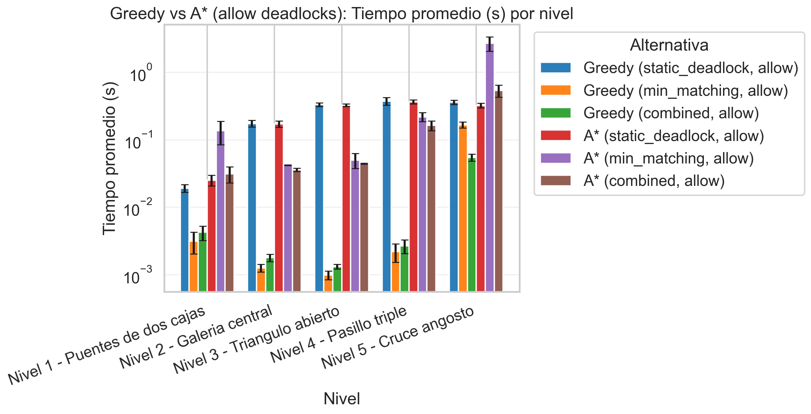

**Que muestra.** `Greedy (combined, allow)` y `Greedy (min_matching, allow)` dominan claramente en tiempo. `Greedy (static_deadlock, allow)` queda cerca de `A* (static_deadlock, allow)` y ambos son mucho mas lentos que las otras variantes informadas.

**Lectura critica e inferencia.** La comparacion deja una leccion muy clara: renunciar a optimalidad solo rinde de verdad cuando la heuristica tambien ordena bien. Si la heuristica es debil como ranking, como pasa con `static_deadlock`, `Greedy` deja de verse brillante y termina casi empatando en costo computacional con `A*`. La inferencia es que no alcanza con ser codicioso; hay que ser codicioso con una senal informativa de calidad.

**Sintesis de la seccion.** `Greedy` y `A*` representan dos filosofias diferentes frente al mismo conocimiento heuristico. `Greedy (combined)` es la mejor alternativa si la prioridad es rendimiento practico y se tolera una suboptimalidad moderada. `A* (combined)` es la mejor alternativa si la prioridad es mantener costo optimo con una penalidad de tiempo y expansiones que, aun siendo visible, sigue estando contenida.

## BFS vs DFS Sin Poda

Pregunta de la seccion: entre los dos algoritmos desinformados, cual es el trade-off real cuando se permiten deadlocks?

Globalmente, `BFS (allow)` vence a `DFS (allow)` en costo (`28.6` contra `2483.2`), en nodos (`61542.6` contra `124328.0`) y en tiempo (`0.640` s contra `1.844` s). `DFS` solo queda mejor en frontera final, pero esa ventaja es metodologicamente engañosa.

### Costo por nivel: BFS vs DFS con deadlocks permitidos (`bfs_vs_dfs_allow_cost_by_level.png`)

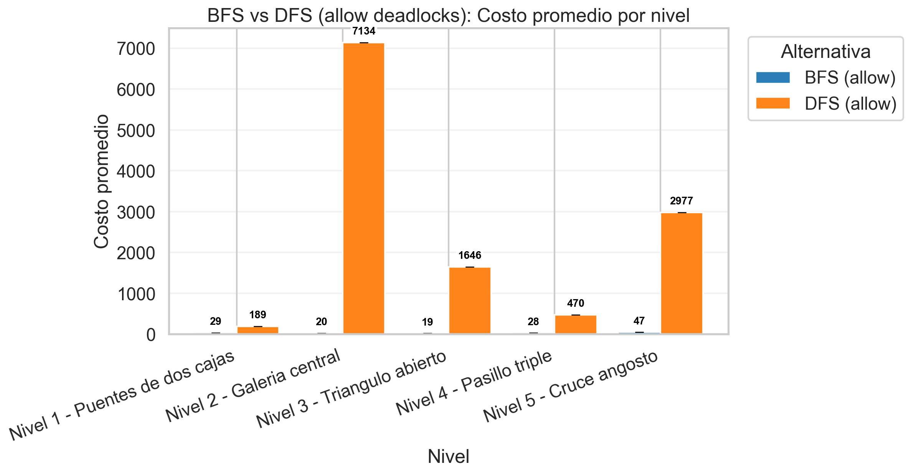

**Que muestra.** `BFS (allow)` conserva el costo optimo en los cinco niveles. `DFS (allow)` produce costos muy superiores y particularmente extremos en `Galeria central`, `Triangulo abierto` y `Cruce angosto`.

**Lectura critica e inferencia.** Este es el grafico que define la comparativa. Aunque `DFS` pueda parecer competitivo en algunas metrias operativas, la calidad de solucion lo deja fuera de carrera si importa resolver bien. La inferencia nueva es que los niveles avanzados castigan mucho mas fuerte la exploracion profunda equivocada que los niveles anteriores: el problema ya no es una pequena perdida de optimalidad, sino una degradacion masiva del costo del plan.

### Nodos expandidos por nivel: BFS vs DFS con deadlocks permitidos (`bfs_vs_dfs_allow_nodes_expanded_by_level.png`)

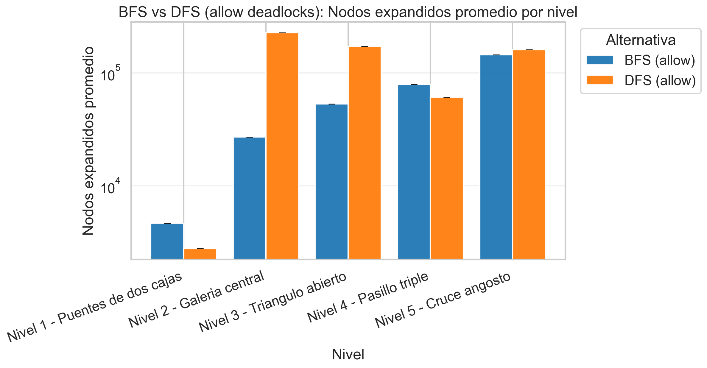

**Que muestra.** `BFS (allow)` gana globalmente en nodos expandidos, pero no barre todos los niveles. `DFS (allow)` expande menos en `Nivel 1` y `Nivel 4`, mientras que `BFS` domina claramente en `Nivel 2`, `Nivel 3` y `Nivel 5`.

**Lectura critica e inferencia.** Esta es una figura excelente para evitar una conclusion simplista. `DFS` puede tocar una solucion relativamente rapido y con menos expansiones en un tablero acotado, pero eso no significa que la encuentre con buen costo. `Nivel 4 - Pasillo triple` es el ejemplo perfecto: `DFS` expande menos y tarda menos que `BFS`, pero entrega costo `470` contra `28`. La inferencia es que medir nodos sin mirar costo puede hacer parecer razonable a una estrategia profundamente miope.

### Tiempo con error bars: BFS vs DFS con deadlocks permitidos (`bfs_vs_dfs_time_errorbars.png`)

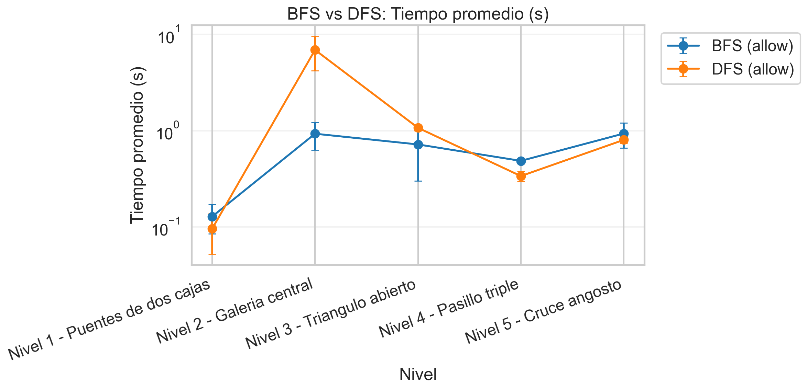

**Que muestra.** El tiempo medio favorece a `BFS (allow)` en el promedio global, aunque `DFS (allow)` logra ser mas rapido en algunos niveles individuales, especialmente `Nivel 1`, `Nivel 4` y `Nivel 5`.

**Lectura critica e inferencia.** Lo importante es no separar este grafico del de costo. `DFS` puede "parecer rapido" porque encuentra antes una primera solucion y sostiene una frontera relativamente angosta, pero esa rapidez convive con planes muy malos. La inferencia mas util para la presentacion es que, sin poda, `DFS` no solo pierde calidad: tampoco construye una narrativa robusta de eficiencia. Gana episodios aislados, pero pierde el benchmark.

**Sintesis de la seccion.** Sin poda, `BFS` es el mejor algoritmo desinformado del set avanzado. Sostiene optimalidad, reduce nodos en promedio y tambien gana en tiempo global. `DFS` solo conserva una ventaja aparente en frontera final y algunas victorias aisladas de tiempo, pero paga esas ventajas con soluciones de muy mala calidad.

## BFS vs DFS Con Poda

Pregunta de la seccion: si ambos algoritmos desinformados reciben poda de deadlocks, cambia de verdad la competencia entre ellos?

Si, pero cambia de una manera muy particular. La poda no mejora el costo de `DFS`; solo mejora dramaticamente su eficiencia operativa. Como resultado, la competencia `BFS vs DFS` pasa de ser "calidad y eficiencia a favor de BFS" a ser "calidad a favor de BFS, esfuerzo de busqueda a favor de DFS".

### Costo con error bars: BFS vs DFS con poda (`cost_by_level_errorbars.png`)

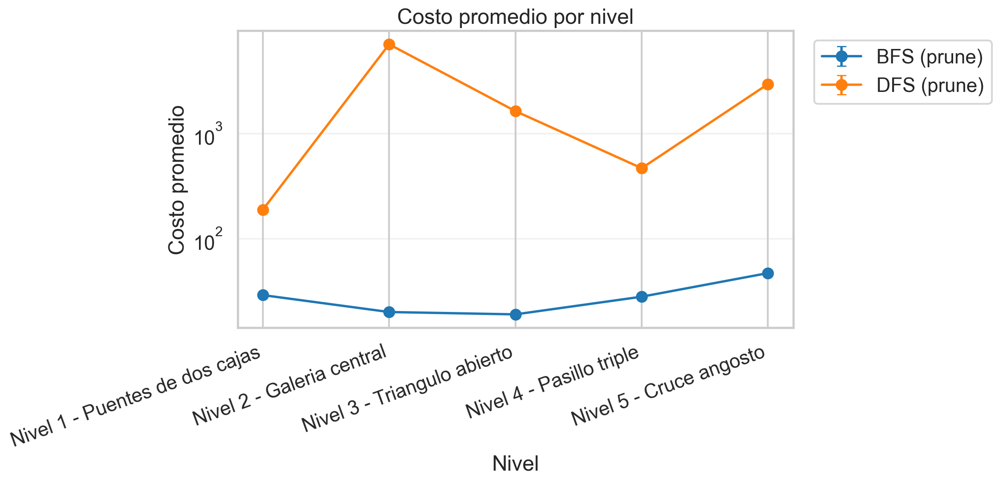

**Que muestra.** `BFS (prune)` sigue resolviendo con costo optimo en los cinco niveles, y `DFS (prune)` conserva exactamente los mismos costos altos que sin poda. La diferencia de calidad de solucion entre ambos no se mueve.

**Lectura critica e inferencia.** Este grafico es clave porque evita atribuirle a la poda un efecto que no tiene. La poda de deadlocks no corrige el sesgo de profundidad de `DFS`; solo evita que ese sesgo desperdicie tanto trabajo. La inferencia correcta es que la calidad del plan y la eficiencia de busqueda son dos dimensiones distintas: se puede mejorar una sin tocar la otra.

### Costo por nivel: version grouped bar (`bfs_vs_dfs_prune_cost_by_level.png`)

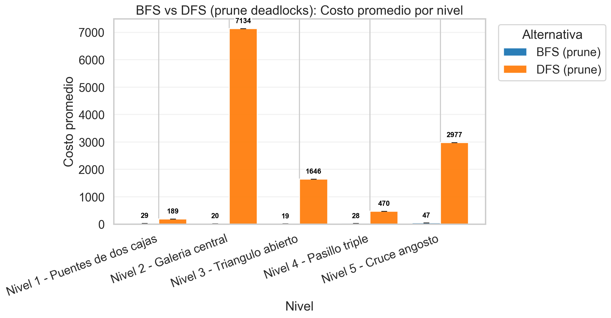

**Que muestra.** El mismo mensaje de costo aparece aca en una version mas facil de usar en una slide. `BFS (prune)` y `DFS (prune)` quedan claramente separados en todos los niveles.

**Lectura critica e inferencia.** Este grafico es redundante en datos, pero excelente en comunicacion. Hace muy evidente que no hay ningun nivel donde la poda vuelva competitivo a `DFS` en costo. La inferencia presentable es simple: la poda corrige el espacio de busqueda, no el criterio de eleccion de ramas.

### Nodos expandidos por nivel: BFS vs DFS con poda (`bfs_vs_dfs_prune_nodes_expanded_by_level.png`)

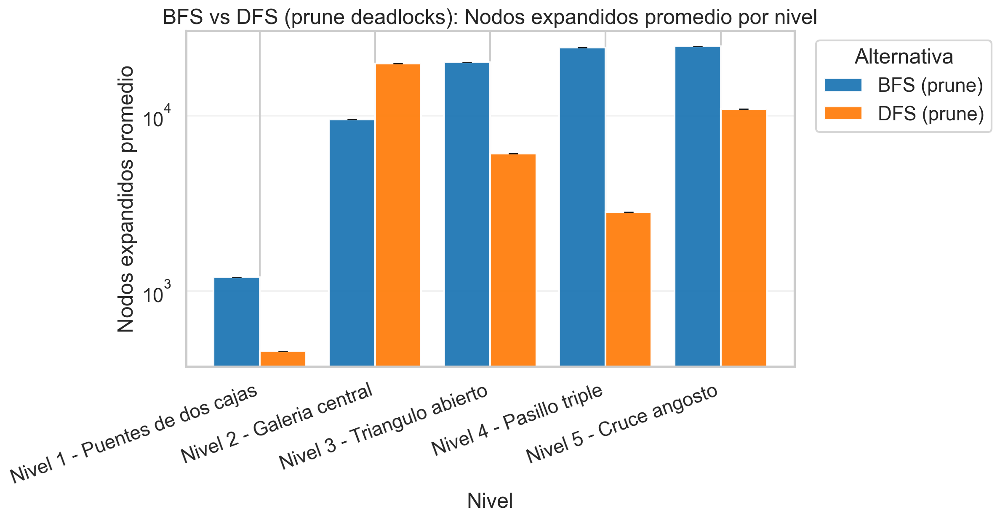

**Que muestra.** Con poda, `DFS (prune)` pasa a ganar en nodos expandidos en cuatro de los cinco niveles y tambien en el promedio global: `8029.8` contra `16065.8` de `BFS (prune)`.

**Lectura critica e inferencia.** Este grafico es uno de los mas importantes del informe porque muestra un cambio de ranking real provocado por la poda. Sin poda, `BFS` era mejor que `DFS` en nodos promedio; con poda, la relacion se invierte. La inferencia es que buena parte de la desventaja operativa de `DFS` no venia de ser profundo en si mismo, sino de profundizar en regiones muertas del espacio. Una vez eliminadas esas ramas, el sesgo de profundidad puede volverse hasta conveniente si uno ignora calidad de solucion.

**Sintesis de la seccion.** La poda cambia el tablero competitivo de `BFS vs DFS`, pero no cambia el veredicto final si importa costo. `DFS (prune)` se vuelve un explorador mucho mas eficiente, incluso mas barato que `BFS (prune)` en nodos y tiempo promedio, pero sigue produciendo soluciones muy malas. Es un gran ejemplo de como una mejora de eficiencia no implica una mejora de calidad.

## Efecto De Prune Por Algoritmo

Pregunta de la seccion: cuanto mejora realmente la poda de deadlocks y en que sentido mejora a cada algoritmo?

La respuesta corta es esta:

- En `BFS`, la poda baja mucho la frontera, los nodos y el tiempo, manteniendo el costo optimo.
- En `DFS`, la poda baja enormemente nodos y tiempo, pero casi no toca la frontera final y no mejora el costo.
- Al comparar `BFS` y `DFS` antes y despues de podar, se ve que la poda no afecta a todos por igual: rescata mucho mas a `DFS` que a `BFS`.

### BFS allow vs BFS prune: frontera por nivel (`bfs_frontier_count_prune_vs_allow_by_level.png`)

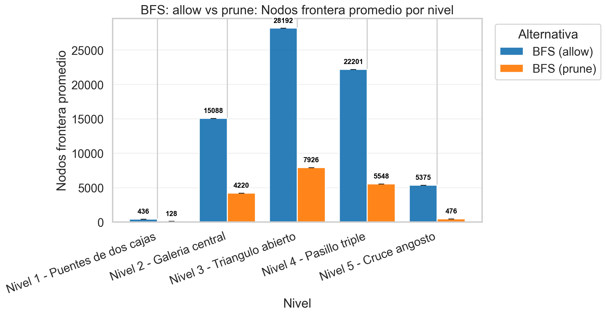

**Que muestra.** `BFS (prune)` reduce la frontera final media de `14258.4` a `3659.6`, una mejora del `74.3%`. El efecto aparece en todos los niveles y es especialmente fuerte en `Cruce angosto`, donde la reduccion llega al `91.1%`.

**Lectura critica e inferencia.** Esta es la clase de grafico que muestra una mejora causal muy facil de defender. `BFS` trabaja por capas y, por eso, cualquier estado muerto que se poda evita arrastrar muchas ramificaciones futuras. La inferencia es que la poda de deadlocks es particularmente valiosa cuando el algoritmo tiende a expandirse en amplitud, porque limpia de una vez regiones enteras del arbol.

### BFS allow vs BFS prune: nodos expandidos por nivel (`bfs_nodes_expanded_prune_vs_allow_by_level.png`)

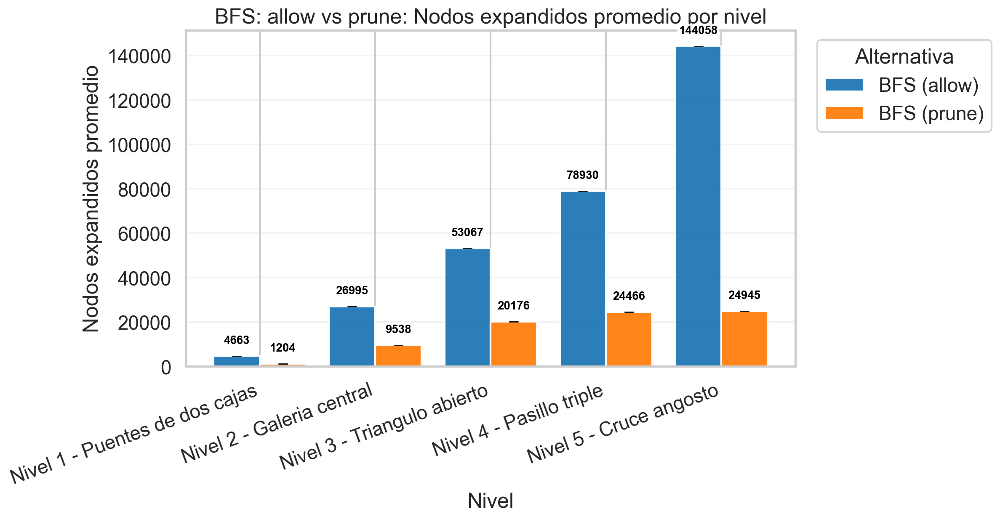

**Que muestra.** La poda baja los nodos expandidos de `BFS` en `73.9%` promedio. Otra vez el efecto es sistematico y el caso mas fuerte vuelve a ser `Cruce angosto`, con `82.7%` menos nodos.

**Lectura critica e inferencia.** Esta figura complementa perfectamente a la anterior. No solo queda mas chica la frontera final; tambien cae el trabajo real ya hecho. La inferencia nueva es que, en `BFS`, la poda no es un ajuste fino sino una mejora estructural del algoritmo. Si hubiera que elegir una sola tecnica de optimizacion para `BFS`, esta serie de resultados justifica que la poda vaya primero.

### DFS allow vs DFS prune: frontera por nivel (`dfs_frontier_count_prune_vs_allow_by_level.png`)

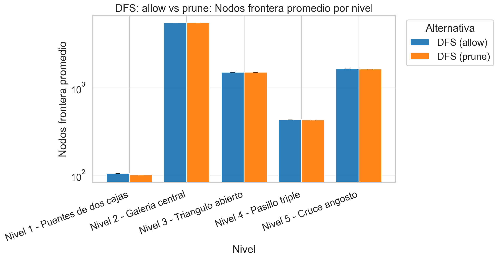

**Que muestra.** En `DFS`, la poda casi no cambia la frontera final. El promedio pasa de `1854.4` a `1850.0`, apenas `0.2%` menos.

**Lectura critica e inferencia.** Esta es una de las mejores pruebas de que `frontier_count` no puede leerse como memoria total ni como resumen universal de eficiencia. `DFS` mejora muchisimo con poda, pero esa mejora no aparece aca. La inferencia correcta es que `DFS` ya tenia una frontera relativamente acotada por su propia naturaleza; su gran problema estaba en las exploraciones profundas improductivas, no en el ancho de la cola al terminar.

### DFS allow vs DFS prune: nodos expandidos por nivel (`dfs_nodes_expanded_prune_vs_allow_by_level.png`)

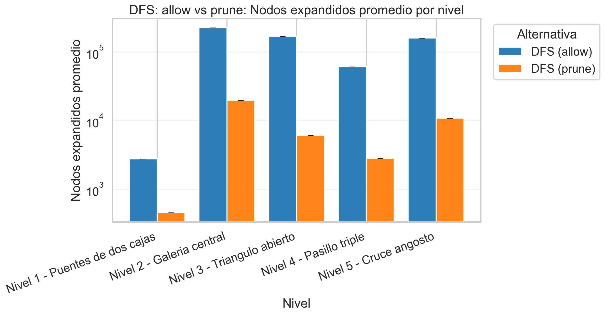

**Que muestra.** Aca si aparece toda la magnitud del cambio. `DFS (prune)` reduce los nodos expandidos de `124328.0` a `8029.8`, una mejora media del `93.5%`. En `Triangulo abierto` la reduccion llega al `96.4%`.

**Lectura critica e inferencia.** Este grafico deja una leccion experimental muy potente: en `DFS`, los deadlocks eran literalmente el problema. La poda rescata al algoritmo de sus peores excursiones y lo devuelve a una escala razonable. La inferencia nueva es que el desastre operativo de `DFS (allow)` no venia solo de su caracter desinformado, sino de la combinacion entre profundidad ciega y estados estructuralmente perdidos.

### DFS allow vs DFS prune: tiempo por nivel (`dfs_policy_sensitivity_time_seconds_by_level.png`)

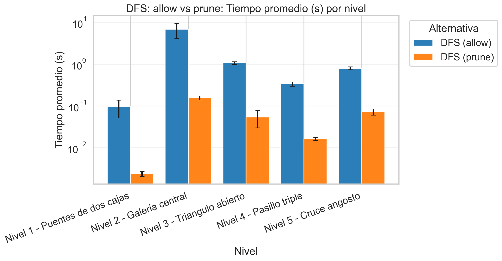

**Que muestra.** En tiempo, `DFS (prune)` tambien mejora mucho: el promedio cae de `2.348` s a `0.281` s, una baja del `88.0%`. La unica excepcion es `Nivel 1`, donde la poda resulta mas lenta por overhead y porque el problema es demasiado chico para amortizarla.

**Lectura critica e inferencia.** Este detalle del `Nivel 1` es valiosisimo para una presentacion honesta. Muestra que la poda no es magia gratis: tiene un costo fijo. En niveles triviales, ese costo puede no recuperarse. En cuanto el tablero gana estructura y complejidad, el balance cambia de inmediato y la mejora es masiva. La inferencia es que las tecnicas de poda deben evaluarse siempre en el contexto del tamano efectivo del problema.

### BFS vs DFS con y sin prune: donde queda DFS despues de podar (`non_optimal_nodes_expanded_by_level.png`)

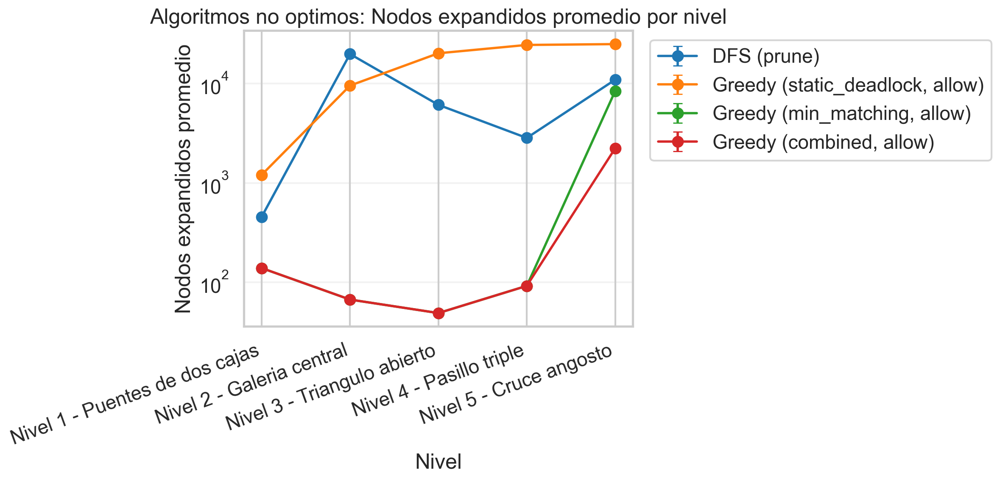

**Que muestra.** Este grafico no compara directamente `BFS` contra `DFS`, pero sirve para ubicar a `DFS (prune)` en el ecosistema completo despues de la mejora. `DFS (prune)` cae muchisimo respecto de su version sin poda, aunque sigue muy por encima de `Greedy (combined, allow)` y `Greedy (min_matching, allow)` en nodos expandidos.

**Lectura critica e inferencia.** Esta es la pieza que permite cerrar la comparacion "con y sin prune". La poda cambia el ranking entre los algoritmos desinformados: `DFS` pasa de perder con `BFS` en nodos a ganarle. Pero no alcanza para convertirlo en un algoritmo realmente competitivo frente a los informados. La inferencia final es que la poda reordena la liga de los desinformados, no la liga completa.

**Sintesis de la seccion.** El efecto de `prune` es asimetrico y por eso tan interesante. En `BFS`, mejora un algoritmo ya bueno. En `DFS`, rescata un algoritmo que sin poda era operacionalmente muy pobre. La lectura mas importante para la presentacion es esta: la poda no reemplaza a las heuristicas ni vuelve optimo a `DFS`, pero cambia de forma radical cuanto trabajo inutil se hace.

## Conclusiones Para La Presentacion

Si hubiera que condensar todo el informe en pocas afirmaciones fuertes para exponer, estas serian las mas defendibles:

- `A* (combined)` es la mejor opcion cuando se exige optimalidad. Mantiene el mismo costo que `BFS` y reduce drasticamente exploracion y tiempo.
- `Greedy (combined)` es la mejor opcion practica cuando no se exige optimalidad estricta. Es el mas rapido y el que menos expande, con una suboptimalidad moderada y estable.
- `static_deadlock` aporta mucho mas como mecanismo de poda que como heuristica de ranking. Por eso aparece varias veces empatando en costo o en nodos con algoritmos podados, pero rara vez domina de forma integral.
- La poda de deadlocks es una mejora estructural obligatoria. En `BFS` aporta mucho; en `DFS` aporta todavia mas. Sin esa poda, `DFS` queda experimentalmente fuera de competencia.
- `frontier_count` debe mostrarse con cuidado. Es util, pero no reemplaza a `nodes_expanded` ni puede interpretarse como pico de memoria.

Para ordenar la presentacion oral conviene seguir este recorrido:

1. Abrir con `A*` y las heuristicas, para fijar el mensaje de optimalidad mas eficiencia.
2. Pasar a `BFS vs A*`, porque es la comparacion teoricamente mas limpia.
3. Introducir la poda con `BFS (allow) vs BFS (prune)` y `DFS (allow) vs DFS (prune)`, que son las figuras con mayor efecto causal.
4. Cerrar con `Greedy vs A*` para mostrar el costo experimental de exigir optimalidad.
5. Usar `BFS vs DFS` como contraste final entre estrategias desinformadas, mostrando como la poda altera la competencia sin arreglar la calidad de `DFS`.

La conclusion conceptual mas fuerte de toda la corrida avanzada es esta: en Sokoban no alcanza con elegir "el algoritmo correcto". Los mejores resultados aparecen cuando se combinan tres capas distintas de inteligencia: una estrategia de busqueda adecuada, una heuristica realmente informativa y una poda estructural que elimine estados muertos antes de pagar por explorarlos.
