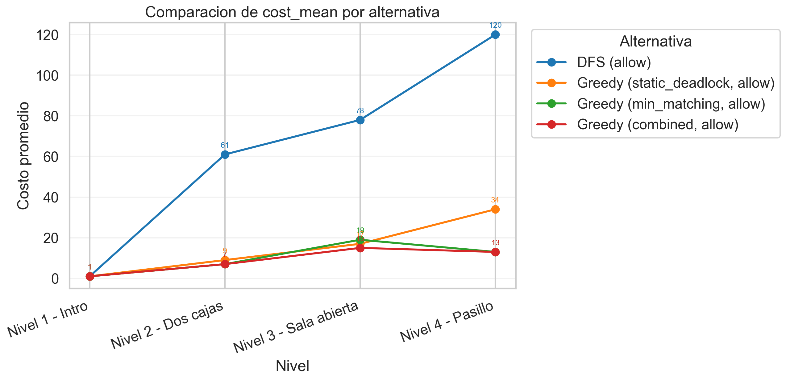
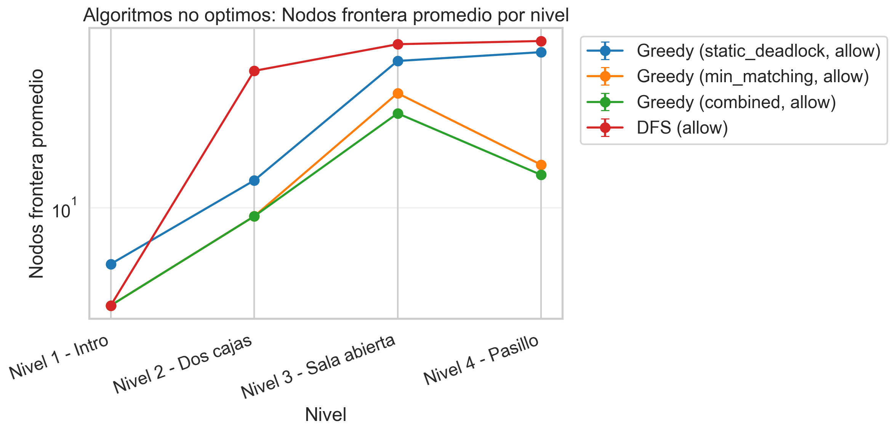
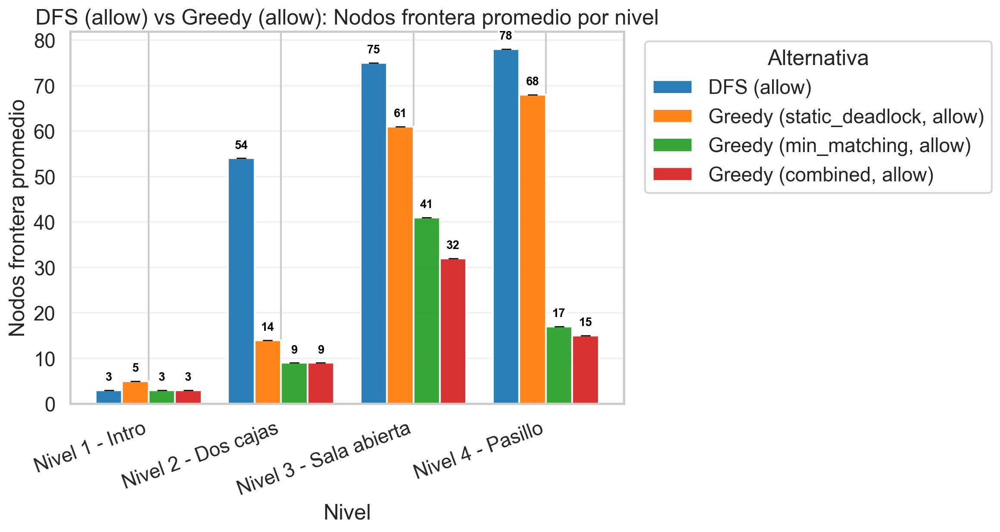
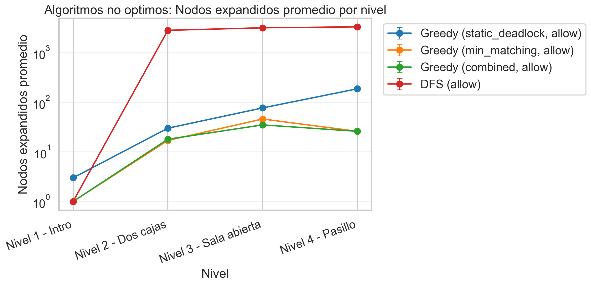
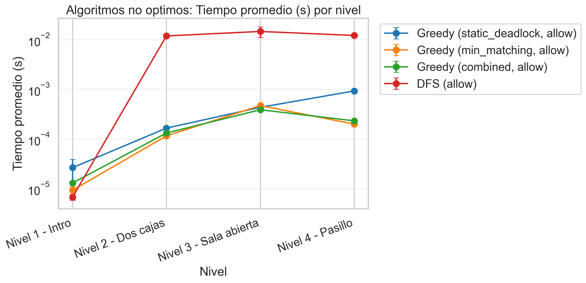
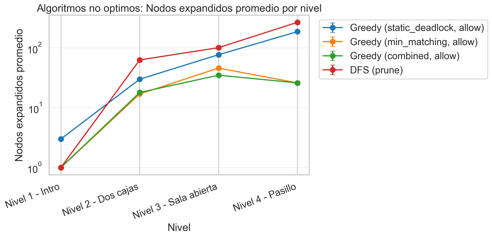
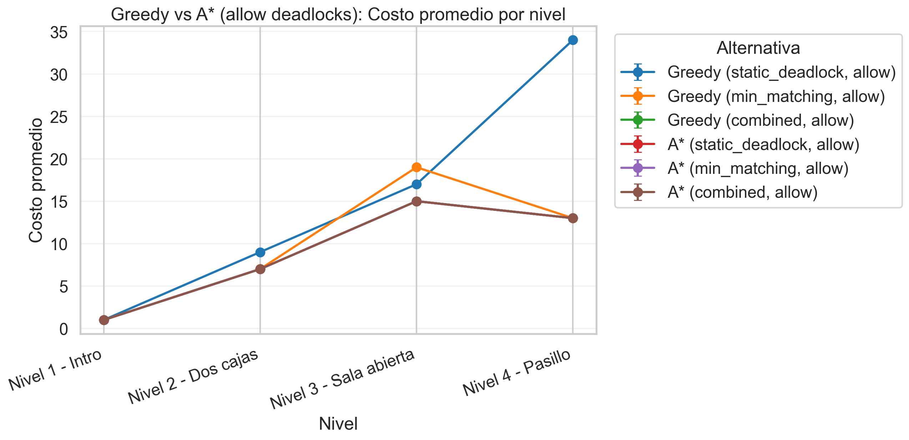
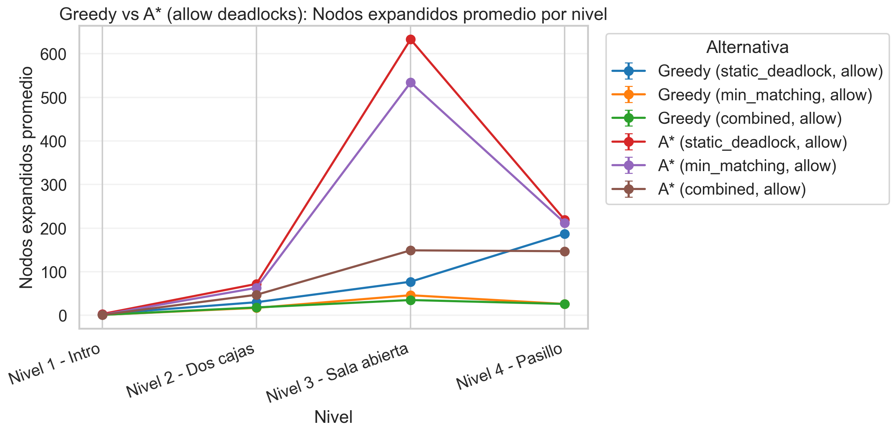
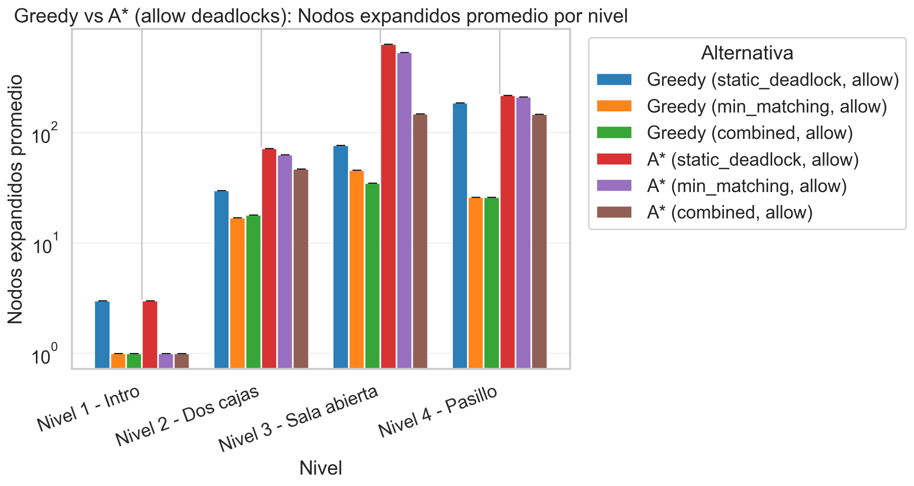
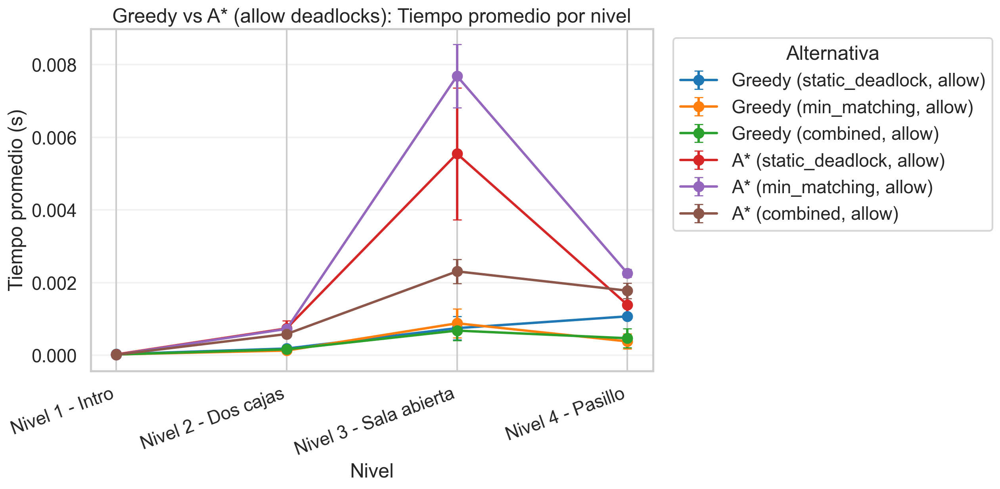

dfs vs greedy

### `results_dfs_allow_deadlocks/cost_mean_by_alternative.png`

### `results_dfs_allow_deadlocks/non_optimal_frontier_count_by_level.png`

`results_barras/dfs_vs_greedy_allow_frontier_count_by_level.png`

`results_dfs_allow_deadlocks/non_optimal_nodes_expanded_by_level.png`

`results_dfs_allow_deadlocks/non_optimal_time_by_level.png`

### `results_dfs_prune_deadlocks/non_optimal_nodes_expanded_by_level.png`

Conclusión General: La superioridad de la información heurística

**guiar la búsqueda con una heurística razonable (Greedy) es inmensamente superior a explorar a ciegas (DFS)**. Incluso cuando DFS cuenta con mecanismos de protección avanzados como la poda (_prune_), Greedy domina en absolutamente todas las métricas: calidad de solución, velocidad, uso de memoria y eficiencia de exploración.

greedy vs a star:

### `results_greedy_vs_a_star/greedy_vs_a_star_allow_cost_by_level.png`

### `results_greedy_vs_a_star/greedy_vs_a_star_allow_nodes_expanded_by_level.png`

### `results_barras/greedy_vs_a_star_allow_nodes_expanded_by_level.png`

`results_greedy_vs_a_star/greedy_vs_a_star_allow_time_seconds_by_level.png`

El análisis comparativo entre los algoritmos A* y Greedy Search evidencia el clásico compromiso entre la garantía teórica de optimalidad y la eficiencia computacional empírica. Mientras que A* asegura invariablemente el hallazgo de la ruta de menor costo sin importar la heurística admisible empleada, lo hace a expensas de un mayor tiempo de ejecución y una expansión de nodos significativamente superior. Por su parte, la búsqueda Greedy demuestra una superioridad rotunda en velocidad y bajo consumo de memoria, aunque su éxito depende de forma crítica de la calidad de la información provista. Notablemente, la implementación de la heurística _combined_ permite a Greedy mitigar su naturaleza subóptima tradicional, logrando emparejar la calidad de solución de A* en los escenarios evaluados pero requiriendo una fracción mínima de sus recursos computacionales, consolidándose así como la alternativa pragmática más eficiente del experimento.