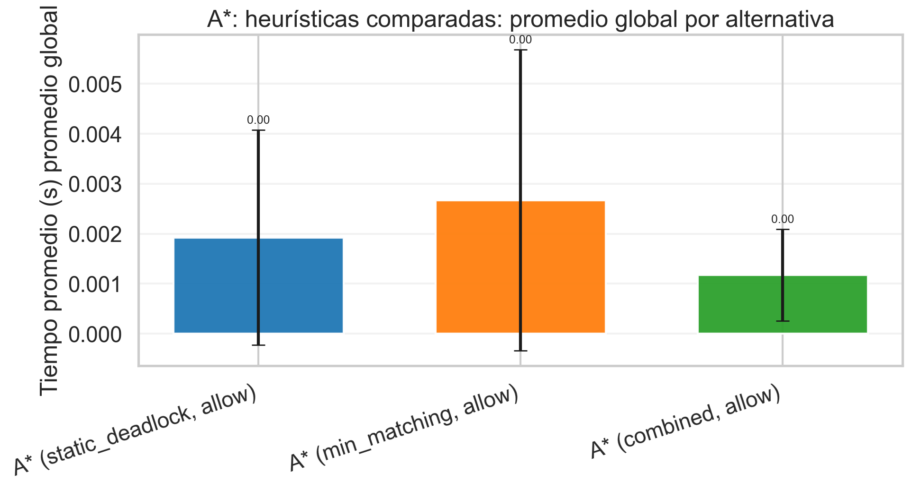

## Hallazgos Transversales

- `A* (combined)` es la variante óptima más sólida: mantiene costo óptimo y reduce nodos/tiempo frente a `BFS` en casi todos los escenarios comparables.
- `Greedy (combined)` es la variante no óptima más fuerte del set: en estos cuatro niveles empata el costo óptimo y además es la más rápida entre los métodos informados.
- `static_deadlock` sola funciona más como **test de poda** que como heurística de ranking: devuelve `0` o `inf`, así que ordena mal los estados aunque detecte imposibles.
- La poda de deadlocks cambia muchísimo el panorama de `DFS` y bastante el de `BFS`, siempre sin alterar el costo final en las suites donde se la comparó.
- `Nivel 3 - Sala abierta` es el mejor nivel para contar la historia heurística: el branching alto amplifica enseguida la diferencia entre búsquedas informadas y no informadas.
- `Nivel 1 - Intro` es demasiado trivial para extraer conclusiones de tiempo; sus microsegundos sirven solo como chequeo de implementación.
- Las iteraciones repetidas no están midiendo variabilidad algorítmica real: el código fija semillas, pero la búsqueda y el orden de sucesores son deterministas ([search.py](../src/engine/search.py), [state.py](../src/model/state.py)).
- La métrica `frontier_count` no es pico de memoria sino tamaño de la frontera en el instante de terminar la búsqueda, según [search.py](../src/engine/search.py). Esto hay que aclararlo si la usás como proxy de complejidad espacial.

### `results_optimal_allow_deadlocks/optimal_frontier_count_by_level.png`

**Qué muestra.** `A* (combined)` es el mejor promedio global en frontera final (45.50) y gana 4/4 niveles, mientras que `BFS` queda último con 306. Frente a `BFS`, `A* (combined)` logra 85.1% menos en promedio.

**Por qué importa.** En teoría clásica, con heurísticas admisibles A* debería mantener costo óptimo y reducir exploración respecto de BFS. Acá se cumple: todos los métodos óptimos mantienen el mismo costo por nivel y lo que cambia es cuánta búsqueda pagan para llegar a esa solución. El patrón acompaña la intuición de eficiencia espacial, aunque en este trabajo la “frontera” guardada es la frontera al finalizar, no el pico de memoria.

### `results_dfs_allow_deadlocks/non_optimal_frontier_count_by_level.png`

**Qué muestra.** `Greedy (combined, allow)` lidera en frontera final con 14.75 y `DFS (allow)` cierra la tabla con 52.50. El reparto de victorias por nivel favorece a `Greedy (combined, allow)` en 3/4 niveles.

**Por qué importa.** En teoría, Greedy debería explorar menos que DFS porque usa información heurística, pero puede pagar eso con peores decisiones de costo. Cuando `Greedy (combined)` gana, está actuando como una versión pragmática de A*: conserva una guía fuerte pero deja de lado la corrección de costo acumulado.

### `results_dfs_vs_bfs_allow_deadlocks/bfs_vs_dfs_allow_cost_by_level.png`

**Qué muestra.** Desglosa por nivel la comparación directa entre `BFS (allow)` y `DFS (allow)`. Globalmente gana `BFS (allow)` en costo (9 contra 65).

**Por qué importa.** Es más legible para slides que las curvas con error bars porque permite señalar nivel por nivel dónde BFS paga amplitud y dónde DFS paga mala calidad de rama. Si la usás, acompañala con el costo: sin esa métrica, DFS puede parecer mejor de lo que realmente es.

### `results_dfs_vs_bfs_prune_deadlocks/cost_by_level_errorbars.png`

**Qué muestra.** `BFS (prune)` tiene el mejor costo medio global (9) y `DFS (prune)` el peor (65). Además, `Greedy (combined)` empata el costo óptimo en 0/4 niveles, algo muy bueno para estos tableros pero no garantizado en general.

**Por qué importa.** El costo es la métrica más cercana a lo que pide el enunciado como calidad de solución. Para la presentación, esta figura es la que te permite separar “rápido” de “bueno”: DFS puede ser veloz, pero si infla el camino no está resolviendo mejor.

### `results_bfs_dfs_prune_vs_allow/dfs_nodes_expanded_prune_vs_allow_by_level.png`

**Qué muestra.** Compara `DFS (allow)` contra `DFS (prune)` por nivel. En promedio, podar deadlocks deja 95.4% menos en nodos expandidos; la mejora más fuerte aparece en `Nivel 2 - Dos cajas` con 97.8% menos.

**Por qué importa.** En DFS la señal es todavía más interesante: la frontera casi no cambia, pero los nodos expandidos sí caen en picada, lo que sugiere que la poda evita excursiones profundas en ramas malas más que ahorrar memoria estructural. Son de las mejores figuras para una slide de “lección aprendida”, porque muestran un efecto causal claro con costo de solución idéntico.

### `results_barras/a_star_heuristics_global_time_seconds_global.png`

**Qué muestra.** `A*: heurísticas comparadas` condensado en una sola barra por alternativa. `A* (combined, allow)` es el mejor promedio global de tiempo y `A* (min_matching, allow)` el peor.

**Por qué importa.** Esta versión global sirve para cierre de presentación. Compara heurísticas admisibles dentro de A*, donde la teoría predice mismo costo final pero distinta eficiencia.

