## Hallazgos Transversales

Los siguientes hallazgos se basan en el análisis integral de todas las suites de resultados (ver [analisis_integral_resultados_tp1.md](analisis_integral_resultados_tp1.md) para el detalle completo por carpeta).

- `A* (combined)` es la variante óptima más sólida: mantiene costo óptimo y reduce nodos/tiempo frente a `BFS` en casi todos los escenarios comparables.
- `Greedy (combined)` es la variante no óptima más fuerte del set: en estos cuatro niveles empata el costo óptimo y además es la más rápida entre los métodos informados.
- `static_deadlock` sola funciona más como **test de poda** que como heurística de ranking: devuelve `0` o `inf`, así que ordena mal los estados aunque detecte imposibles.
- La poda de deadlocks cambia muchísimo el panorama de `DFS` y bastante el de `BFS`, siempre sin alterar el costo final en las suites donde se la comparó.
- `Nivel 3 - Sala abierta` es el mejor nivel para contar la historia heurística: el branching alto amplifica enseguida la diferencia entre búsquedas informadas y no informadas.
- `Nivel 1 - Intro` es demasiado trivial para extraer conclusiones de tiempo; sus microsegundos sirven solo como chequeo de implementación.
- Las iteraciones repetidas no están midiendo variabilidad algorítmica real: el código fija semillas, pero la búsqueda y el orden de sucesores son deterministas ([search.py](../src/engine/search.py), [state.py](../src/model/state.py)).
- La métrica `frontier_count` no es pico de memoria sino tamaño de la frontera en el instante de terminar la búsqueda, según [search.py](../src/engine/search.py). Esto hay que aclararlo si la usás como proxy de complejidad espacial.

### `results_optimal_allow_deadlocks/optimal_frontier_count_by_level.png`

**Qué muestra.** `A* (combined)` es el mejor promedio global en frontera final (45.50) y gana o empata en 4/4 niveles, mientras que `BFS` queda último con 306. Frente a `BFS`, `A* (combined)` logra 85.1% menos en promedio. Este porcentaje está dominado por Nivel 3, donde el branching alto amplifica las diferencias. Nota: el gráfico usa escala logarítmica porque la diferencia entre métodos abarca órdenes de magnitud.

**Por qué importa.** En teoría clásica, con heurísticas admisibles A* debería mantener costo óptimo y reducir exploración respecto de BFS. Acá se cumple: todos los métodos óptimos mantienen el mismo costo por nivel y lo que cambia es cuánta búsqueda pagan para llegar a esa solución. El patrón acompaña la intuición de eficiencia espacial, aunque en este trabajo la “frontera” guardada es la frontera al finalizar, no el pico de memoria.

### `results_optimal_allow_deadlocks/optimal_nodes_expanded_by_level.png`

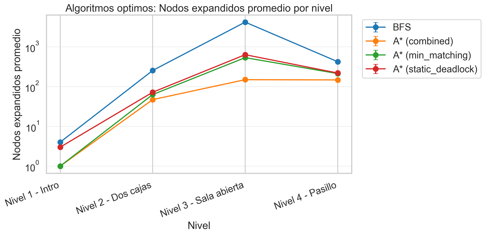

**Qué muestra.** `A* (combined)` es el mejor promedio global en nodos expandidos (86) y gana 4/4 niveles, mientras que `BFS` queda último con 1212.75. Frente a `BFS`, `A* (combined)` logra 92.9% menos en promedio.

**Por qué importa.** En teoría clásica, con heurísticas admisibles A* debería mantener costo óptimo y reducir exploración respecto de BFS. Acá se cumple: todos los métodos óptimos mantienen el mismo costo por nivel y lo que cambia es cuánta búsqueda pagan para llegar a esa solución. Esta es una de las figuras más alineadas con la teoría, porque las expansiones sí reflejan directamente calidad heurística.

### `results_optimal_allow_deadlocks/optimal_time_by_level.png`

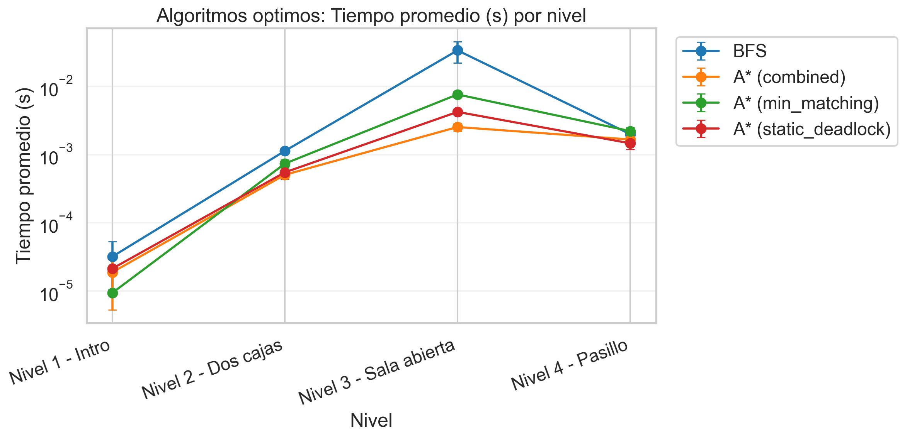

**Qué muestra.** `A* (combined)` es el mejor promedio global en tiempo (0.001182 s) y gana 2/4 niveles, mientras que `BFS` queda último con 0.009230 s. Frente a `BFS`, `A* (combined)` logra 87.2% menos en promedio.

**Por qué importa.** En teoría clásica, con heurísticas admisibles A* debería mantener costo óptimo y reducir exploración respecto de BFS. Acá se cumple: todos los métodos óptimos mantienen el mismo costo por nivel y lo que cambia es cuánta búsqueda pagan para llegar a esa solución. No conviene sobreinterpretar `Nivel 1 - Intro`: las diferencias ahí son de microsegundos.

### `results_optimal_bfs_prune_deadlocks/optimal_frontier_count_by_level.png`

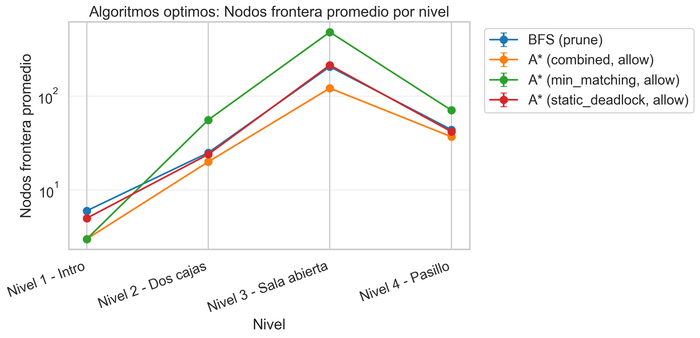

**Qué muestra.** `A* (combined, allow)` es el mejor promedio global en frontera final (45.50) y gana 4/4 niveles, mientras que `A* (min_matching, allow)` queda último con 153.50. En esta suite mixta, `A* (combined, allow)` no se compara en igualdad de condiciones con `BFS (prune)`, así que la lectura correcta es estrategia + poda, no estrategia sola.

**Por qué importa.** En teoría clásica, con heurísticas admisibles A* debería mantener costo óptimo y reducir exploración respecto de BFS. Acá se cumple: todos los métodos óptimos mantienen el mismo costo por nivel y lo que cambia es cuánta búsqueda pagan para llegar a esa solución. El patrón acompaña la intuición de eficiencia espacial, aunque en este trabajo la “frontera” guardada es la frontera al finalizar, no el pico de memoria.

# results_optimal_bfs_prune_deadlocks/optimal_nodes_expanded_by_level.png`

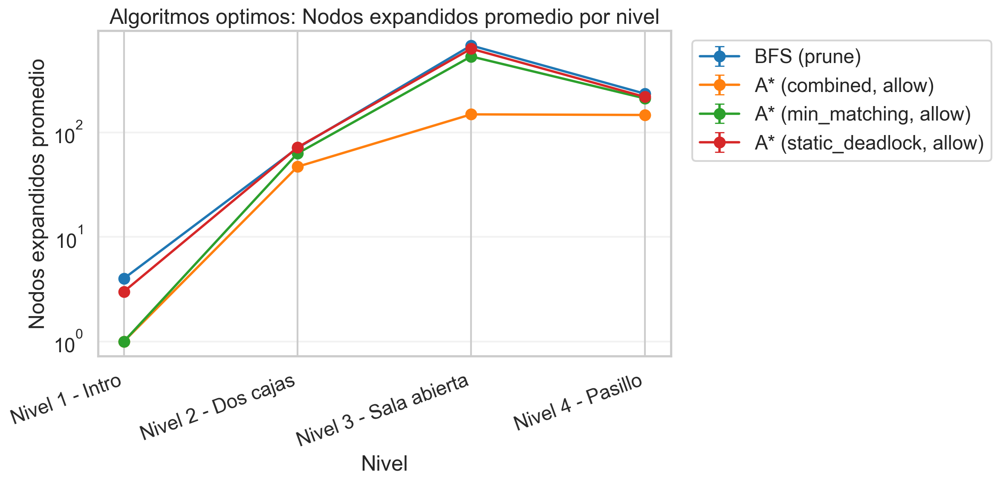

**Qué muestra.** `A* (combined, allow)` es el mejor promedio global en nodos expandidos (86) y gana 4/4 niveles, mientras que `BFS (prune)` queda último con 247.50. En esta suite mixta, `A* (combined, allow)` no se compara en igualdad de condiciones con `BFS (prune)`, así que la lectura correcta es estrategia + poda, no estrategia sola.

**Por qué importa.** En teoría clásica, con heurísticas admisibles A* debería mantener costo óptimo y reducir exploración respecto de BFS. Acá se cumple: todos los métodos óptimos mantienen el mismo costo por nivel y lo que cambia es cuánta búsqueda pagan para llegar a esa solución. Esta es una de las figuras más alineadas con la teoría, porque las expansiones sí reflejan directamente calidad heurística.

### `results_dfs_allow_deadlocks/cost_mean_by_alternative.png`

**Qué muestra.** Ordena el costo medio por alternativa y deja muy visible que `Greedy (combined, allow)` queda en 9 mientras `DFS (allow)` sube a 65.

**Por qué importa.**
  El costo es la métrica más cercana a lo que pide el enunciado como calidad de solución. Para la presentación, esta figura es la que te permite separar “rápido” de “bueno”: DFS puede ser veloz, pero si infla el camino no está resolviendo mejor.
 Para una slide es más directa que el errorbar por nivel: sintetiza la idea de calidad de solución en un vistazo. En particular, ayuda a contar que `static_deadlock` sola no es una heurística de ranking fuerte; funciona mejor como detector/poda que como guía principal.
### `results_dfs_allow_deadlocks/non_optimal_frontier_count_by_level.png`

**Qué muestra.** `Greedy (combined, allow)` lidera en frontera final con 14.75 y `DFS (allow)` cierra la tabla con 52.50. El reparto de victorias por nivel favorece a `Greedy (combined, allow)` en 3/4 niveles.

**Por qué importa.** En teoría, Greedy debería explorar menos que DFS porque usa información heurística, pero puede pagar eso con peores decisiones de costo. Cuando `Greedy (combined)` gana, está actuando como una versión pragmática de A*: conserva una guía fuerte pero deja de lado la corrección de costo acumulado.

### `results_barras/dfs_vs_greedy_allow_frontier_count_by_level.png`

**Qué muestra.** `DFS (allow) vs Greedy (allow)` por nivel. Globalmente, `Greedy (combined, allow)` marca el mejor promedio de frontera final y `DFS (allow)` el más alto.

**Por qué importa.** Sirve para mostrar que una heurística razonable vale más que explorar profundo “a ciegas”, aun cuando el método siga siendo no óptimo.

### `results_dfs_allow_deadlocks/non_optimal_nodes_expanded_by_level.png`

**Qué muestra.** `Greedy (combined, allow)` lidera en nodos expandidos con 20 y `DFS (allow)` cierra la tabla con 2334. El reparto de victorias por nivel favorece a `Greedy (combined, allow)` en 2/4 niveles.

**Por qué importa.** En teoría, Greedy debería explorar menos que DFS porque usa información heurística, pero puede pagar eso con peores decisiones de costo. Cuando `Greedy (combined)` gana, está actuando como una versión pragmática de A*: conserva una guía fuerte pero deja de lado la corrección de costo acumulado.

`results_dfs_allow_deadlocks/non_optimal_time_by_level.png`

**Qué muestra.** `Greedy (combined, allow)` lidera en tiempo con 0.000191 s y `DFS (allow)` cierra la tabla con 0.009662 s. El reparto de victorias por nivel favorece a `Greedy (combined, allow)` en 1/4 niveles.

**Por qué importa.** En teoría, Greedy debería explorar menos que DFS porque usa información heurística, pero puede pagar eso con peores decisiones de costo. Cuando `Greedy (combined)` gana, está actuando como una versión pragmática de A*: conserva una guía fuerte pero deja de lado la corrección de costo acumulado.

## `results_dfs_prune_deadlocks`

Comparativa entre `DFS (prune)` y `Greedy (allow)`. Muestra cuánto mejora DFS cuando se lo protege de deadlocks, aunque sigue cargando su sesgo no óptimo.

Todas las corridas resumidas en esta carpeta tuvieron `success_rate = 1.0`. La tabla siguiente consolida los promedios globales por solver:

| Solver | Tiempo medio | Nodos expandidos | Frontera final | Costo |
|---|---:|---:|---:|---:|
| Greedy (combined, allow) | 0.000193 s | 20 | 14.75 | 9 |
| Greedy (min_matching, allow) | 0.000208 s | 22.50 | 17.50 | 10 |
| Greedy (static_deadlock, allow) | 0.000397 s | 74.25 | 37 | 15.25 |
| DFS (prune) | 0.000408 s | 108.25 | 50.25 | 65 |

### `results_dfs_vs_bfs_prune_deadlocks/cost_by_level_errorbars.png`

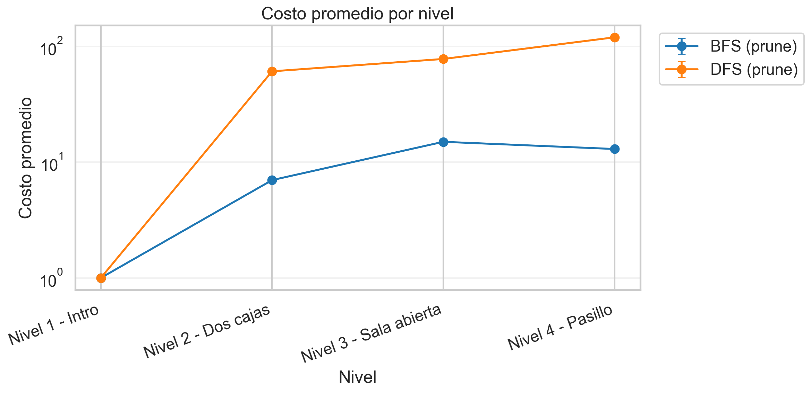

**Qué muestra.** `BFS (prune)` tiene el mejor costo medio global (9) y `DFS (prune)` el peor (65). Además, `Greedy (combined)` empata el costo óptimo en 0/4 niveles, algo muy bueno para estos tableros pero no garantizado en general.

**Por qué importa.** El costo es la métrica más cercana a lo que pide el enunciado como calidad de solución. Para la presentación, esta figura es la que te permite separar “rápido” de “bueno”: DFS puede ser veloz, pero si infla el camino no está resolviendo mejor.

### `results_bfs_dfs_prune_vs_allow/dfs_nodes_expanded_prune_vs_allow_by_level.png`

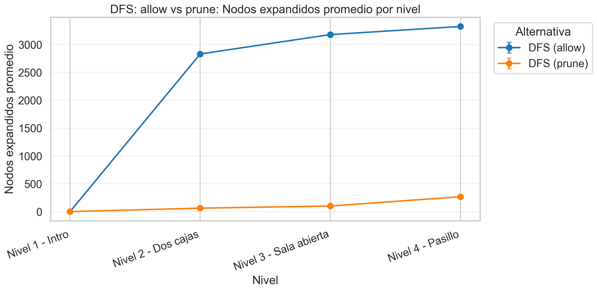

**Qué muestra.** Compara `DFS (allow)` contra `DFS (prune)` por nivel. En promedio, podar deadlocks deja 95.4% menos en nodos expandidos; la mejora más fuerte aparece en `Nivel 2 - Dos cajas` con 97.8% menos.

**Por qué importa.** En DFS la señal es todavía más interesante: la frontera casi no cambia, pero los nodos expandidos sí caen en picada, lo que sugiere que la poda evita excursiones profundas en ramas malas más que ahorrar memoria estructural. Son de las mejores figuras para una slide de “lección aprendida”, porque muestran un efecto causal claro con costo de solución idéntico.

### `results_dfs_prune_deadlocks/non_optimal_nodes_expanded_by_level.png`

**Qué muestra.** `Greedy (combined, allow)` lidera en nodos expandidos con 20 y `DFS (prune)` cierra la tabla con 108.25. El reparto de victorias por nivel favorece a `Greedy (combined, allow)` en 2/4 niveles.

**Por qué importa.** En teoría, Greedy debería explorar menos que DFS porque usa información heurística, pero puede pagar eso con peores decisiones de costo. Cuando `Greedy (combined)` gana, está actuando como una versión pragmática de A*: conserva una guía fuerte pero deja de lado la corrección de costo acumulado.

## `results_dfs_vs_bfs_allow_deadlocks`

Comparativa directa `BFS` vs `DFS` dejando deadlocks permitidos. Es una buena foto del trade-off clásico entre calidad de solución y costo de exploración.

Todas las corridas resumidas en esta carpeta tuvieron `success_rate = 1.0`. La tabla siguiente consolida los promedios globales por solver:

| Solver | Tiempo medio | Nodos expandidos | Frontera final | Costo |
|---|---:|---:|---:|---:|
| BFS (allow) | 0.006694 s | 1212.75 | 306 | 9 |
| DFS (allow) | 0.011508 s | 2334 | 52.50 | 65 |

### `results_dfs_vs_bfs_allow_deadlocks/bfs_vs_dfs_allow_cost_by_level.png`

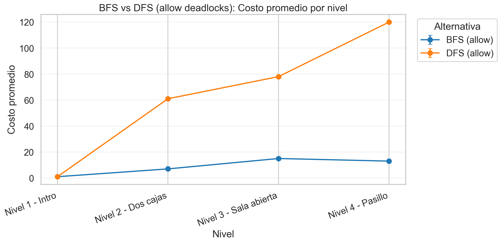

**Qué muestra.** Desglosa por nivel la comparación directa entre `BFS (allow)` y `DFS (allow)`. Globalmente gana `BFS (allow)` en costo (9 contra 65).

**Por qué importa.** Es más legible para slides que las curvas con error bars porque permite señalar nivel por nivel dónde BFS paga amplitud y dónde DFS paga mala calidad de rama. Si la usás, acompañala con el costo: sin esa métrica, DFS puede parecer mejor de lo que realmente es.

### `results_dfs_vs_bfs_prune_deadlocks/bfs_vs_dfs_prune_cost_by_level.png`

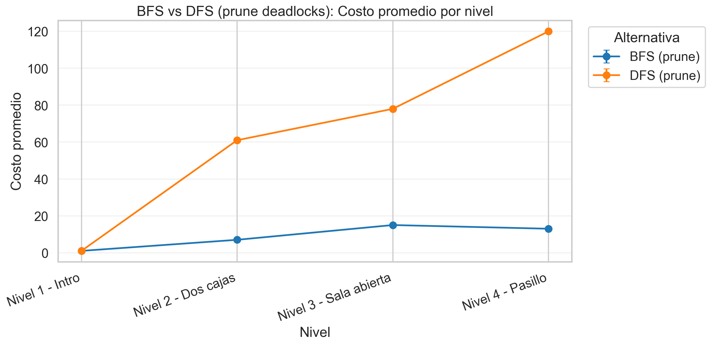

**Qué muestra.** Desglosa por nivel la comparación directa entre `BFS (prune)` y `DFS (prune)`. Globalmente gana `BFS (prune)` en costo (9 contra 65).

**Por qué importa.** Es más legible para slides que las curvas con error bars porque permite señalar nivel por nivel dónde BFS paga amplitud y dónde DFS paga mala calidad de rama. Si la usás, acompañala con el costo: sin esa métrica, DFS puede parecer mejor de lo que realmente es.
### `results_dfs_vs_bfs_allow_deadlocks/bfs_vs_dfs_allow_nodes_expanded_by_level.png`

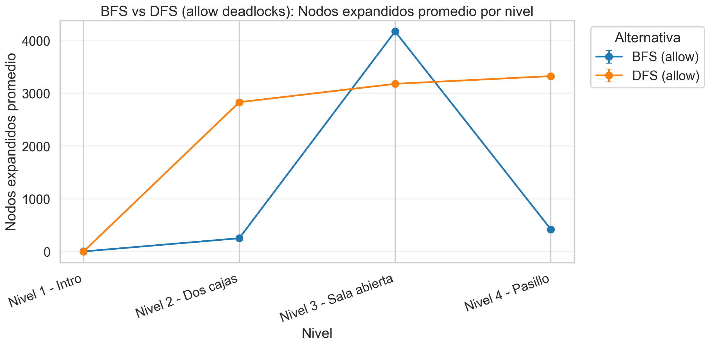

**Qué muestra.** Desglosa por nivel la comparación directa entre `BFS (allow)` y `DFS (allow)`. Globalmente gana `BFS (allow)` en nodos expandidos (1212.75 contra 2334).

**Por qué importa.** Es más legible para slides que las curvas con error bars porque permite señalar nivel por nivel dónde BFS paga amplitud y dónde DFS paga mala calidad de rama. Si la usás, acompañala con el costo: sin esa métrica, DFS puede parecer mejor de lo que realmente es.

### `results_dfs_vs_bfs_prune_deadlocks/bfs_vs_dfs_prune_nodes_expanded_by_level.png`

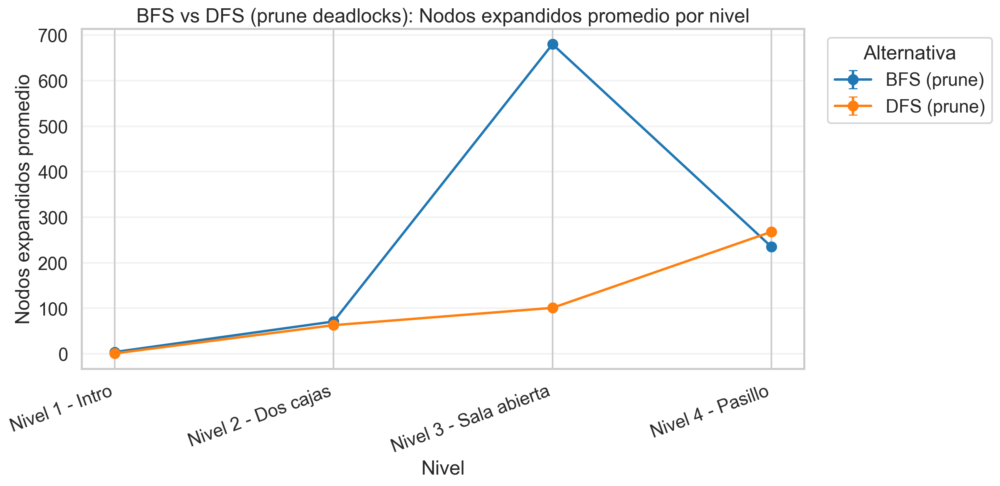

**Qué muestra.** Desglosa por nivel la comparación directa entre `BFS (prune)` y `DFS (prune)`. Globalmente gana `DFS (prune)` en nodos expandidos (108.25 contra 247.50).

**Por qué importa.** Es más legible para slides que las curvas con error bars porque permite señalar nivel por nivel dónde BFS paga amplitud y dónde DFS paga mala calidad de rama. Si la usás, acompañala con el costo: sin esa métrica, DFS puede parecer mejor de lo que realmente es.

### `results_dfs_vs_bfs_allow_deadlocks/bfs_vs_dfs_time_errorbars.png`

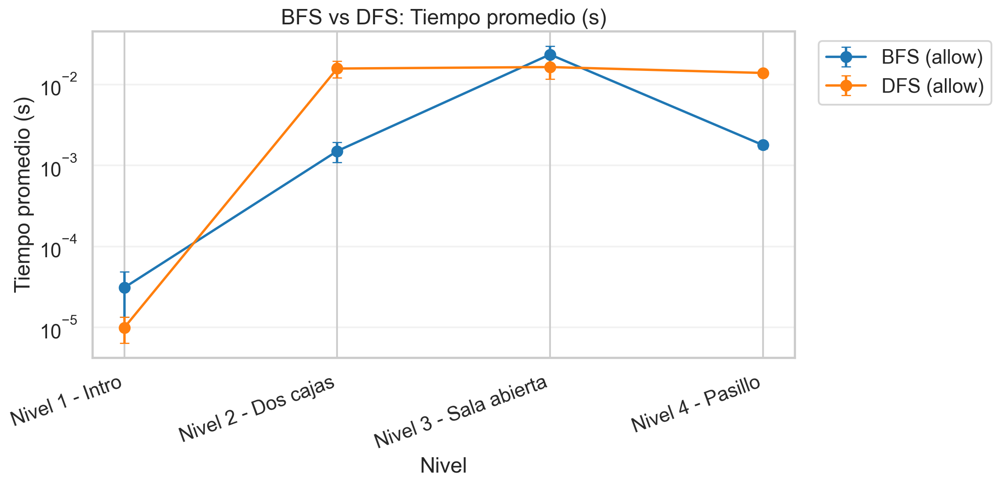

**Qué muestra.** `BFS` tiene mejor promedio de tiempo que `DFS` (0.006694 s contra 0.011508 s).

**Por qué importa.** Es una comparación clásica de IA. `BFS` gana en esta suite, pero la conclusión correcta no es “uno domina siempre”, sino que el comportamiento depende fuerte de la estructura del nivel y de la política de deadlocks. Con deadlocks permitidos, `DFS` puede parecer competitivo por encontrar rápido una primera solución, pero esa rapidez convive con costos de solución muy altos.

### `results_bfs_dfs_prune_vs_allow/bfs_frontier_count_prune_vs_allow_by_level.png`

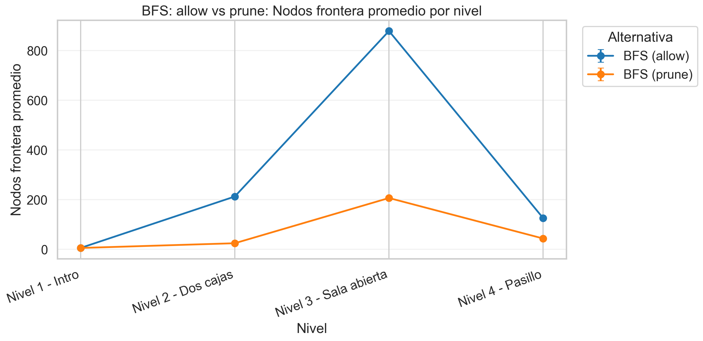

**Qué muestra.** Compara `BFS (allow)` contra `BFS (prune)` por nivel. En promedio, podar deadlocks deja 77.0% menos en frontera final; la mejora más fuerte aparece en `Nivel 2 - Dos cajas` con 88.3% menos.

**Por qué importa.** En BFS esto era esperable: la poda evita generar capas enteras de estados muertos, así que baja mucho la explosión combinatoria. Son de las mejores figuras para una slide de “lección aprendida”, porque muestran un efecto causal claro con costo de solución idéntico.

### `results_bfs_dfs_prune_vs_allow/bfs_nodes_expanded_prune_vs_allow_by_level.png`

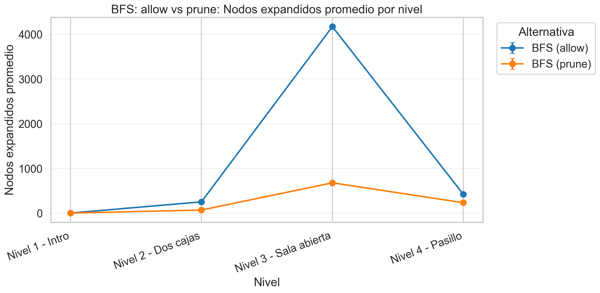

**Qué muestra.** Compara `BFS (allow)` contra `BFS (prune)` por nivel. En promedio, podar deadlocks deja 79.6% menos en nodos expandidos; la mejora más fuerte aparece en `Nivel 3 - Sala abierta` con 83.7% menos.

**Por qué importa.** En BFS esto era esperable: la poda evita generar capas enteras de estados muertos, así que baja mucho la explosión combinatoria. Son de las mejores figuras para una slide de “lección aprendida”, porque muestran un efecto causal claro con costo de solución idéntico.

### `results_bfs_dfs_prune_vs_allow/dfs_frontier_count_prune_vs_allow_by_level.png`

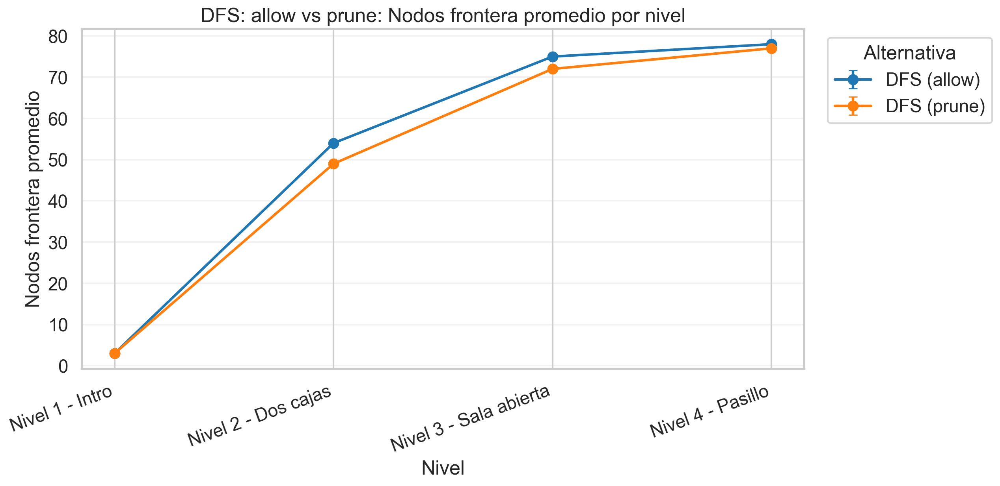

**Qué muestra.** Compara `DFS (allow)` contra `DFS (prune)` por nivel. En promedio, podar deadlocks deja 4.3% menos en frontera final; la mejora más fuerte aparece en `Nivel 2 - Dos cajas` con 9.3% menos.

**Por qué importa.** En DFS la señal es todavía más interesante: la frontera casi no cambia, pero los nodos expandidos sí caen en picada, lo que sugiere que la poda evita excursiones profundas en ramas malas más que ahorrar memoria estructural. Son de las mejores figuras para una slide de “lección aprendida”, porque muestran un efecto causal claro con costo de solución idéntico.

### `results_bfs_dfs_prune_vs_allow/dfs_nodes_expanded_prune_vs_allow_by_level.png`

**Qué muestra.** Compara `DFS (allow)` contra `DFS (prune)` por nivel. En promedio, podar deadlocks deja 95.4% menos en nodos expandidos; la mejora más fuerte aparece en `Nivel 2 - Dos cajas` con 97.8% menos.

**Por qué importa.** En DFS la señal es todavía más interesante: la frontera casi no cambia, pero los nodos expandidos sí caen en picada, lo que sugiere que la poda evita excursiones profundas en ramas malas más que ahorrar memoria estructural. Son de las mejores figuras para una slide de “lección aprendida”, porque muestran un efecto causal claro con costo de solución idéntico.

## `results_greedy_vs_a_star`

Comparativa central entre `Greedy` y `A*` con tres heurísticas admisibles. Es el bloque más rico para discutir heurísticas, optimalidad y costo computacional.

Todas las corridas resumidas en esta carpeta tuvieron `success_rate = 1.0`. La tabla siguiente consolida los promedios globales por solver:

| Solver | Tiempo medio | Nodos expandidos | Frontera final | Costo |
|---|---:|---:|---:|---:|
| Greedy (combined, allow) | 0.000331 s | 20 | 14.75 | 9 |
| Greedy (min_matching, allow) | 0.000352 s | 22.50 | 17.50 | 10 |
| Greedy (static_deadlock, allow) | 0.000507 s | 74.25 | 37 | 15.25 |
| A* (combined, allow) | 0.001170 s | 86 | 45.50 | 9 |
| A* (static_deadlock, allow) | 0.001924 s | 231.75 | 71.50 | 9 |
| A* (min_matching, allow) | 0.002670 s | 202.50 | 153.50 | 9 |

### `results_greedy_vs_a_star/greedy_vs_a_star_allow_cost_by_level.png`

**Qué muestra.** Junta las seis variantes informadas por nivel. `Greedy (combined, allow)` es la mejor en promedio de costo y `Greedy (static_deadlock, allow)` la peor.

**Por qué importa.** Esta es una figura fuerte para presentar heurísticas. Acá aparece el dato más interesante de toda la suite: `A*` mantiene costo óptimo con cualquier heurística admisible, mientras que `Greedy (combined)` logra empatarlo en estos cuatro niveles y `Greedy (static_deadlock)` se despega para peor.

### `results_greedy_vs_a_star/greedy_vs_a_star_allow_nodes_expanded_by_level.png`

**Qué muestra.** Junta las seis variantes informadas por nivel. `Greedy (combined, allow)` es la mejor en promedio de nodos expandidos y `A* (static_deadlock, allow)` la peor.

**Por qué importa.** Esta es una figura fuerte para presentar heurísticas. Se ve muy claro que `combined` domina dentro de cada familia: al sumar poder informativo del matching y detección de deadlocks, evita expansiones inútiles sin romper la teoría de admisibilidad en A*.

### `results_barras/greedy_vs_a_star_allow_nodes_expanded_by_level.png`

**Qué muestra.** `Greedy vs A* (allow deadlocks)` por nivel. Globalmente, `Greedy (combined, allow)` marca el mejor promedio de nodos expandidos y `A* (static_deadlock, allow)` el más alto.

**Por qué importa.** Es la comparación conceptual más importante del trabajo: rapidez y agresividad de Greedy contra optimalidad garantizada de A*.
### `results_greedy_vs_a_star/greedy_vs_a_star_allow_time_seconds_by_level.png`

**Qué muestra.** Junta las seis variantes informadas por nivel. `Greedy (combined, allow)` es la mejor en promedio de tiempo y `A* (min_matching, allow)` la peor.

**Por qué importa.** Esta es una figura fuerte para presentar heurísticas. Se ve muy claro que `combined` domina dentro de cada familia: al sumar poder informativo del matching y detección de deadlocks, evita expansiones inútiles sin romper la teoría de admisibilidad en A*.
### `results_barras/a_star_heuristics_global_time_seconds_global.png`

### `results_barras/a_star_heuristics_global_cost_global.png`

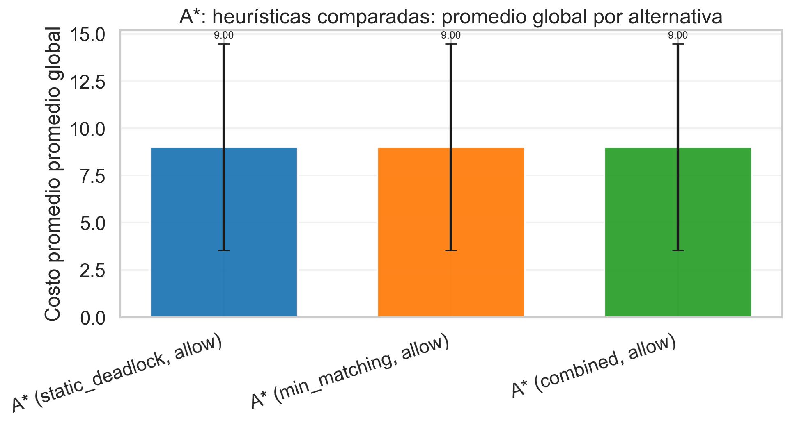
**Por qué importa.** Esta versión global sirve para cierre de presentación. La igualdad de costos no es casual: con heurísticas admisibles, A* debe conservar optimalidad. Entonces la discusión real pasa a tiempo, nodos y frontera.

### `results_barras/a_star_heuristics_global_frontier_count_global.png`

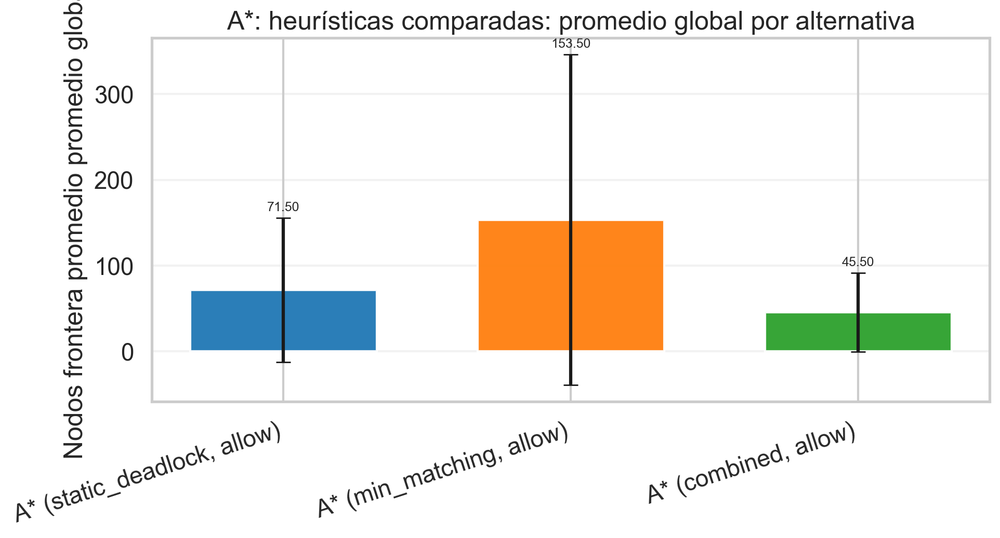

**Qué muestra.** `A*: heurísticas comparadas` condensado en una sola barra por alternativa. `A* (combined, allow)` es el mejor promedio global de frontera final y `A* (min_matching, allow)` el peor.

**Por qué importa.** Esta versión global sirve para cierre de presentación. Compara heurísticas admisibles dentro de A*, donde la teoría predice mismo costo final pero distinta eficiencia.

### `results_barras/a_star_heuristics_global_nodes_expanded_global.png`

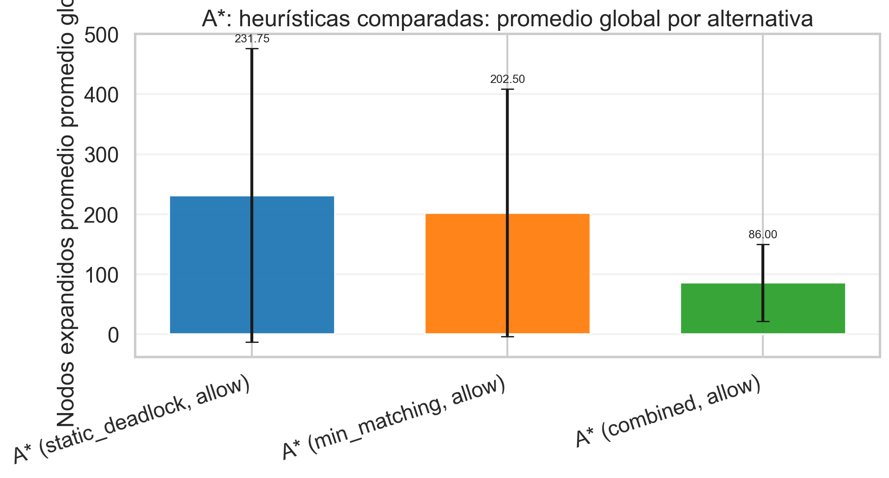

**Qué muestra.** `A*: heurísticas comparadas` condensado en una sola barra por alternativa. `A* (combined, allow)` es el mejor promedio global de nodos expandidos y `A* (static_deadlock, allow)` el peor.

**Por qué importa.** Esta versión global sirve para cierre de presentación. Compara heurísticas admisibles dentro de A*, donde la teoría predice mismo costo final pero distinta eficiencia.

### `results_barras/bfs_vs_a_star_allow_cost_by_level.png`

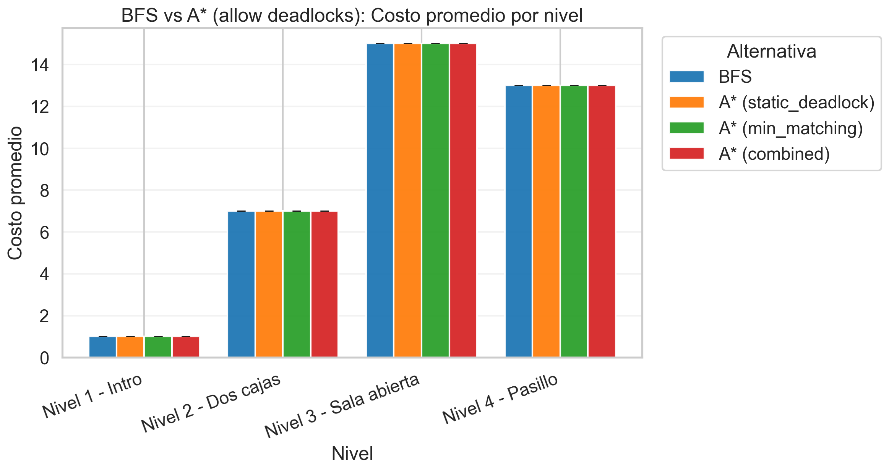

**Qué muestra.** `BFS vs A* (allow deadlocks)` por nivel. Globalmente, `A* (combined)` marca el mejor promedio de costo y `A* (combined)` el más alto.

**Por qué importa.** Contrasta una búsqueda óptima no informada con variantes de A* admisibles bajo la misma política de deadlocks permitidos.

### `results_barras/bfs_vs_a_star_allow_nodes_expanded_by_level.png`

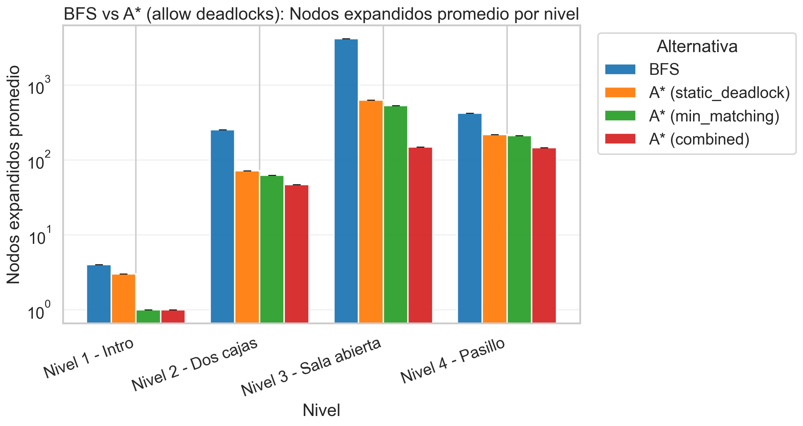

**Qué muestra.** `BFS vs A* (allow deadlocks)` por nivel. Globalmente, `A* (combined)` marca el mejor promedio de nodos expandidos y `BFS` el más alto.

**Por qué importa.** Contrasta una búsqueda óptima no informada con variantes de A* admisibles bajo la misma política de deadlocks permitidos.

### `results_barras/bfs_vs_a_star_prune_nodes_expanded_by_level.png`

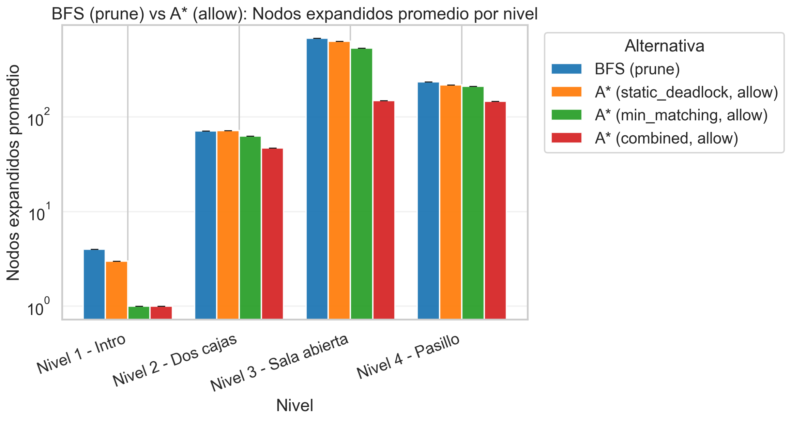

**Qué muestra.** `BFS (prune) vs A* (allow)` por nivel. Globalmente, `A* (combined, allow)` marca el mejor promedio de nodos expandidos y `BFS (prune)` el más alto.

**Por qué importa.** La figura es útil si explicás explícitamente que `BFS` recibe ayuda extra de la poda y `A*` no. Si no, puede inducir una conclusión injusta sobre el algoritmo.

### `results_barras/dfs_policy_sensitivity_time_seconds_by_level.png`

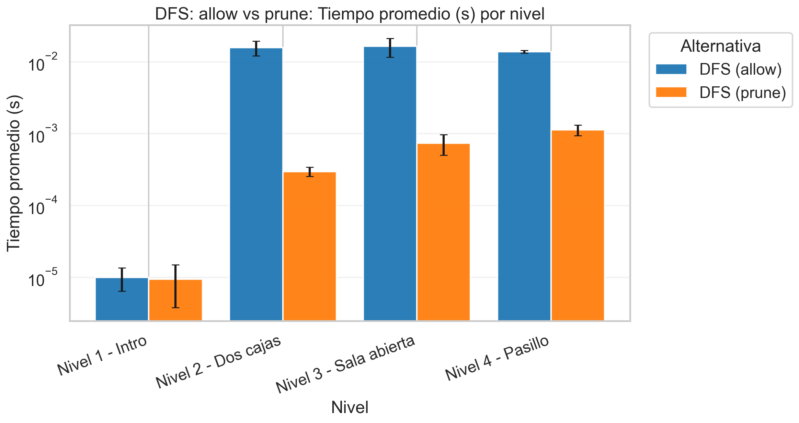

**Qué muestra.** Contrasta `DFS (allow)` contra `DFS (prune)` por nivel. `DFS (prune)` deja 95.3% menos en promedio respecto de `DFS (allow)` para la métrica tiempo.

**Por qué importa.** En DFS la poda es casi una corrección de comportamiento: evita que el orden de acciones lo arrastre por regiones estériles.

# FALTAN ESTOS GRAFICOS
- Greedy vs a star. Con los niveles q tenemos no se ve bien la diferencia!