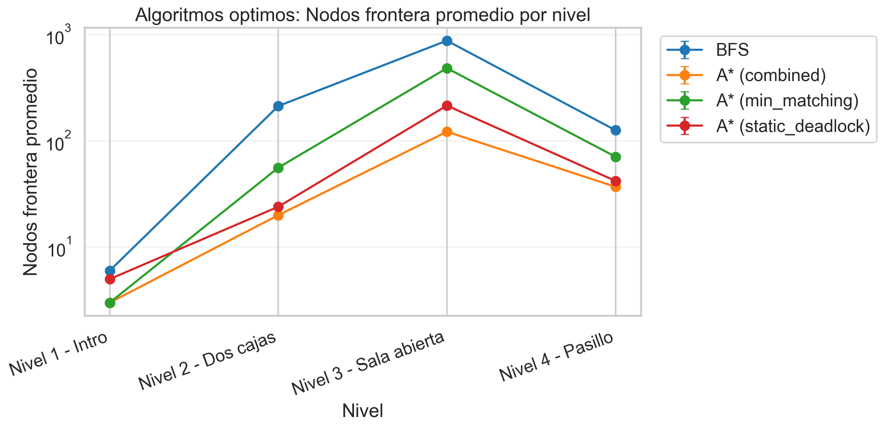

## Hallazgos Transversales

- `A* (combined)` es la variante óptima más sólida: mantiene costo óptimo y reduce nodos/tiempo frente a `BFS` en casi todos los escenarios comparables.
- `Greedy (combined)` es la variante no óptima más fuerte del set: en estos cuatro niveles empata el costo óptimo y además es la más rápida entre los métodos informados.
- `static_deadlock` sola funciona más como **test de poda** que como heurística de ranking: devuelve `0` o `inf`, así que ordena mal los estados aunque detecte imposibles.
- La poda de deadlocks cambia muchísimo el panorama de `DFS` y bastante el de `BFS`, siempre sin alterar el costo final en las suites donde se la comparó.
- `Nivel 3 - Sala abierta` es el mejor nivel para contar la historia heurística: el branching alto amplifica enseguida la diferencia entre búsquedas informadas y no informadas.
- `Nivel 1 - Intro` es demasiado trivial para extraer conclusiones de tiempo; sus microsegundos sirven solo como chequeo de implementación.
- Las iteraciones repetidas no están midiendo variabilidad algorítmica real: el código fija semillas, pero la búsqueda y el orden de sucesores son deterministas ([search.py](../src/engine/search.py), [state.py](../src/model/state.py)).
- La métrica `frontier_count` no es pico de memoria sino tamaño de la frontera en el instante de terminar la búsqueda, según [search.py](../src/engine/search.py). Esto hay que aclararlo si la usás como proxy de complejidad espacial.

### `results_optimal_allow_deadlocks/optimal_frontier_count_by_level.png`

**Qué muestra.** `A* (combined)` es el mejor promedio global en frontera final (45.50) y gana 4/4 niveles, mientras que `BFS` queda último con 306. Frente a `BFS`, `A* (combined)` logra 85.1% menos en promedio.

**Por qué importa.** En teoría clásica, con heurísticas admisibles A* debería mantener costo óptimo y reducir exploración respecto de BFS. Acá se cumple: todos los métodos óptimos mantienen el mismo costo por nivel y lo que cambia es cuánta búsqueda pagan para llegar a esa solución. El patrón acompaña la intuición de eficiencia espacial, aunque en este trabajo la “frontera” guardada es la frontera al finalizar, no el pico de memoria.